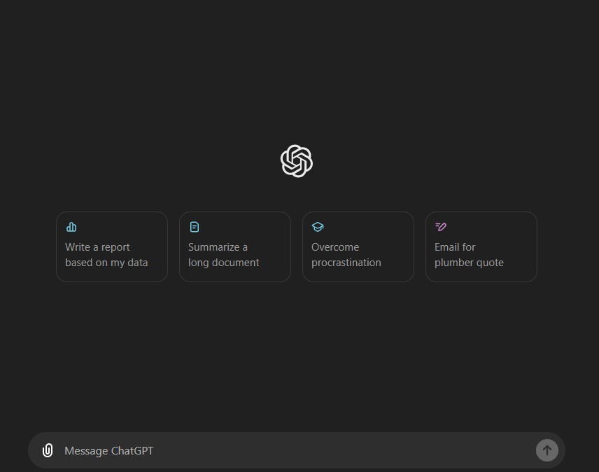
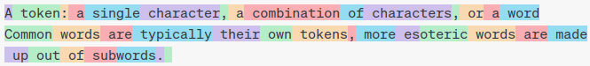
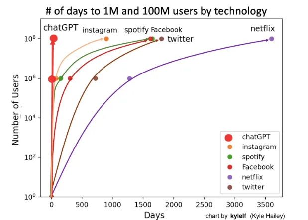
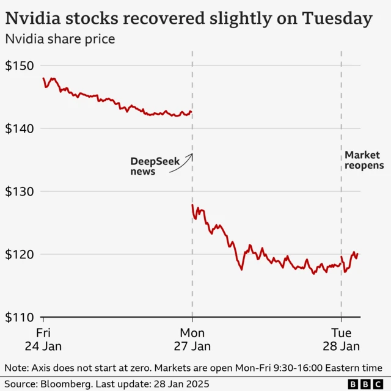

```{r setup, include = FALSE}
# libraries --------------------------------------------------------------------
library(anicon)
library(countdown)
library(fontawesome)
library(knitr)
```

## Welcome

**STA1000 - Data Analytics and Metrics**...

- Is a 10 ECTS module in the MSc in Digital Marketing
- Lectures scheduled 2hrs per week, every week (except specific days)
- Includes 1hr tutorial per week from week 8 to week 11

**You will learn** ...

- How to visualise marketing data in online dashboards
- How to process marketing data with python
- How to use actionable marketing metrics to drive insights and decisions

## About Me {background="#43464B"}

:::: {layout="[1.5,1]"}
::: {#first-column}
```{r}
#| echo: false
#| fig-align: "center"
include_img("map_about.png")
```
:::

::: {#second-column}
Since 2019, I have been teaching **Data Analytics** and **Statistics** at DCU Business School.

{style="border-radius:50%;"}
:::
::::

## Assessment Structure

### Mid November

- Assignment 1: Tableau Online Dashboard (25%)

### End November

- Inclass test 1 at the last lecture of Semester 1 (25%)

### Mid April

- Assignment 2: Website + Analytics Report (25%)

### End April

- Inclass test 2 at the last lecture of Semester 2 (25%)

# 1. Data, Information and Analytics

## Data vs. Information

Without data, an organisation could not successfully complete most business
activities. However, organisations need to convert these data into meaningful
**information**

- **Data** consists of raw facts
- **Information** is data that has been transformed for a purpose

::: {.callout-note}
## Example: Sales Manager

- Knowing the number of sales for each representative (fact - **data**)
- Knowing total monthly sales (transformed - **information**)
:::

::: {style="text-align:center;margin-top:0.5em;"}
**Data** → *transformation process* → **Information**
:::

## Value of Information

**Goals**
: Helps decision makers achieve organisational goals

**Performance**
: Valuable information helps people and organisations perform

**Accuracy**
: Inaccurate or incomplete information leads to poor decisions,
  and can result in high cost for the organisation

. . .

<br>

### The problem this module deals with

Marketing produces enormous quantities of **data** and comparatively little
**information**. A dashboard with forty numbers on it is still data.

## Data Analytics {.smaller}

> The science of using data to build models that lead to **better decisions**
> that in turn add value to individuals, companies and institutions

. . .

The analysis of data, typically large sets of data, by the use of mathematics,
statistics, and computer software.

```{mermaid}
%%| echo: false
%%| fig-align: center
%%| fig-height: 4.2
flowchart LR
  P["Business<br>performance"] --> A["What happened?<br><b>Descriptive</b>"]
  P --> B["Why did it happen?<br><b>Diagnostic</b>"]
  P --> C["What do we want to happen?<br><b>Predictive and prescriptive</b>"]
```

## Styles of Data Analytics {.smaller}

Historical information and reference data about customers or products, used for analysis and decision support:

**Standard reports**
: Preformatted information for predefined, backward-looking analysis

**Academic reports**
: Research methods using descriptive and inferential statistics

**Dashboards**
: Performance metrics in a tabular or graphical format

**Alerts**
: A message when a key variable moves outside a predefined range

**Predictive analytics**
: Information used to predict future performance and to prescribe a course of action

## A Test for Every Number

Before we look at any tool, one question, which we will return to in every
lecture:

. . .

> **What decision would change if this number were different?**

. . .

If the answer is "none", the number is decoration. Producing it is not analysis,
it is reporting.

# 2. Big Data: Hype versus Value

## What are Big Data?

### Definition

The term Big Data corresponds to a table containing observations (i.e. database
or dataset) that is **too long, too large or too complex to be handled by
conventional tools**

## What are Big Data?

### Microsoft Excel's limits (v16.77 - Office 365)

- Total number of rows: **1,048,576 rows**
- Total number of columns: **16,384 columns**

*Have you ever tried to scroll down to the end of Excel? Because I did!*

## The Three (or Five, or Seven) Vs

- **Volume**: how much
- **Velocity**: how fast
- **Variety**: how many kinds
- **Veracity**: how trustworthy
- **Value**: worth having

The first three are properties of the **data**.

The last two are properties of the **decision you are trying to make**.

Most big data investment optimises the first three and assumes the last two.

## Where the Hype Fails

**More rows do not fix a badly posed question.**

. . .

**More rows do not fix a biased sample.** A million records from people who
accepted cookies still tells you nothing about the people who declined.

. . .

**More rows make spurious correlations more likely, not less.** With enough
variables, something always correlates with revenue.

. . .

**Most marketing questions are answered with a few hundred rows.** You will
spend most of this module with datasets small enough to open in a spreadsheet.

## The Cost Side

Data collection is never free:

- **Storage and tooling**
- **Analyst time**, which is the expensive part
- **Legal exposure**, which we make concrete in Lecture 4
- **Attention**: every metric on a dashboard competes with every other

. . .

**Collect what a decision needs. Not what a tool offers.**

# 3. From Analysis to Story

## The Role of Data Storytelling

> **Stories** are how we translate core, essential **content**<br>to different
> **forms**<br>for specific **audiences**.

. . .

### Purpose

Visual communication plays an important role in a visual analytics process. No
matter how advanced and sophisticated the techniques are, if you fail to tell a
compelling story with the visualisation you designed, all the hard work is
wasted.


## From Reality to a Reader's Head {.smaller}

, after Alberto Cairo](./figures/external/smm635_cairo_model.png){fig-align="center" height="300px"}

*Data is gathered and filtered, then structured, then decoded by an audience
with its own memories and expectations. Two of those three steps are yours.*

## Exploratory versus Explanatory

:::: {.columns}
::: {.column width="45%"}
**Exploratory analysis**

- Exploring and understanding the data
- Conducting the analysis
- For you. Ugly is fine, fast is better
:::
::: {.column width="45%"}
**Explanatory analysis**

- Explaining your findings in a coherent narrative
- Leading to a call to action
- For someone else. Ugly is not fine
:::
::::

. . .

*You will do a lot of the first. You are assessed on the second.*

## Three Levels of Analytics Work {.smaller}

::: {.callout-note}
## Reporting

> "Sessions were up 12% last month."

Describes the past. Changes nothing on its own.
:::

::: {.callout-note}
## Analysis

> "Sessions were up 12% because paid search spend rose 40%, and cost per
conversion rose with it."

Explains. May change a decision.
:::

::: {.callout-note}
## Decision support

> "Paid search is now above our cost-per-acquisition ceiling. Cut spend by 30% or
raise the ceiling."

States the option and its cost.
:::

. . .

Most marketing dashboards stop at the first column. **This module is aimed at
the third.**

## A Tale of Two Charts

:::: {.columns}
::: {.column width="45%"}
**What the tool gave you**

- Shows the relationship
- Default colours, default frame
- Legend wherever it landed
- Built for you, in five seconds
:::
::: {.column width="45%"}
**What a newsroom would publish**

- Shows *one* relationship
- One accent colour, everything else grey
- Series labelled directly, no legend
- Built for a reader, in an hour
:::
::::

. . .

*Same data. Same finding. The difference is who it was made for.

## A good chart should

- **Show the data**, and avoid distorting what the data say
- **Induce thinking about the substance**, not about the methodology
- **Present many numbers in a small space**, and make a large dataset coherent
- **Encourage comparison** between the pieces of data
- **Serve a clear purpose**: description, exploration, or decoration
- **Integrate** with the words and statistics around it

. . .

*"Looks nice" is not on the list.*


## Build Your Story

> When adding text or visualisations, ask yourself: "Does this element support
> the point I want to make about the data?"

. . .

### Guiding your viewer

Use **annotations** to guide someone through the figure. But only label the data
that matters.

. . .

### Use your titles and captions

- Titles guide people to the point of your figure
- They prime people to know what to look for
- *If there is a conclusion you want your audience to reach, state it in words*

## Before a Chart Leaves Your Hands

- **Purpose**: does it serve a clear analytical goal?
- **Data**: does it represent the data accurately?
- **Clarity**: can a reader take the message quickly?
- **Simplicity**: have you removed everything that is not needed?
- **Aesthetics**: is it appropriate for this audience?
- **Iteration**: have you tested it on someone and revised it?

. . .

*Six questions, thirty seconds. Most bad charts fail the first one.*

## Going Further

### References

- [Fundamentals of Data Visualization](https://clauswilke.com/dataviz/), Claus
  Wilke
- [Hands-On Data Visualization](https://handsondataviz.org/), Jack Dougherty and
  Ilya Ilyankou
- *The Visual Display of Quantitative Information*, Edward Tufte
- *The Grammar of Graphics*, Leland Wilkinson

# Your Turn {background="#43464B"}

## Your Turn {background="#43464B"}

### Loomrow

A Dublin 8 womenswear label, founded 2024 by two design graduates. 

Small-batch drops of five to nine pieces cut from deadstock and recycled fabric. Direct to consumer through its own store, no wholesale, no shop. 

Five people, one of whom writes the posts and buys the ads. Prices €45 to €180, gross margin 52%. 

Instagram is effectively the entire top of the funnel.

## Your Turn {background="#43464B"}

1. Go to loop page and download the file insta-data.csv

2. Create a 1 page PDF report of follower's engagement in the last 18 months with actionable insights.

```{r}
#| echo: false
countdown::countdown(minutes = 5, warn_when = 60)
```

# 4. AI in This Module

## Hello world!

- <span class="highlighted-text">Generative AI</span>, is the biggest data-driven hype of the past years.

{fig-align="center"}

## What is an LLM?

- A Large Language model trained on enormous amounts of data:
    - Which was instruction tuned
    - Which was finetuned with RLHF
- Which resulted in:
    - *Extremely* impressive Chatbot capabilities
    - *Much* better interaction and
    - *Much* better language understanding while also 
    - *Accessible* to use for <span class="highlighted-text">Anybody</span>

## What is generative AI

- Generative AI:

::: {.center}

::: {.fragment}
<div style="text-align: center;">
*"In three words: deep learning worked."*
</div>
:::

::: {.fragment}
<div style="text-align: center;">
*"In 15 words: deep learning worked, got predictably better with scale, and we dedicated increasing resources to it."*
</div>
:::

::: {.fragment}
<div style="text-align: center;">
*"That’s really it; humanity discovered an algorithm that could really, truly learn any distribution of data (or really, the underlying “rules” that produce any distribution of data). To a shocking degree of precision, the more compute and data available, the better it gets at helping people solve hard problems. I find that no matter how much time I spend thinking about this, I can never really internalize how consequential it is."*
</div>
<div style="text-align: right;">
*- Sam Altman, [The Intelligence Age, 23-09-2024]*
</div>
:::

:::

## What is generative AI

- Typically meant in the context of content-creation

- This is **not new**: [thispersondoesnotexist.com (2018)](https://thispersondoesnotexist.com/)
    - For more check out [ThisXdoesnotexist.com](https://thisxdoesnotexist.com/)

- But became significantly more **powerfull**, **flexible**, **practical**, and **"mainstream"** around ~2022

## What is generative AI - Language Models

- Large Language Models are:
    - The State-of-the-Art for <span class ="highlighted-text" >generating language</span>
    - Famous LLMs are:
        - OpenAI: ChatGPT
        - Anthropic: Claud
        - Google: Gemini

## Next-word prediction machine
$$P(token_n|token_{n-1}, \cdots, token_1)$$

A token: *a single character, a combination of characters, or a word*

{fig-align="center"}

## Next-word prediction machine
$$P(token_n|token_{n-1}, \cdots, token_1)$$

This is nothing new, your phone does something similair: 

{fig-align="center"}

[Try it Yourself](https://platform.openai.com/tokenizer)

## The fast rise of ChatGPT
::: {.columns}
::: {.column width="40%"}

- Released on 30 November 2022
- Took the world by storm
- Everybody has heard of it, but...

:::
::: {.column width="50%"}
  {width=80%}
:::
:::

## Always better models
::: {.columns}
::: {.column width="60%"}

- Deepseek-R1 Released on 20 january 2025
- <span class="highlighted-text">Open sourced</span> Open sourced methodology and released models <span class="highlighted-text">Generative AI</span>open weights </span>
- Quickly dethroned ChatGPT as most downloaded app in App store and Play store
- Disruptive, erased 1 trillion dollars from the stock markets: Nvidia stocks dropped by 18\%

:::
::: {.column width="30%"}
  {width=80%}
:::
:::

## From Chatbot to Agent

A language model on its own only produces **text**. You read it, you decide, you
act.

. . .

An <span class="highlighted-text">agent</span> is the same model wrapped in a
loop that lets it *act*: it can call tools, read what comes back, and decide what
to do next, without you in between.

. . .

::: {.callout-note}
## The difference in one line

- **Chatbot**: "Here is the Python code to clean that file."
- **Agent**: opens the file, writes the code, runs it, reads the error, fixes it,
  and hands back the cleaned file.
:::

. . .

Same model. The capability is in the **loop**, not in the language.

## The Agent Loop

```{mermaid}
%%| echo: false
%%| fig-align: center
%%| fig-height: 3.6
flowchart LR
  G["Goal<br>your prompt"] --> P["Plan<br><b>what next?</b>"]
  P --> A["Act<br><b>call a tool</b>"]
  A --> O["Observe<br><b>read the result</b>"]
  O --> P
  O --> D["Stop<br><b>report back</b>"]
```

The tools are ordinary software: a web browser, a file system, a SQL query, an
API call to Google Analytics or to your Tableau server.

. . .

**The model chooses which tool to call, and when to stop.** That is the whole
difference, and it is also the whole risk.

## What Actually Changed {.smaller}

The useful measure is not "how clever" but **how long a task an agent finishes
unsupervised**.

- METR benchmarks the task length a frontier model completes with **50% reliability**
- 2023: a few minutes. Early 2026: <span class="highlighted-text">around five hours</span> for the best models
- That length has roughly doubled every **4 to 7 months**, with no plateau yet

. . .

**Read it as a trend, not a prophecy.** The benchmark tasks are software tasks
with clean pass or fail criteria. Almost no marketing question is like that.

::: {.callout-note}
## What 50% means
An agent that finishes a five-hour job half the time still needs somebody who
can tell which half they got.
:::

*Source: [METR, Time Horizon 1.1 (Jan 2026)](https://metr.org/blog/2026-1-29-time-horizon-1-1/)*

## Agents Are Becoming Your Customers {.smaller}

Agentic browsing has moved from demo to **traffic source**. Adobe, across over a
trillion visits to US retail sites:

- AI-referred traffic to US retailers **up 393%** year on year in Q1 2026
- In March 2025 that traffic converted **38% worse** than human traffic
- In March 2026 it converted **42% better**, with **37% higher revenue per visit**

. . .

Your analytics now contain a visitor that **reads** your site rather than looks
at it. It ignores your hero image, your colour scheme and your carousel, and
reads your structured data instead.

. . .

That is a new segment. It has to be identified, attributed and defended in a
report, exactly like any other. We come back to it in the attribution and
segmentation lectures.

*Source: [Adobe Analytics via TechCrunch, April 2026](https://techcrunch.com/2026/04/16/ai-traffic-to-us-retailers-rose-393-in-q1-and-its-boosting-their-revenue-too/)*

## Where Agents Break {.smaller}

**They do not fail loudly.** A wrong join, a mis-parsed date, a filter quietly
dropping half the rows: the agent reports success either way.

. . .

**They are not reproducible.** Run the same prompt twice, get two different
pipelines and two different numbers. Your marking, and later your employer's
audit, both need one.

. . .

**They optimise the task you stated, not the decision behind it.** "Increase
conversion rate" is satisfied by narrowing the definition of a conversion.

. . .

Which brings back the test from Section 1:

> **What decision would change if this number were different?**

An agent cannot answer that for you, because it does not carry the consequence.
You do.

## You Will Use It. Say So.

There is no version of this module where you do not use an AI assistant, and no
version where pretending otherwise would help you.

. . .

**The policy is simple:**

- Use it for anything
- Say what you used it for
- You are responsible for every number you submit

. . .

"The AI produced it" is not a defence here, and it will not be one in a job.

If an assistant makes those decisions for you, you will not understand your own
data later, and it will show.

. . .

**Delegate the typing. Keep the deciding.**

## {background="#43464B"}

```{css, echo = FALSE}
img.circle {border-radius:50%;}
```

::: {layout-ncol="2"}


**Thanks for your attention and don't hesitate to ask if you have any questions!**  
[`r fa(name = "mastodon")` @damien_dupre](https://datasci.social/@damien_dupre)  
[`r fa(name = "github")` @damien-dupre](https://github.com/damien-dupre)  
[`r fa(name = "link")` https://damien-dupre.github.io](https://damien-dupre.github.io)  
[`r fa(name = "paper-plane")` damien.dupre@dcu.ie](mailto:damien.dupre@dcu.ie)
:::