## Previously ...

- In Lecture 1 we have seen that Analytics is the process to **transform Data to Information**. Once done, Information should be structured in a convincing story bringing **textual with values and visusal evidence with graphs**. Ultimately, this should be use to make decisions.

- You also met **Loomrow**, and were handed `insta-data.csv`. We have seen how good AI is but also that you will have to stand behind everything you submit, including AI outputs.

**Today we open that file, decide what can be drawn from it, and build the first views in the tool your first assignment is marked in.**

# 1. The Files Data Arrives In

## Question from Kareem


## ️ Your Turn! {background="#43464B"}

### Find what is going wrong with this table


## Answer from Michael


## Use a Name Convention

An addition to Michael's list would be to transform headers with a proper naming convention

My suggestion is **snake_case**: all small letter and words separated by "_"


## To Clean Data ...

#### 1. Ditch the chart and all non values
Charts can mess up with other software

#### 2. Column headings in row 1
No more than 1 heading row and remove blanks

#### 3. Columns start at column A
Remove blanks before data

#### 4. Use a naming convention
snake_case is preferable but any would do

#### 5. Save as .csv file
Better format and keeps only the current sheet

## ️ Your Turn! {background="#43464B"}

On the module Loop page, got to "Lecture Data" and download the document called `unicef.xlsx`:

**1. Using AI, clean the 1st sheet of this file but only until column P, remove all other columns.**

**2. Calculate the sum of the 2nd column to obtain the world population in 2018.**

::: {#timer2_1 .timer seconds="300" starton="interaction"}
:::

# 2. Data Files

## CSV: Comma/Colon Separated Values

```csv
post_id,posted_at,format,product_line,reach,spend_eur
LR0001,2025-01-08 20:00:00,reel,Knitwear,735,0.0
LR0002,2025-01-10 18:00:00,carousel,Dresses,1042,0.0
```

Every tool on earth reads it. Nothing is hidden. It diffs cleanly in version control. **It is the default answer.**

. . .

What it does **not** carry: 

- data types, 
- formatting, 
- formulas, 
- multiple sheets, 
- or any record of where it came from.

## Delimiters, Decimals, Dates and Encoding

**A value containing a comma** must be quoted: `LR0184,"Back in stock, finally",535086`. Some exports forget, and the row silently gains a column.

. . .

**A European Excel** writes `LR0203;124,50;18422`: the decimal separator is a
comma, so the delimiter becomes a semicolon. Load it with default settings and
`124,50` becomes text, or `12450`.

. . .

**Dates.** `03/04/2026` is 3 April in Dublin and 4 March in Boston. Insist on `YYYY-MM-DD`, which sorts correctly as text and cannot be misread.

. . .

**Encoding.** Read a Latin-1 file as UTF-8 and `€180` becomes `€180`, `Dupré` becomes `Dupré`. Called **mojibake**, and not fixable by find-and-replace once saved twice. Use UTF-8.

## Excel, JSON, Parquet, Connectors

**Excel** carries types, sheets, formulas and formatting, and is what your stakeholders usualy use. 

. . .

**JSON** is nested rather than rectangular, and it is what APIs return, including GA4 and Meta in Semester 2. Carries types, costs four times the space, has to be flattened to do analytics.

. . .

**Parquet** is columnar, typed, compressed and binary: reading three columns of a hundred never touches the other ninety-seven.

. . .

**Connectors** (Google Sheets, SQL, BigQuery) are live. **A file is a photograph; a connector is a window.**

## Your Turn! {background="#43464B"}

Download `data/formats/` from Loop. In pairs:

1. Open `insta-data.csv` in a text editor, then in Excel. What did Excel change?
2. Open `insta-data-european.csv` in Excel. What went wrong, and why?
3. Open `insta-data.json`. How many rows does it have, and how can you tell?

::: {#timer2_2 .timer seconds="420" starton="interaction"}
:::

# 3. Data Transformations

## Tidy Data

- Each variable has its own column 
- Each observation is placed in its own row 
- Each value is placed in its own cell


## Long or Wide?

### Long Format


## Long or Wide?

### Wide Format


## Long or Wide?


## Master the Key Transformations

:::: {layout="[0.5,1]"}
::: {#first-column}
1. Extension

<br>

2. Reduction

<br>

3. Direction

<br>

4. Aggregation

<br>

5. Combination
:::

::: {#second-column}
{style="max-height:600px;"}

:::
::::

# 4. Data Structure

## Variables have different types 

- **Categorical**: If the variable's possibilities are words or sentences (character string)
  - if they cannot be ordered: Categorical Nominal (*e.g.*, gender)
  - if they can be ordered: Categorical Ordinal (*e.g.*, opinion scales)

- **Continuous**: If they are numbers (*e.g.*, age or temperature)

[]{style="color:#e34948;"} Variables can be converted to either Categorical and Continuous but it is always better to keep them in their correct scale. Example:

> Likert items are Categorical Ordinal but are analysed as Continuous.

> Gender item is Categorical Nominal but can be recoded as 1 and 2.

## Guess Variable Type (1) {background="#43464B"}

| Variable Name | Variable Range | Variable Type |
|---|---|---|
| Gender | Male/Female/Other | |
| Country | Ireland/France/USA | |
| Age | 0 to Inf | |
| Age | 0-19, 20-29, 30-39, 40-49 | |
| Price | 0 to Inf | |
| Temperature | -Inf to Inf | |
| IQ | Low/Mid/High | |
| Results | 0 to 100 | |
| Results | Fail/Pass/2:1/First | |

::: {#timer2_3 .timer seconds="120" starton="interaction"}
:::

## Guess Variable Type (1)

| Variable Name | Variable Range | Variable Type |
|---|---|---|
| Gender | Male/Female/Other | Categorical Nominal |
| Country | Ireland/France/USA | Categorical Nominal |
| Age | 0 to Inf | Continuous |
| Age | 0-19, 20-29, 30-39, 40-49 | Categorical Ordinal |
| Price | 0 to Inf | Continuous |
| Temperature | -Inf to Inf | Continuous |
| IQ | Low/Mid/High | Categorical Ordinal |
| Results | 0 to 100 | Continuous |
| Results | Fail/Pass/2:1/First | Categorical Ordinal |

## Guess Variable Type (2) {background="#43464B" .smaller}

:::: {layout="[1.5,1]"}
::: {#first-column}

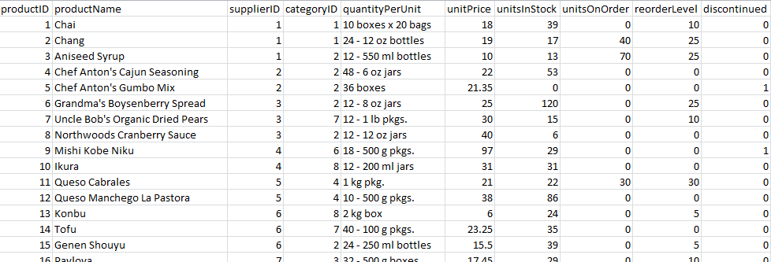{fig-align="center" style="max-height:250px;"}

:::

::: {#second-column}

| Variable Name | Variable Type |
|---|---|
| productName | |
| supplierID | |
| categoryID | |
| quantityPerUnit | |
| unitPrice | |
| unitsInStock | |

:::
::::

::: {#timer2_4 .timer seconds="120" starton="interaction"}
:::

## Guess Variable Type (2) {.smaller}

:::: {layout="[1.5,1]"}
::: {#first-column}

{fig-align="center" style="max-height:250px;"}

:::

::: {#second-column}

| Variable Name | Variable Type |
|---|---|
| productName | Categorical Nominal |
| supplierID | Categorical Nominal |
| categoryID | Categorical Nominal |
| quantityPerUnit | Categorical Nominal |
| unitPrice | Continuous |
| unitsInStock | Continuous |

:::
::::

# 5. Tableau

## What is Tableau? {.smaller}

Tableau Software is an interactive data visualization software company focused on business intelligence:

- Created in 2003
- Acquired by Salesforce 2019

Tableau is a set of different product which aims to create interactive data visualisation dashboard.

Among these product, you will find:

- **Tableau Prep** (dedicated to cleaning data - no use here)
- **Tableau Desktop** (the main software - not free but can be access with a student license)
- **Tableau Public** (exact same a Tableau Desktop but free and the only way to save your work is by publishing dashboard online)
- **Tableau Server & Tableau Online** (alternative to Tableau Desktop without local installation)

## How to Use Tableau Public

1. Go to <https://public.tableau.com>
2. Sign in
3. Enjoy full features of Tableau Desktop (except saving file, only public publication online)

{fig-align="center" style="max-height:330px;"}

::: {style="font-size:0.5em;text-align:center;"}
Source: How I Came to Choose One out of Sixty Two Data Visualizations [](https://www.doingdata.org/)
:::

## How to Use Tableau Public

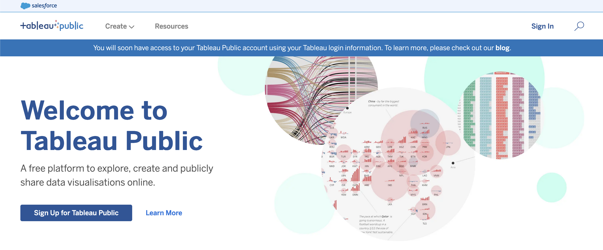

## How to Use Tableau Public

:::: {layout="[1,1]"}
::: {#first-column}

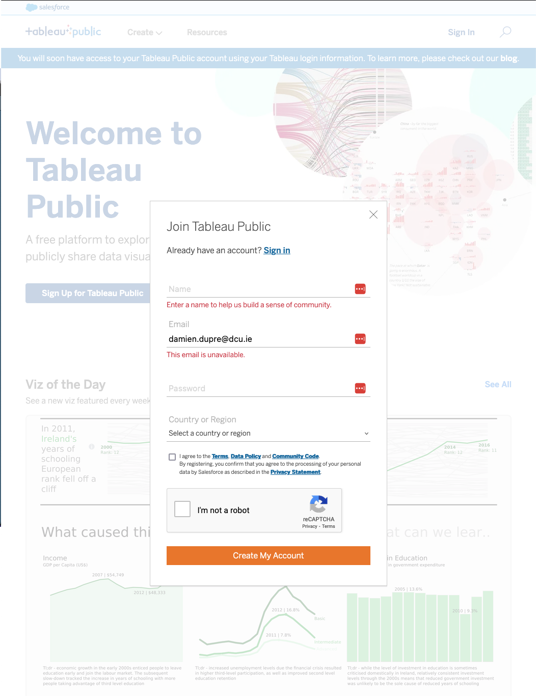{fig-align="center" style="max-height:600px;"}

:::

::: {#second-column}

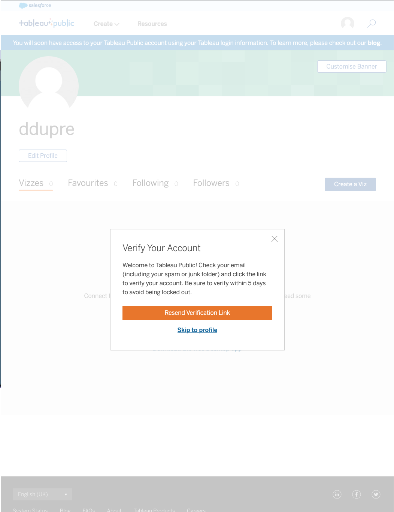{fig-align="center" style="max-height:600px;"}

:::
::::

## How to Use Tableau Public

:::: {layout="[1,1]"}
::: {#first-column}

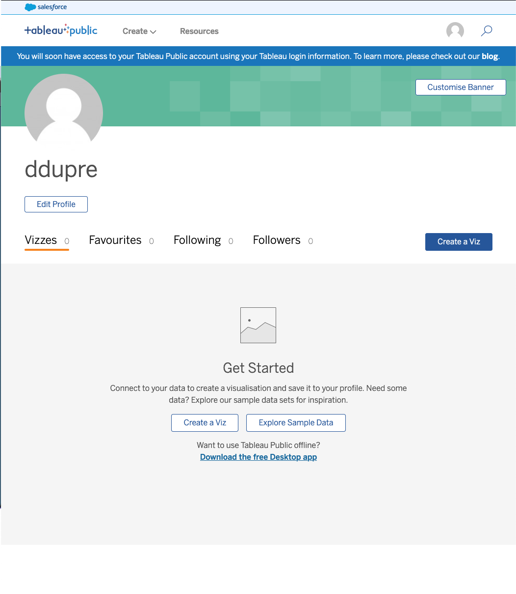{fig-align="center" style="max-height:600px;"}

:::

::: {#second-column}

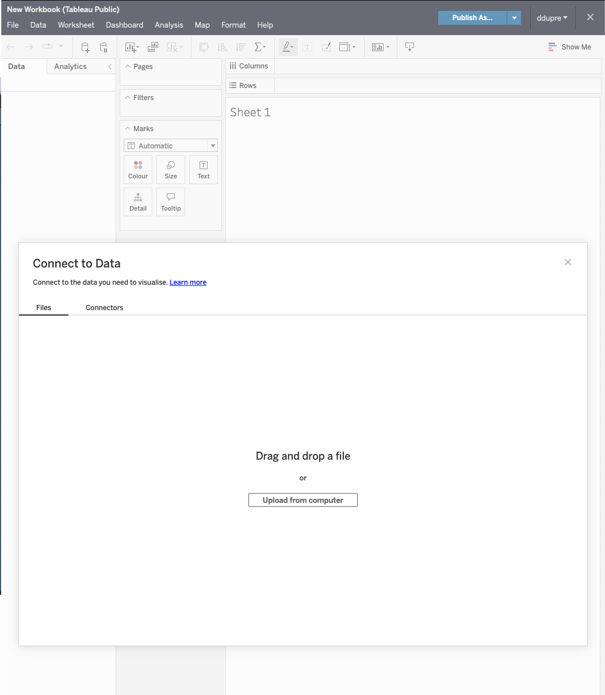{fig-align="center" style="max-height:600px;"}

:::
::::

## Tableau in a Nutshell

Tableau is very similar to Power BI but it actually simpler in its structure (but the visualisation capabilities are more complex):

There are 4 types of areas:

- **Data Source** is where you check the type of variables and where you can do basic transformations
- **Worksheet** is where you build each individual visualisation (1 worksheet per visualisation)
- **Dashboard** is where you combine all the visualisations in 1 interactive page
- **Story** is where you create interactive presentation with multiple slides (no use here)

## Tableau Data Source

:::: {layout="[1,1]"}
::: {#first-column}

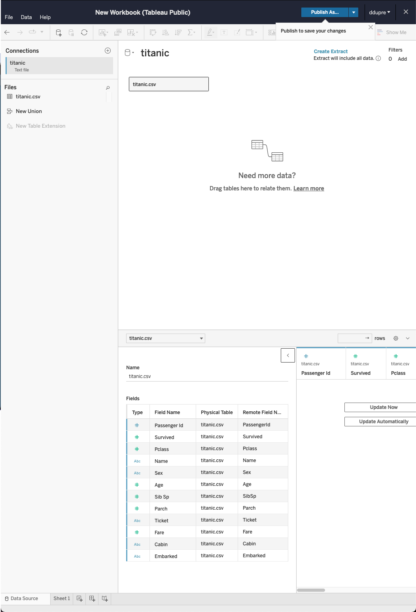{fig-align="center" style="max-height:600px;"}

:::

::: {#second-column}

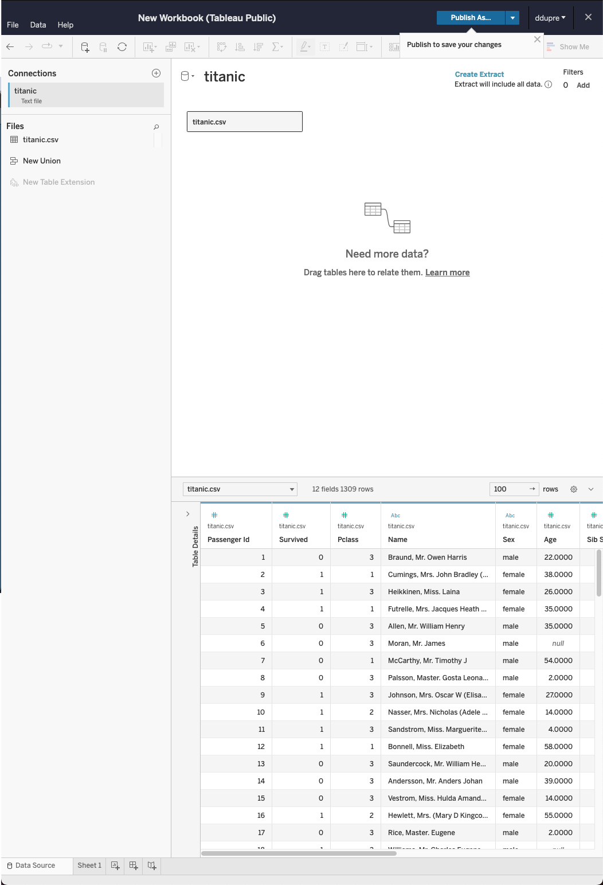{fig-align="center" style="max-height:600px;"}

:::
::::

## Tableau Worksheet

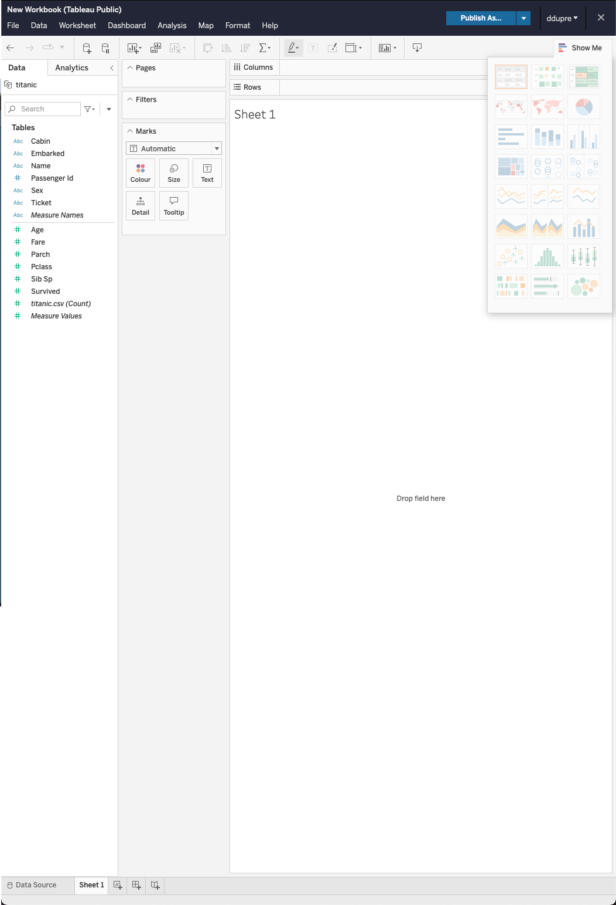{fig-align="center"}

## Tableau Dashboard and Story

:::: {layout="[1,1]"}
::: {#first-column}

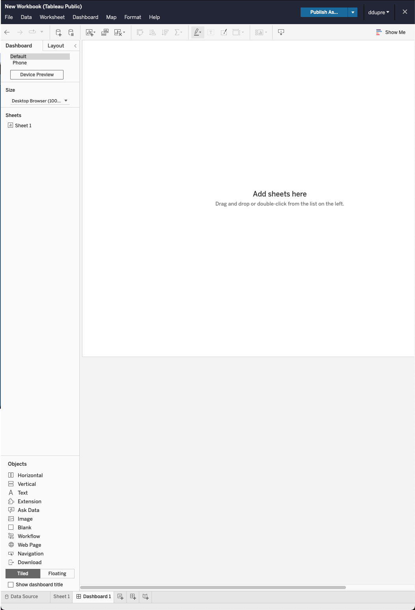{fig-align="center" style="max-height:600px;"}

:::

::: {#second-column}

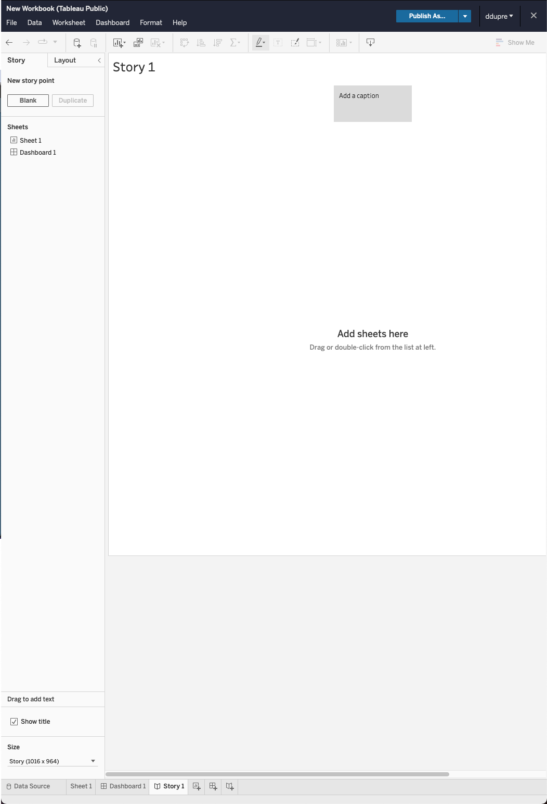{fig-align="center" style="max-height:600px;"}

:::
::::

## Principles

Tableau is only about:

- Dragging & dropping from variable list to plot (no-code software)
- Selecting the right data summary
- Creating independent figures and organising them on a page

{fig-align="center" style="max-height:300px;"}

## Files or Connectors? {.smaller}

Without being too complicated, there is two major ways to connect data in Tableau:

- From a File which won't be modified
- From a database through a connector (i.e., interface) to obtained data stored on a remote server (e.g., [Covid Dashboards](https://public.tableau.com/en-us/s/covid-19-viz-gallery))

**Files** can be of format .csv, .xls, .xlsx, .json, ...

**Databases** cloud hosted on google drive or with OData protocol (url access to the data)

. . .

:::: {layout="[1,1]"}
::: {#first-column}

[]{style="color:#2a78d6;"} More details about Tableau data connection possibilities with the following contents among others found online:

- [Connecting to Data Sources by Tableau](https://help.tableau.com/current/pro/desktop/en-us/data.htm)
- [Tableau Data Connections to Databases and Multiple Sources](https://www.guru99.com/tableau-data-connections.html)
- [Types of Tableau Data Sources with Connection Establishment Process](https://data-flair.training/blogs/tableau-data-sources/)

:::

::: {#second-column}

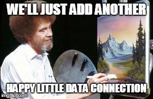

:::
::::

# Live Demo

## Your turn {background="#43464B"}

From the loop page, on the tile "Lecture Data", use the file `insta-data.csv`

1. Open it in Tableau Public (do not save it as .xlsx first)

2. Try to figure out how to create your first visualisation.

::: {#timer2_5 .timer seconds="300" starton="interaction"}
:::

# 6. Understand the Worksheet

## Variable List Tab

:::: {layout="[1,1]"}
::: {#first-column}

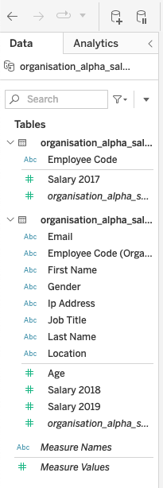{fig-align="center" style="max-height:600px;"}

:::

::: {#second-column}

**Dimensions = Categorical Variables**

- Made of character string (most of the time)
- Can be numeric if refers to an ID

**Measures = Continuous Variables**

- Made of numbers
- Special cases of **Measure Names**, and **Measure Values**

:::
::::

## Analytics Tab

:::: {layout="[1,1]"}
::: {#first-column}

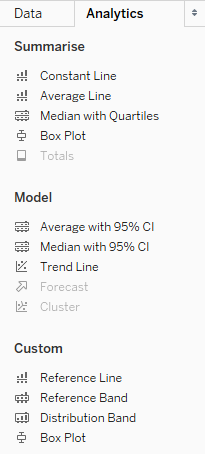{fig-align="center" style="max-height:600px;"}

:::

::: {#second-column}

Special features behind the Data Tab:

- Box Plot
- Median and Quartiles
- Average
- Regression Line (Trend Line)

:::
::::

## Plot Configuration {.smaller}

:::: {layout="[1,1]"}
::: {#first-column}

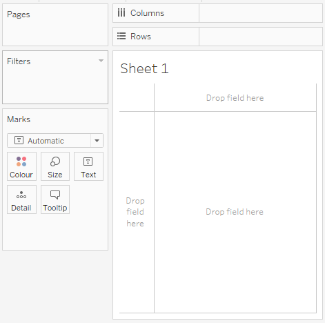{fig-align="center" style="max-height:600px;"}

:::

::: {#second-column}

Equivalent to Excel Pivot Table but for visualisations

- **Columns** = X axis
- **Rows** = Y axis
- **Pages** = 1 plot per values (categories)
- **Filters** = Keep specific values
- **Marks** = Design of representation
  - Colors
  - Size
  - Texts
  - ...

:::
::::

## Show Me: Additional Design

:::: {layout="[1,1]"}
::: {#first-column}

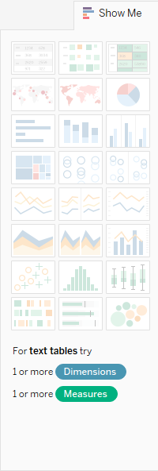{fig-align="center" style="max-height:600px;"}

:::

::: {#second-column}

- Tables
- Maps
- Histograms
- Pie charts
- Line charts
- Bar charts
- Scatterplots
- Box plots
- ...

:::
::::

## Aggregation Method

When a Measure (green pill) is in Rows or Columns, open its menu from the dropdown arrow, or with  right-click /  <kbd>⌃ Control</kbd> + click

:::: {layout="[1,1]"}
::: {#first-column}

Choose between:

- Dimensions (raw data, equivalent of "Don't summarize" in PowerBI)
- Measure (COUNT, AVERAGE, STD, ...)

:::

::: {#second-column}

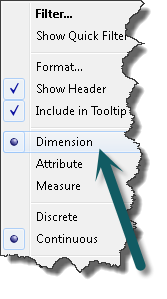

:::
::::

# Live Demo

## Your Turn {background="#43464B"}

With the `insta-data.csv` file, create:

- 1 worksheet with a bar chart using the variables `theme` and `likes`
- 1 worksheet with a line chart using `posted_at` and `impressions`
- 1 worksheet with a scatterplot using `likes` and `impressions`

**Then, create a dashboard with these visualisations an publish your dashboard.**

::: {#timer2_6 .timer seconds="420" starton="interaction"}
:::

## {background="#43464B"}

```{=html}
<style>img.circle {border-radius:50%;}</style>
```

:::: {layout="[1,1]"}
::: {#first-column}


:::
::: {#second-column}
**Thanks for your attention and don't hesitate to ask if you have any questions!**

[ @damien_dupre](https://datasci.social/@damien_dupre)

[ @damien-dupre](https://github.com/damien-dupre)

[ https://damien-dupre.github.io](https://damien-dupre.github.io)

[ damien.dupre@dcu.ie](mailto:damien.dupre@dcu.ie)
:::
::::