## Previously ...

You built four Tableau worksheets from `insta-data.csv`. Two of them reported an
average, and you were told the mean reach is 9,788 while the median is 5,184.

Today: when is an average a lie?

## Learning Outcomes

By the end of this lecture you will be able to:

- Plot a distribution before summarising it, and say why that order matters
- Choose an appropriate summary for a skewed, zero-inflated distribution
- Explain why mean session duration and mean order value mislead
- Report a distribution rather than a point estimate, in a sentence a client
  understands

# 1. Visualise Before You Summarise

## A Chart for Every Question {.smaller}

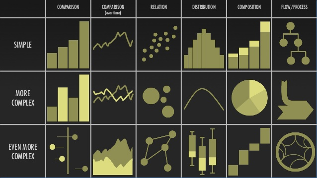{fig-align="center" height="370px"}

. . .

Four of those six columns are the whole of section 3, and the variables you have
choose the column for you: **1 categorical → composition. 1 continuous →
distribution. Categorical plus anything → comparison. 2 continuous →
relationship.**

# 3. The Four Families of Figure

## Composition: One Categorical Variable

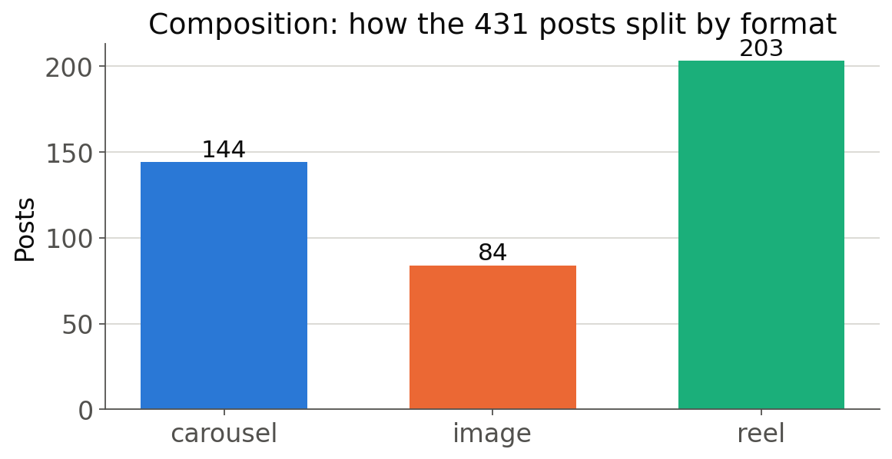{fig-align="center" height="380px"}

. . .

Counts, or the same bars as percentages. *What is this made of?*

## Distribution: One Continuous Variable

{fig-align="center" height="360px"}

. . .

*What do the values look like?* Here: **most posts reach nobody, and the mean
describes no post that ever existed.** Lecture 3 is about that gap.

## Comparison: Categorical and Continuous

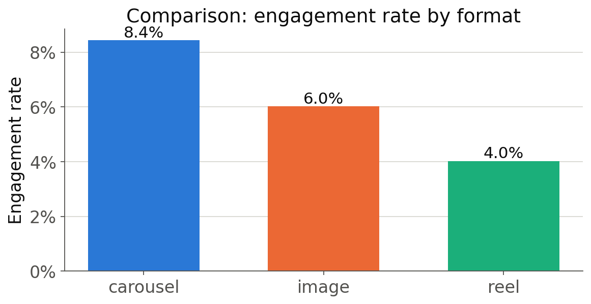{fig-align="center" height="380px"}

. . .

*Does this group differ from that one?* Hold on to this chart. It is wrong in a
way we cannot see yet, and Lecture 4 takes it apart.

## Relationship: Two Continuous Variables

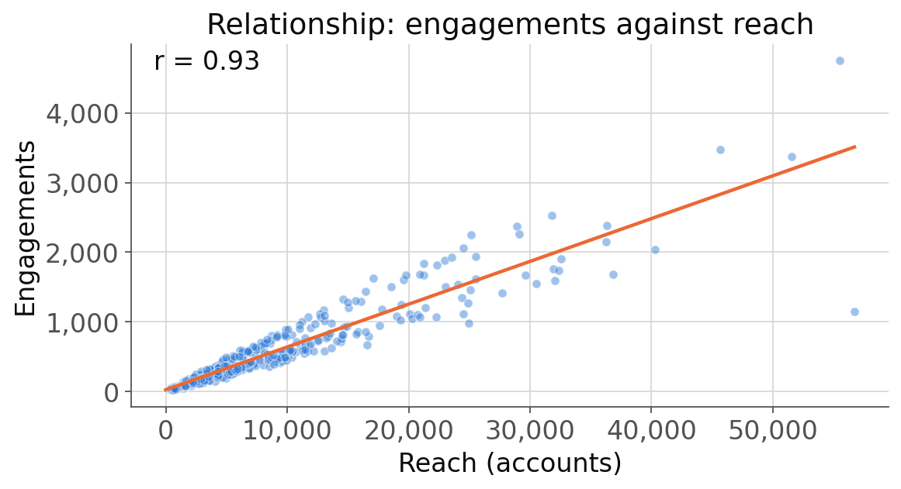{fig-align="center" height="380px"}

. . .

*Does one move with the other?* The scatterplot, and a line through it.

## What a Figure Throws Away {.smaller}

Every figure is an **aggregation**. Choosing one is choosing which summary the
reader sees, and everything else is discarded.

:::: {layout="[1,1]"}
::: {#first-column}

{height="215px"}

**Median** is the middle value; **Q1** and **Q3** cut the outer quarters. The gap
between them, the **interquartile range**, is what a box plot draws as its box.

:::

::: {#second-column}

{height="160px"}

**Correlation** is the slope of the best line, rescaled to run from -1 to +1.
Near zero rules out only a *straight* relationship, and never implies causation.

:::
::::

. . .

The others: **count**, **proportion**, and **mean with standard deviation**. A
large SD means the mean describes nobody.

## When Is a Pie Chart Acceptable? {.smaller}

:::: {layout="[1,1]"}
::: {#first-column}

{height="195px"}

**Two categories**, flat, directly labelled.

:::

::: {#second-column}

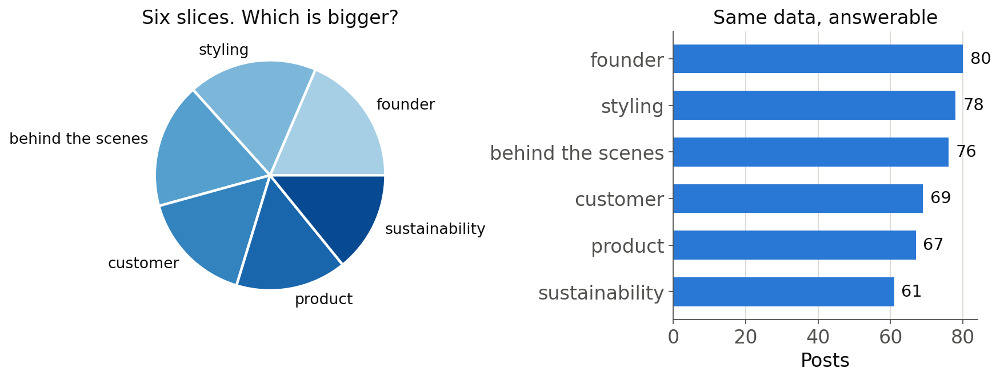{height="225px"}

:::
::::

. . .

Past two or three slices, human beings cannot compare angles, and the bar chart
answers in one second what the pie never answers at all.

# 4. Five Principles, and How Charts Lie

## Principle 1: Do Not Cheat With Axes {.smaller}

:::: {layout="[1,1,1]"}
::: {#first-column}

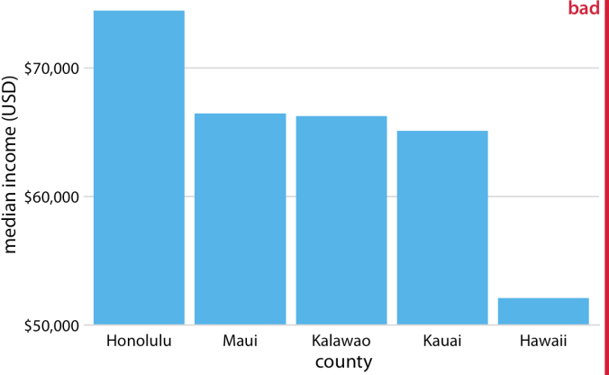{height="215px"}

:::

::: {#second-column}

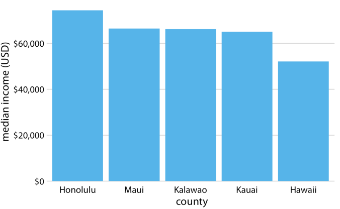{height="215px"}

:::

::: {#third-column}

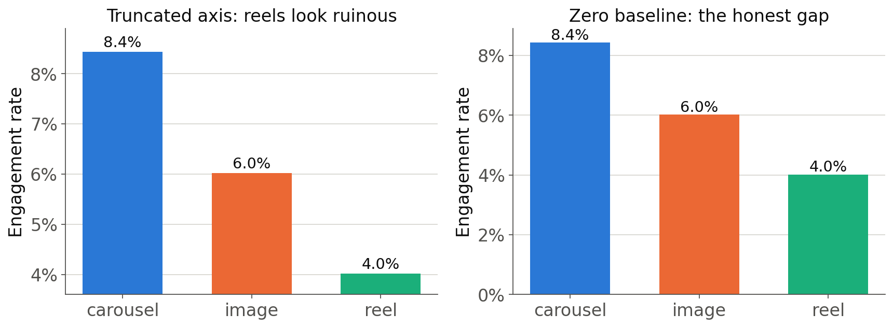{height="215px"}

:::
::::

. . .

**Include zero whenever zero is meaningful**, which for a count, a rate or a
proportion it always is. A truncated axis is legitimate for a temperature or a
stock index. Say so on the chart when you do it.

## Principle 2: Make It Easy to Read {.smaller}

:::: {layout="[1,1]"}
::: {#first-column}

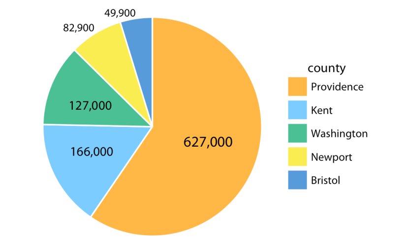{height="300px"}

:::

::: {#second-column}

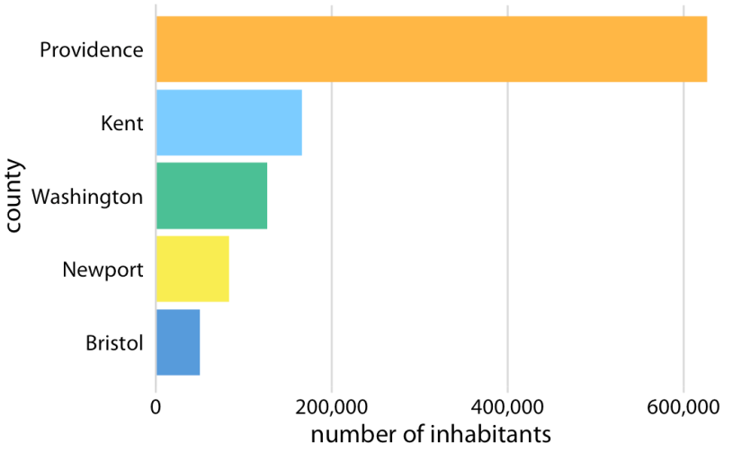{height="300px"}

:::
::::

. . .

Sort bars by value, not alphabetically. Horizontal bars when labels are long;
rotated text is a failure. Label directly rather than sending the eye to a legend
and back. **One idea per figure.**

## Principle 3: Be Fancy Only When It Helps {.smaller}

:::: {layout="[1,1]"}
::: {#first-column}

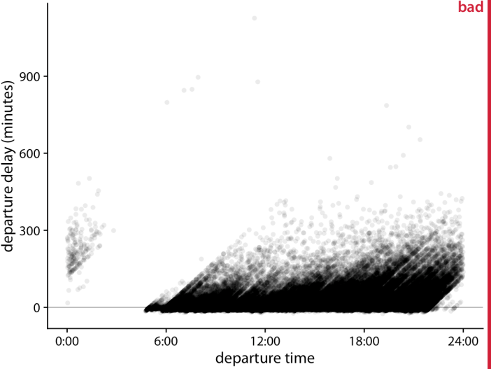{height="300px"}

:::

::: {#second-column}

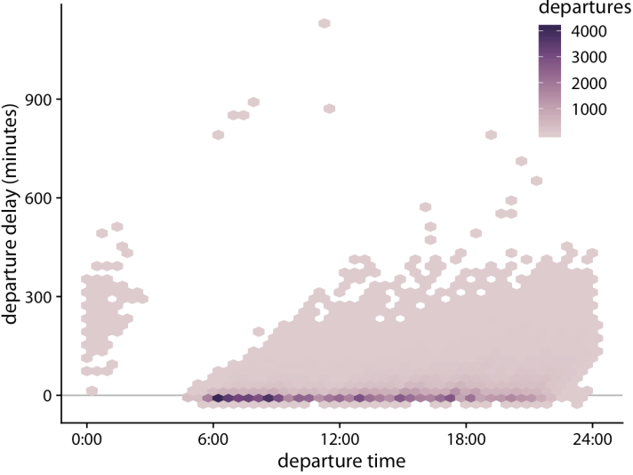{height="300px"}

:::
::::

. . .

Transparency when points pile up, jitter when values are rounded, small multiples
instead of eight colours. And the reverse: 3D bars, drop shadows and gradients
solve nothing. **Never use two y-axes.** Two measures, two charts.

## Principle 4: Colour Carries Meaning {.smaller}

:::: {layout="[1,1]"}
::: {#first-column}

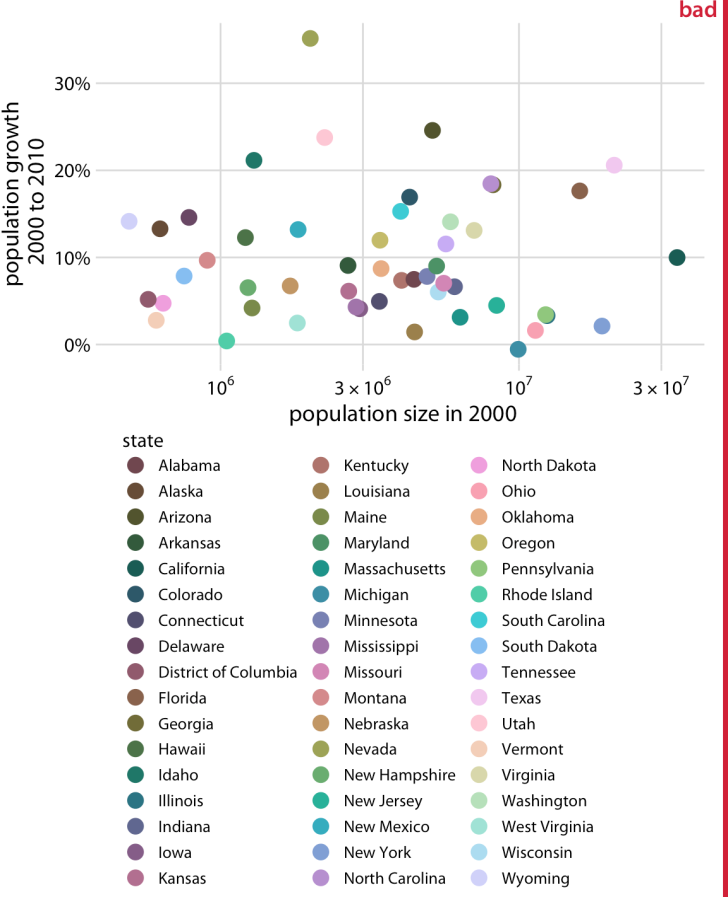{height="290px"}

:::

::: {#second-column}

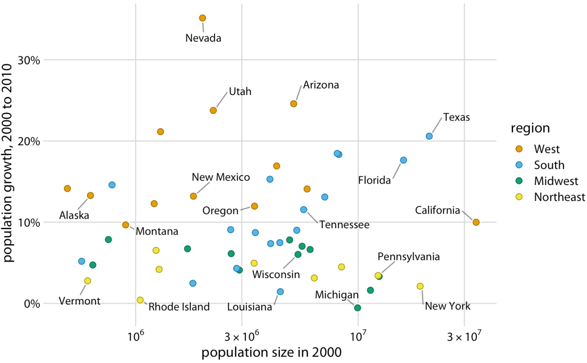{height="290px"}

:::
::::

. . .

Fifty-one colours and a legend is not a colour scheme. **Cut to a handful of
groups and label them on the chart.** Keep the same colour for the same thing
across a dashboard, use one hue light to dark for ordered data, never a rainbow,
and check the palette: around 1 man in 12 cannot separate red from green.

## Principle 5: The Details Are the Work {.smaller}

:::: {layout="[1,1]"}
::: {#first-column}

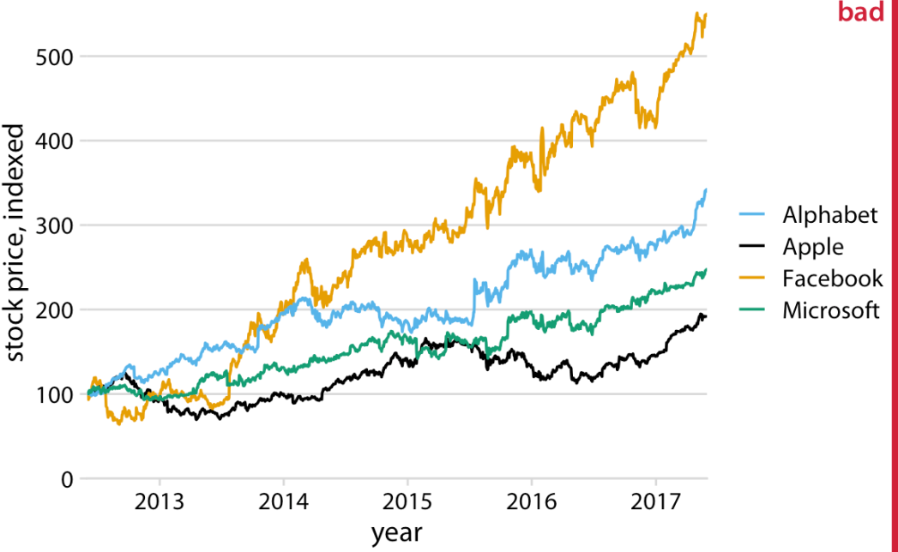{height="280px"}

:::

::: {#second-column}

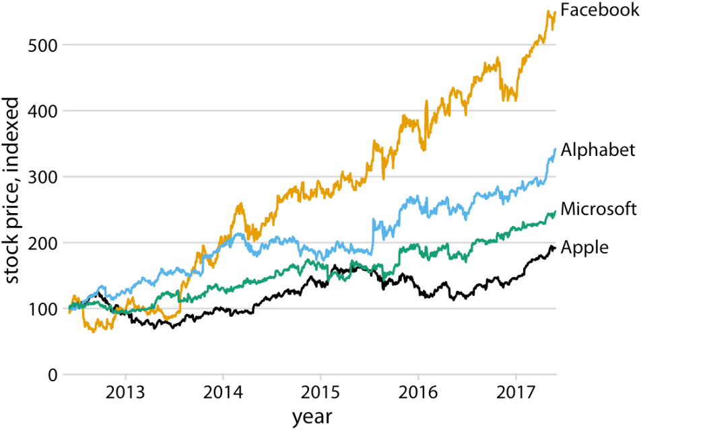{height="280px"}

:::
::::

. . .

A legend makes the reader do work the chart should have done. **Label the line
at its end.** Then the rest: units on every axis, thousands separators, sensible
precision (`10.4%`, never `10.4056%`), a title that **states the finding**, and
the **sample size** somewhere, because a 40% rate on five posts is not a rate.

## Exercise 3: What Is Wrong Here? {background="#43464B" .smaller}

:::: {layout="[1,1]"}
::: {#first-column}

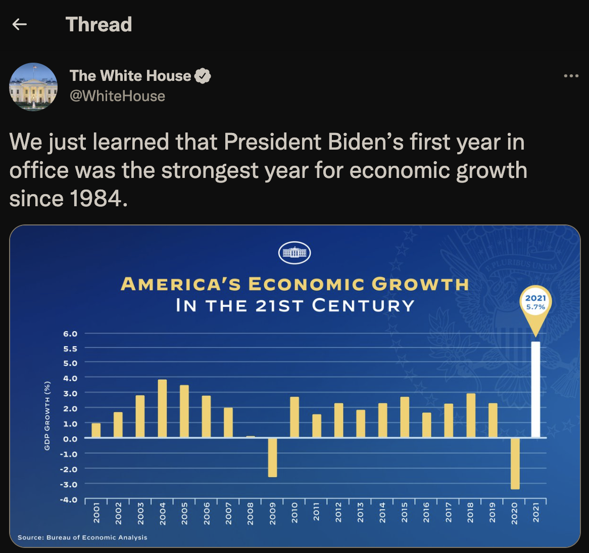{height="400px"}

:::

::: {#second-column}

**Find four faults. Then write the sentence this chart should have reported.**

::: {.fragment}
- The claim says *since 1984*; the chart starts at **2001**
- One bar is white and the rest yellow, encoding **nothing but the conclusion**
- 2020 was a pandemic collapse, so 2021 is a **rebound**, not growth
- No definition of "economic growth", and no comparison to trend
:::

:::
::::

::: {style="font-size:0.5em;"}
Source: @WhiteHouse on Twitter
:::

::: {#timer3 .timer seconds="420"}
:::

## Same Summary, Different Data

Four datasets. Identical means, identical standard deviations, identical
correlation, identical regression line.

. . .

Plotted, they are a line, a curve, a line with one outlier, and a star.

. . .

This is Anscombe's quartet (1973), and its modern descendant, the *Datasaurus
Dozen* (Matejka and Fitzmaurice, 2017), which produces a dinosaur with the same
summary statistics as a cloud of noise.

::: {.callout-note appearance="minimal"}
If summary statistics cannot distinguish a dinosaur from a cloud, what exactly
are you claiming when you report a mean and stop?
:::

<!-- Speaker notes: show the Autodesk animation if the room has network. It
     morphs one dataset through twelve shapes while the summary statistics stay
     fixed on screen. Nothing else makes the point as fast. -->

## Four Datasets, One Regression Line {.smaller}

 (CC BY 4.0)](./figures/external/mgt100_same_stats_different_graphs.png){fig-align="center" height="255px"}

*Identical means, identical variances, identical fitted line. Only one of these
is a linear relationship.*

## The Rule

**Plot the distribution before you compute a summary of it.**

. . .

Not as a courtesy to the audience. As a check on yourself. The most common use
of a chart is private: an analyst looking at a variable for the first time.

. . .

A junior analyst who reports a mean without having seen the histogram is telling
you something about their process, and it is not good news.

## What You Are Looking For

When the histogram appears, four questions:

1. **Where is the mass?** One lump, two, or a long tail?
2. **Where is the floor?** How much of the data sits at or near zero?
3. **What is the ceiling?** Is something capping the values artificially?
4. **What is on the far right?** One customer, or a broken row?

::: {.callout-note appearance="minimal"}
On a portfolio site, the far right of the session-duration distribution is
usually you, with the tab left open. Is that a data error or a real session?
Who decides, and where do you write the decision down?
:::

# 2. The Shape of Marketing Data

## Right-Skewed and Zero-Inflated Is the Normal Case

<!-- Speaker notes: nearly every marketing quantity is right-skewed and
     zero-inflated. This is not an edge case, it is the normal case, and the
     statistics they were taught assumed the opposite. -->

| Quantity | Shape | Spike at zero because |
|---|---|---|
| Session duration | Right-skewed | Bounces are recorded as 0s |
| Order value | Right-skewed | Most sessions buy nothing |
| Pages per session | Right-skewed | One page and gone |
| Time to conversion | Right-skewed | Most never convert |
| Revenue per user | Extreme | A handful of customers are most of it |

. . .

**The normal distribution is the exception in marketing, not the default.**

## The 5 Percent Who Are the Business

In consumer categories where spending is heavily skewed, a small share of
customers generates most of the revenue, and a small share can generate negative
revenue.

. . .

Published work on online gambling operators found roughly **3% of customers
generating half of net revenue**, and the top 5% of winners costing operators
around a fifth of it.

. . .

A mean computed over that distribution describes nobody, and hides both ends.

::: {.callout-note appearance="minimal"}
If your revenue is that concentrated, what does "the average customer" mean as a
planning object? What would you report instead to someone setting next
quarter's budget?
:::

## The Shape of Almost Every Marketing Dataset {.smaller}

 (CC BY 4.0)](./figures/external/mgt100_revenue_by_customer_rank.png){fig-align="center" height="340px"}

*Cumulative revenue by customer percentile. The mean of this distribution
describes nobody.*

# 3. Which Summary, When

## Mean, Median, Mode {.smaller}

:::: {layout="[1,1,1]"}
::: {#first-column}

**Mean**

Sum divided by count.

Uses every value, including the one broken row.

Right for: totals, budgets, anything you will multiply by a count.

:::

::: {#second-column}

**Median**

The middle value.

Ignores how extreme the extremes are.

Right for: "what does a typical session look like".

:::

::: {#third-column}

**Mode**

The most common value.

On marketing data it is usually zero, which is often the finding.

:::
::::

. . .

**The decision rule**: if you will multiply the summary by a count to get a
total, you need the mean. For everything else on skewed data, start with the
median.

## Spread

**Standard deviation** assumes a symmetric distribution and is dragged by
outliers, in the same direction and for the same reason as the mean.

. . .

**Interquartile range** (p25 to p75) survives them. It is the middle half of
your data, and it is what you should quote alongside a median.

. . .

On a right-skewed variable, reporting mean ± SD produces a lower bound below
zero for a quantity that cannot be negative. That is the distribution telling
you the summary is wrong.

## Percentiles as the Marketer's Default {.smaller}

> "Average session duration is 2m14s."

versus

> "Half of our sessions end within 20 seconds. One in ten lasts more than four
> minutes."

. . .

The second is the same data, is harder to argue with, and suggests a different
action.

. . .

**Build the p50 / p90 habit.** Two numbers, no distributional assumptions, and
a client can picture both.

::: {.callout-note appearance="minimal"}
Which of those two sentences would a client be more likely to repeat correctly
to someone else? Does that matter?
:::

## The Bounce Problem {.smaller}

A bounced session is recorded with duration 0. Bounces are typically the largest
single group in the data.

. . .

So mean session duration is mostly a measure of **how many people left
immediately**, wearing the costume of a measure of engagement.

. . .

:::: {layout="[1,1]"}
::: {#first-column}

**All sessions**

n = 500, 320 of them bounces

Mean duration: 41s

:::

::: {#second-column}

**Engaged sessions only**

n = 180

Mean duration: 114s

:::
::::

. . .

Neither number is wrong. Reporting one without saying which is.

## Honest Summary: Five Rules

1. Plot it before you summarise it
2. Report a count next to every rate and every average
3. On skewed data, lead with the median and give the spread
4. Say which rows the summary is computed over
5. If the summary would change a decision, show the distribution it came from

::: {.callout-note appearance="minimal"}
Rule 2 is the one that gets dropped under time pressure. Why is a rate without
its denominator worse than no number at all?
:::

# 4. Doing It in Tableau

## Live Demo {background="#43464B"}

1. Histogram of session duration, bin width chosen badly, then chosen well
2. The same data as a box plot; find the whisker rule Tableau used
3. Median line on a weekly time series, with the mean line on top of it, and the
   gap between them narrated
4. Filter out bounces, watch every number move, and write the caveat that now
   has to travel with the chart

## Exercise {background="#43464B"}

Using your own data:

1. Plot the distribution of session duration
2. Report the mean and the median side by side, with n
3. Report p50 and p90
4. Write one sentence explaining the gap between mean and median to a
   non-analyst
5. Decide which number you would put in a client report, and defend it in
   writing

**20 minutes**

# 5. AI as a Statistical Critic

## AI This Block: Chat with context

Where we are on the module's AI spine, set out in Lecture 1 and named properly
in Lecture 12:

> **Chat with context**

## Ask It to Argue Against Your Summary

Assistants are markedly better at criticising a choice than at making one. A
critique is a well-defined task with a large literature behind it. Choosing a
summary requires knowing what the number is for, which is the part it cannot
see.

. . .

> "I reported mean session duration as 2m14s to a client. Argue that this number
> is misleading, using the distribution I have attached. Then tell me what you
> would need to know about the business before recommending a replacement."

## Where It Will Mislead You

- It will suggest a test without checking the test's assumptions
- It will not know that your zero-duration sessions are bounces, unless you say
  so, and it will not ask
- It will not tell you your sample is too small unless you ask directly
- It will produce a confident sentence about a distribution it has seen twenty
  rows of

. . .

**All four are failures of context, not of capability.** Supplying the context
is the analyst's job, and it is the job it cannot take from you.

## Exercise {background="#43464B"}

1. Attach your session duration distribution
2. Ask it to argue against reporting the mean
3. Ask what it would need to know before recommending a summary
4. Note which of its points you had already made yourself, and which one you had
   not
5. Note one point it made that is wrong about *your* site, and why it could not
   have known

**10 minutes**

## Going Further

- Anscombe (1973), *Graphs in Statistical Analysis* — four pages, still the best
  four pages on this
- Matejka and Fitzmaurice (2017), *Same Stats, Different Graphs* — the
  Datasaurus, with the method for generating it
- Tufte, *The Visual Display of Quantitative Information*, ch. 1 — "show the
  data", which is this lecture in three words

## Next Lecture

Back to Tableau, with calculated fields, and the first breakdowns that combine
two variables at once.

**Prepare**: bring your four worksheets from Lecture 2, and the `campaign`
column of `insta-data.csv`. All of its values, including the blank ones.
