## Previously ...

- In Lecture 2 we opened `insta-data.csv`, cleaned and transformed data, and identified the **type of each variable**: categorical or continuous.

- We also met **Tableau**: Data Source, Worksheet and Dashboard, with **Dimensions** for categorical variables and **Measures** for continuous ones.

**Today it is time to look at the data: which figure for which variables, and how to build it in Tableau.**

## Why Use Figures?

Data visualisations are important:

- For the **analyst**, to **understand** what is going on in the data (errors, unexpected values, analyses to run)
- For the **reader**, to access the message and **be convinced**: a report tells a story, and each figure supports it

[]{style="color:#e34948;"} Figures can also lie or mislead: use them with ethics and professionalism.

# 1. The Key Figures

## What Would You Like to Show?

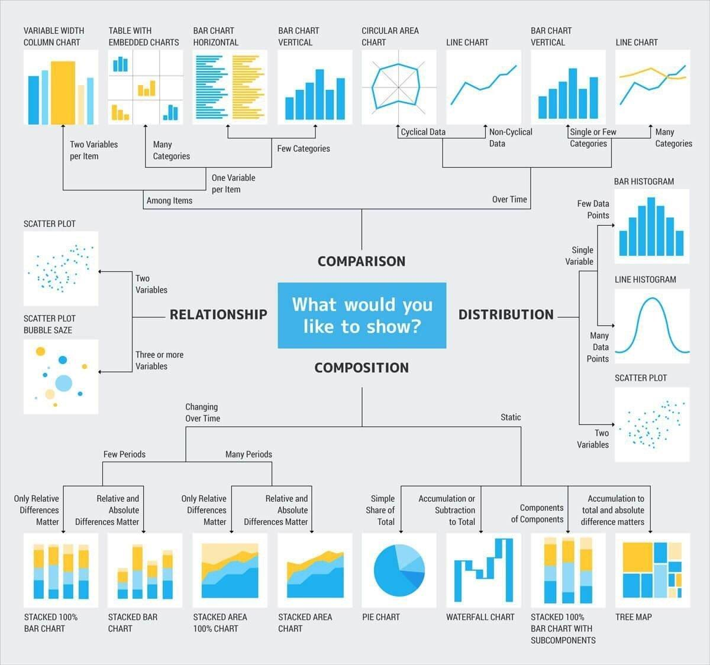{fig-align="center" style="max-height:470px;"}

::: {style="font-size:0.5em;text-align:center;"}
Based on Andrew Abela's Chart Chooser: start from the question, not from the chart
:::

## Keep Your Figures Clear and Self-Explanatory

:::: {layout="[1,1]"}
::: {#first-column}

#### 1. Clear

Complex figures should be crystal clear: use design features (colours, sizes, ...) to make them clear

#### 2. Self-Explanatory

Always use a title, a legend and well-defined axes

:::

::: {#second-column}

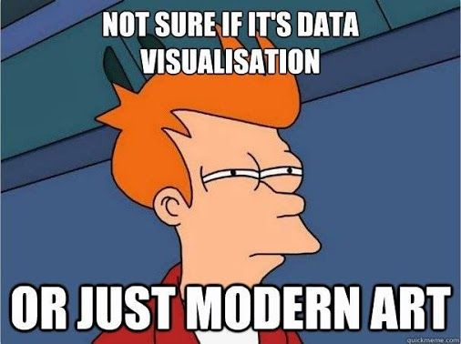{fig-align="center"}

::: {style="font-size:0.5em;text-align:center;"}
Source: www.venngage.com [](https://venngage-wordpress.s3.amazonaws.com/uploads/2020/06/image17.png)
:::

:::
::::

## Figures Aggregate Data

A figure **aggregates** data into information with basic statistical calculations

:::: {layout="[1,1.6]"}
::: {#first-column}

| Student | Group | Mark |
|---|---|---|
| S1 | A | 60 |
| S2 | B | 70 |
| S3 | A | 60 |
| S4 | B | 55 |
| S5 | A | 65 |
| S6 | B | 65 |
| S7 | A | 65 |

:::

::: {#second-column}

**Count**
: A = 4, B = 3

**Proportion**
: A = 57%, B = 43%

**Density**
: 55 = 14%, 60 = 29%, 65 = 43%, 70 = 14%

**Median and quartiles**
: Q1 = 60, Median = 65, Q3 = 65

**Mean and Standard Deviation**
: Mean = 62.9, SD = 4.9

:::
::::

## Zoom on Median and Quartiles

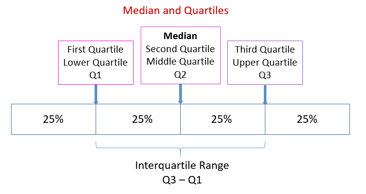{fig-align="center" style="max-height:255px;"}

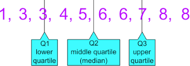{fig-align="center" style="max-height:105px;"}

Sort the values, then cut them into four groups of equal size. The **interquartile range** (IQR = Q3 - Q1) holds the middle 50% of the data.

## Zoom on the Box Plot

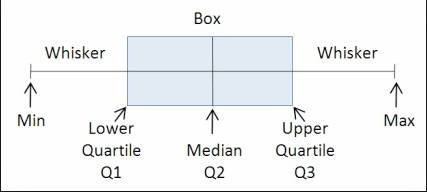{fig-align="center" style="max-height:250px;"}

- The **box** runs from Q1 to Q3, and the line inside is the **median**
- The **whiskers** stop at the most extreme values within 1.5 × IQR of the box
- Anything further away is drawn as a **dot**: a possible outlier

## Zoom on Mean and Standard Deviation

- **Mean** (or average) is the sum of all the values divided by their number
- **Standard deviation** (SD) is the typical distance to the mean: the square root of the average squared distance

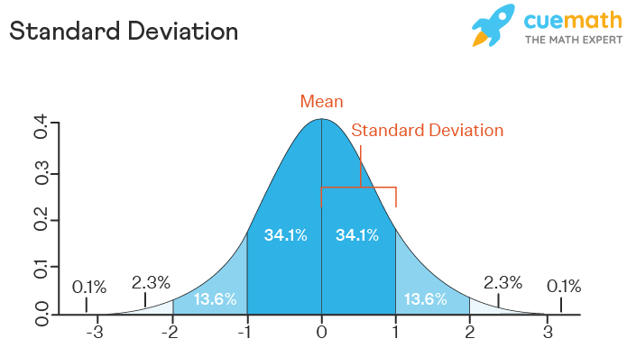{fig-align="center" style="max-height:300px;"}

::: {style="font-size:0.5em;text-align:center;"}
Source: Cuemath [](https://d138zd1ktt9iqe.cloudfront.net/media/seo_landing_files/standard-deviation-1626765925.png)
:::

## Zoom on Regression

The line that best fits the points of two continuous variables is a **regression line**: **Y = b₀ + b₁X + e**

:::: {layout="[1,1]"}
::: {#first-column}

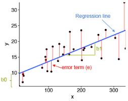{fig-align="center" style="width:100%; max-height:400px;"}

:::

::: {#second-column}

- **b₀** is the **intercept**: the value of Y when X is 0
- **b₁** is the **slope**: how much Y changes when X increases by 1
- **e** is the **error** (or residual): the distance between each point and the line

:::
::::

## Zoom on Correlation

The **correlation** (r) is the slope of the regression line once both variables are on the same scale. It measures how closely the points follow a straight line, **from -1 to +1**:

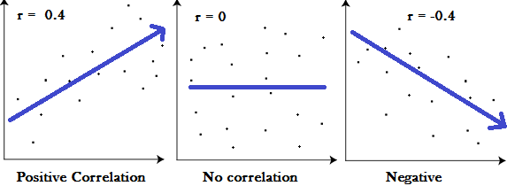{fig-align="center" style="width:100%; max-height:400px;"}

## Which Figure for Which Variables?

```{dot}
//| echo: false
//| fig-width: 11
//| fig-height: 6
digraph figures {
  graph [rankdir = LR, bgcolor = "transparent", nodesep = 0.35, ranksep = 0.7]
  node [shape = box, style = "rounded,filled", fillcolor = "#ffffff", color = "#23373b",
        fontname = "Helvetica", fontsize = 16, penwidth = 1.5, margin = "0.25,0.12"]
  edge [color = "#23373b", penwidth = 1.3, arrowsize = 0.8]
  vars [label = "Variable(s)\nto analyse"]
  cat [label = "Categorical"]
  con [label = "Continuous"]
  mix [label = "Categorical + Categorical\nCategorical + Continuous"]
  two [label = "Continuous + Continuous"]
  node [fillcolor = "#23373b", fontcolor = "#fafafa"]
  composition [label = "COMPOSITION"]
  distribution [label = "DISTRIBUTION"]
  comparison [label = "COMPARISON"]
  relationship [label = "RELATIONSHIP"]
  vars -> cat -> composition
  vars -> con -> distribution
  vars -> mix -> comparison
  vars -> two -> relationship
}
```

. . .

In Tableau, **categorical = Dimension** and **continuous = Measure**.

##  Your Turn! {background="#43464B"}

### Which family of figures?

| Variable(s) in `insta-data.csv` | Family |
|---|---|
| `format` | |
| `reach` | |
| `format` and `reach` | |
| `format` and `is_paid` | |
| `impressions` and `likes` | |
| `theme` | |

::: {#timer3_1 .timer seconds="120" starton="interaction"}
:::

## Which Family of Figures?

| Variable(s) in `insta-data.csv` | Family | Figure |
|---|---|---|
| `format` | Composition | Bar chart |
| `reach` | Distribution | Histogram, box plot |
| `format` and `reach` | Comparison | Box plots |
| `format` and `is_paid` | Comparison | Stacked bars |
| `impressions` and `likes` | Relationship | Scatterplot |
| `theme` | Composition | Bar chart, not a pie |

# 2. The Four Families on Loomrow

## Composition Figures

Count of the different categories

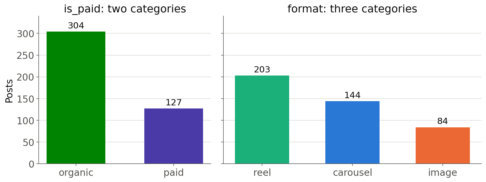{fig-align="center" style="max-height:440px;"}

## Composition Figures

Proportion of the different categories

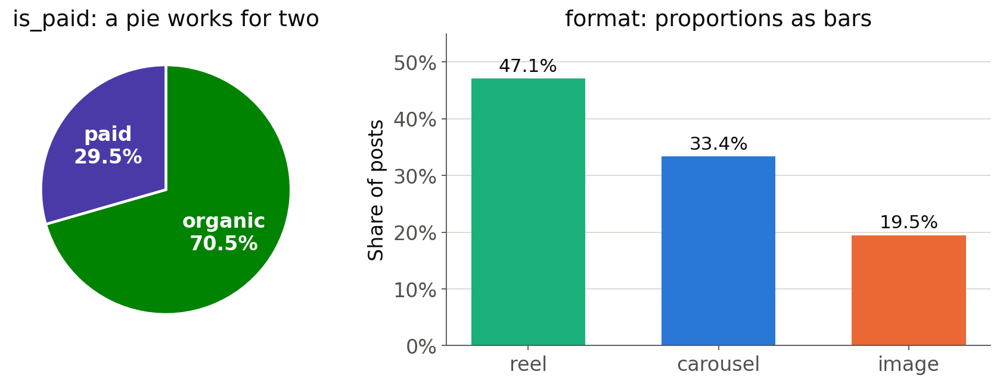{fig-align="center" style="max-height:440px;"}

## When to Use a Pie Chart?

:::: {layout="[1,1]"}
::: {#first-column}

Only when the variable has **two categories**

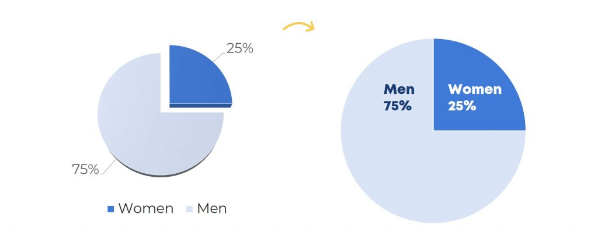

:::

::: {#second-column}

::: {.fragment}
With more categories, use a **bar chart**

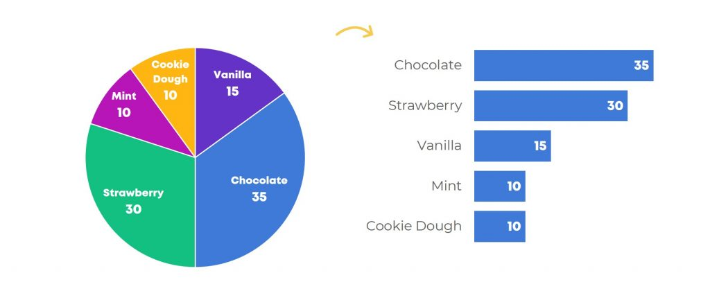
:::

:::
::::

::: {style="font-size:0.5em;text-align:center;"}
Source: Depict Data Studio [](https://depictdatastudio.com/when-pie-charts-are-okay-seriously-guidelines-for-using-pie-and-donut-charts/)
:::

## When to Use a Pie Chart?

Here is a pie chart that works:

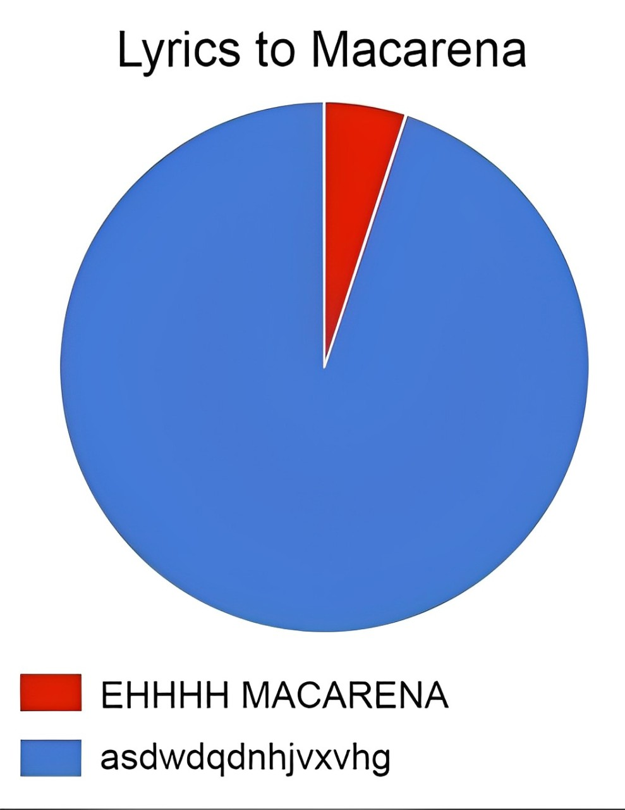{fig-align="center" style="max-height:470px;"}

## Distribution Figures

Four figures of one continuous variable, `reach`

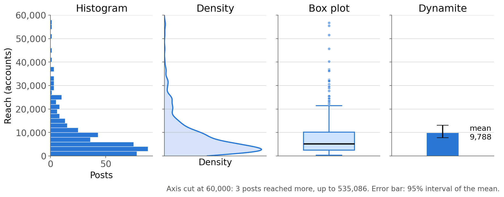{fig-align="center" style="max-height:360px;"}

. . .

Each figure keeps something and throws the rest away: the dynamite keeps **only the mean**.

## Mean or Median? {.smaller}

:::: {layout="[1.7,1]"}
::: {#first-column}

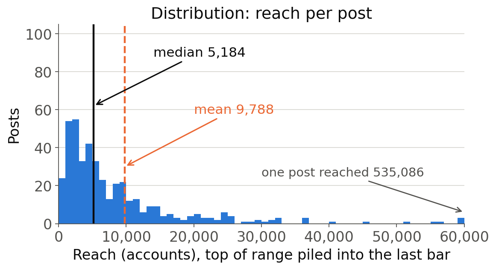{fig-align="center"}

:::

::: {#second-column}

Reach is **right-skewed**: most posts reach a few thousand accounts, a few reach tens of thousands, and **one reel reached 535,086**.

The **mean (9,788)** is pulled towards that tail. The **median (5,184)** is the typical post.

::: {.fragment}
Mean ± SD = 9,788 ± 27,748: a range that goes **below zero**, for a count that cannot be negative.
:::

:::
::::

## Comparison Figures

Two categorical variables: `format` and `is_paid`

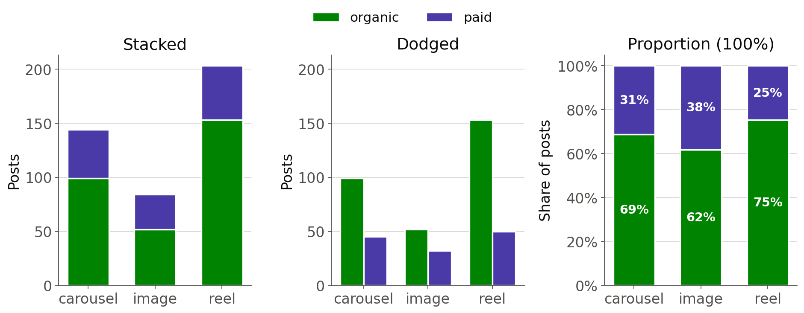{fig-align="center" style="max-height:430px;"}

## Comparison Figures

A categorical and a continuous variable: `format` and `reach`

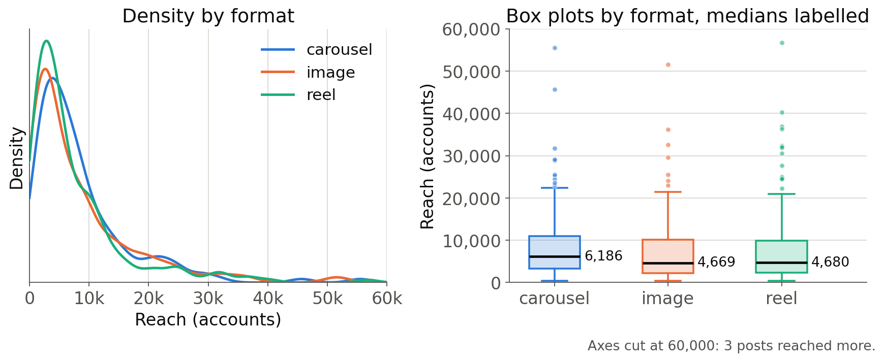{fig-align="center" style="max-height:430px;"}

## Relationship Figures

Two continuous variables: `impressions` and `likes`

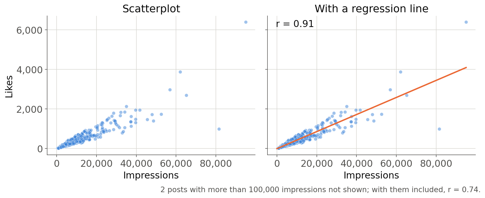{fig-align="center" style="max-height:430px;"}

## Relationship Figures

Adding a categorical variable: one panel per `format`, same axes

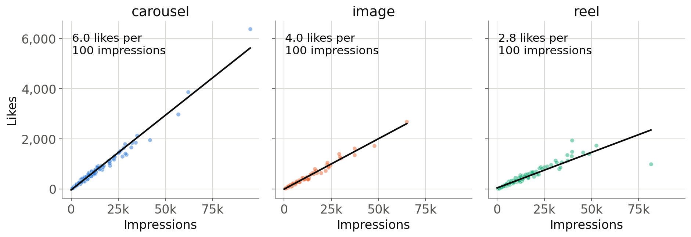{fig-align="center" style="max-height:390px;"}

. . .

For the same impressions, carousels earn about 6 likes per 100 impressions and reels fewer than 3.

# 3. The Key Figures in Tableau

## Variable Types and Tableau Figures

:::: {layout="[1,2.4]"}
::: {#first-column}

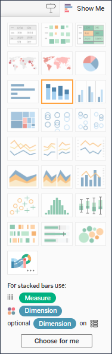{fig-align="center" style="max-height:500px;"}

:::

::: {#second-column}

A family of figures for each type of variable:

- **Composition**: 1 Dimension
- **Distribution**: 1 Measure
- **Comparison**: 2 Dimensions, or 1 Dimension and 1 Measure
- **Relationship**: 2 Measures

**Show Me** highlights the figures they allow, it also explicitely indicate what combinaison of **Dimension** and **Measure** is needed.

:::
::::

## Composition in Tableau {.smaller}

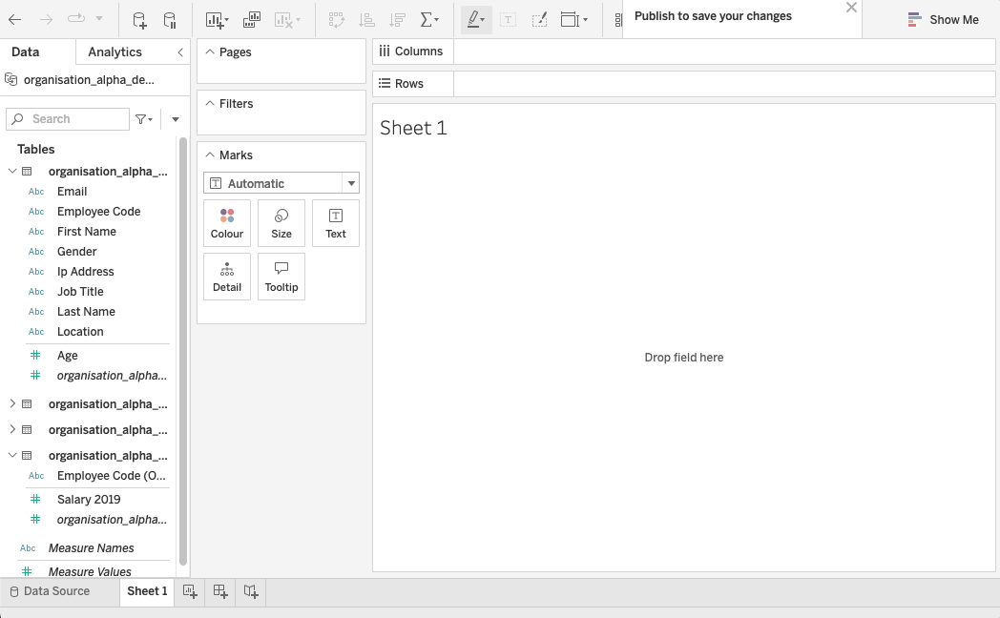{fig-align="center" style="max-height:395px;"}

A Dimension on **Columns** and the count field on **Rows**. For percentages, open the menu of the count pill (click its arrow, or  right-click /  <kbd>⌃ Control</kbd> + click) → **Quick Table Calculation** → **Percent of Total**.

::: {style="font-size:0.7em;text-align:center;"}
The recordings in this section use another dataset: the clicks are the same with `insta-data.csv`.
:::

## Composition in Tableau: Pie Chart {.smaller}

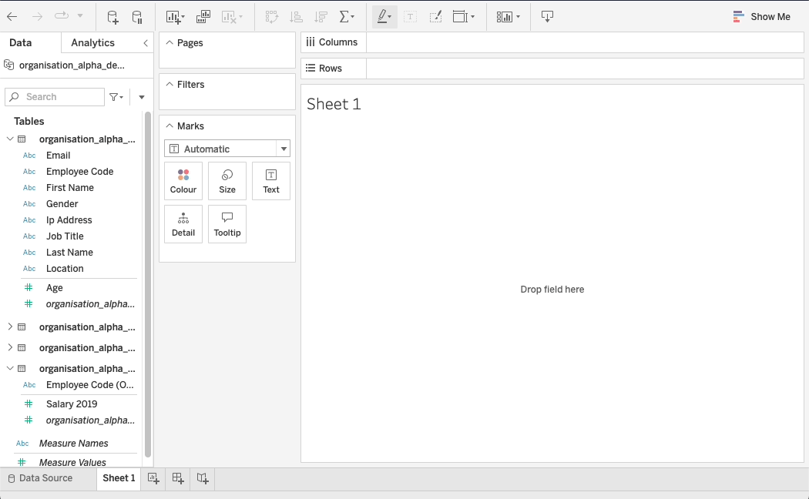{fig-align="center" style="max-height:450px;"}

Only for variables with **two categories**: the Dimension on **Columns**, the count on **Rows**, then **Show Me** → pie chart.

## Distribution in Tableau

:::: {layout="[1.5,1]"}
::: {#first-column}

Tableau does not draw every distribution figure:

- **Histogram**: yes, with Show Me
- **Density**: no density curve out of the box
- **Box plot**: yes, with Show Me or the Analytics pane
- **Dynamite**: an average bar, but no error bars

:::

::: {#second-column}

{fig-align="center"}

:::
::::

## Distribution in Tableau: Histogram {.smaller}

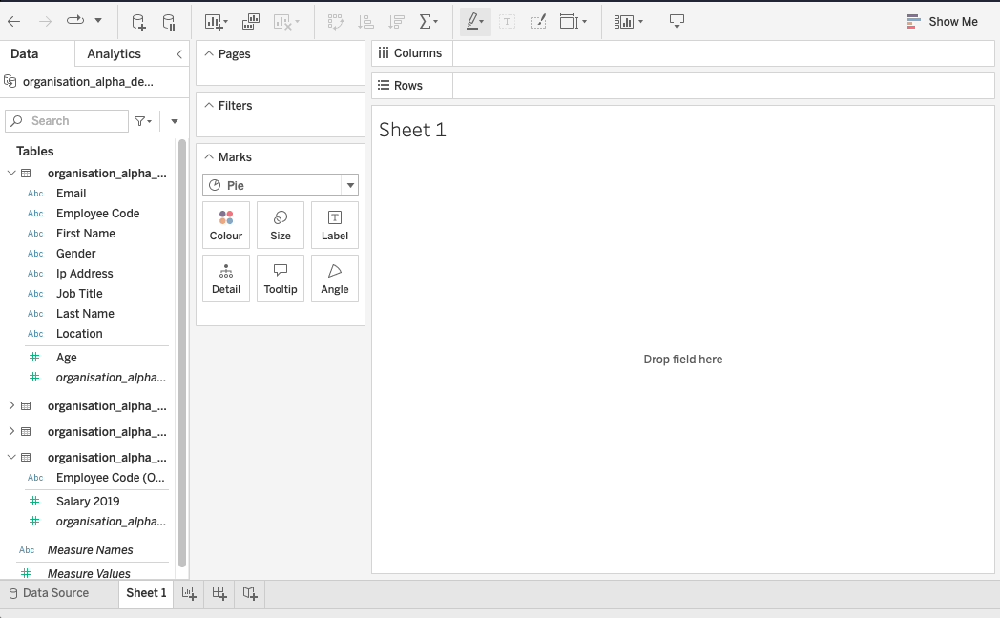{fig-align="center" style="max-height:430px;"}

- A Measure on **Rows**, then **Show Me** → histogram. 

- Tableau creates a new field, `variable (bin)`: to change the width of the bars, open its menu → **Edit**.

## Distribution in Tableau: Box Plot {.smaller}

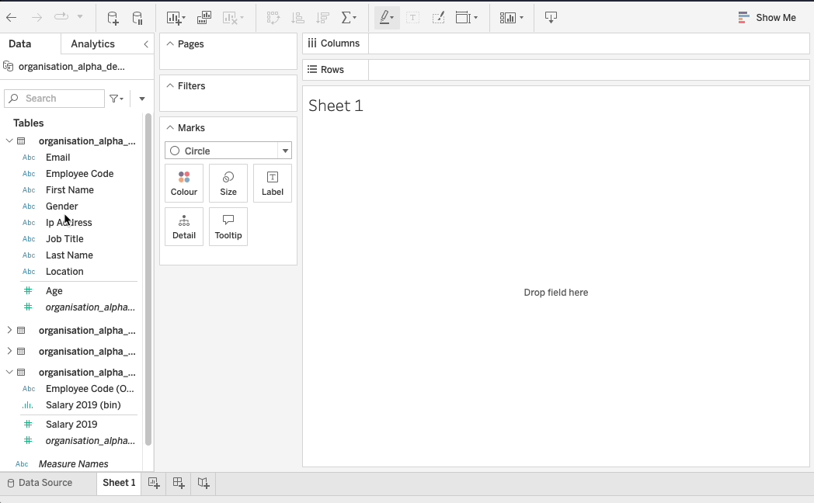{fig-align="center" style="max-height:430px;"}

- A Measure on **Rows**, then **Show Me** → box-plot
- Use dimension to display all the values and the 2 whiskers.

## Distribution in Tableau: Average Bar {.smaller}

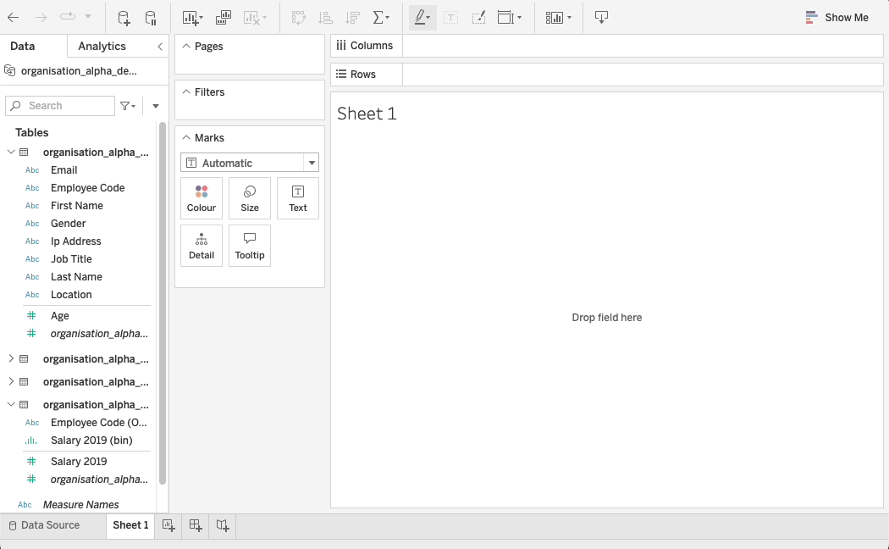{fig-align="center" style="max-height:430px;"}

- A Measure on **Rows** is a **SUM** by default: open its menu → **Measure** → **Average**. 
- Alternatively, the same menu offers **Median** if needed.

##  Your Turn! {background="#43464B"}

### Composition and distribution in Tableau

With `insta-data.csv`, one worksheet each:

1. Posts per `format`: count, then percent of total
2. A pie chart of `is_paid`
3. A histogram of `reach`: where are most posts?
4. A box plot of `reach`, `post_id` on Detail: which post is the highest dot?
5. `reach` as an **Average**, then as a **Median**: which would you report?

::: {#timer3_2 .timer seconds="600" starton="interaction"}
:::

## Comparison in Tableau {.smaller}

Add a Dimension on **Colour**, **Columns** or **Rows** to any of the previous figures: bar or pie charts with the count, histograms, box plots, bar charts with the average.

:::: {layout="[1,1]"}
::: {#first-column}

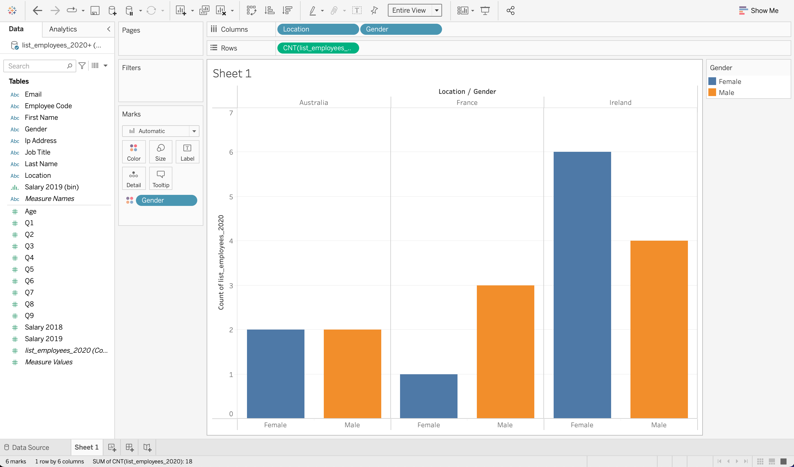

:::

::: {#second-column}

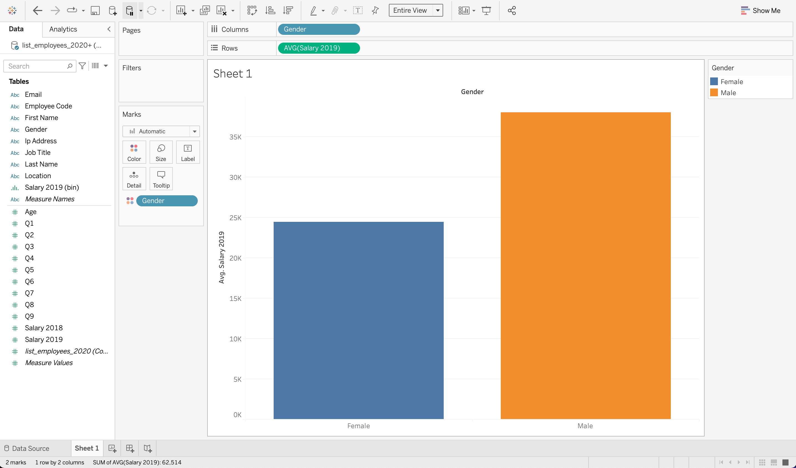

:::
::::

## Comparison in Tableau: Multiple Bars {.smaller}

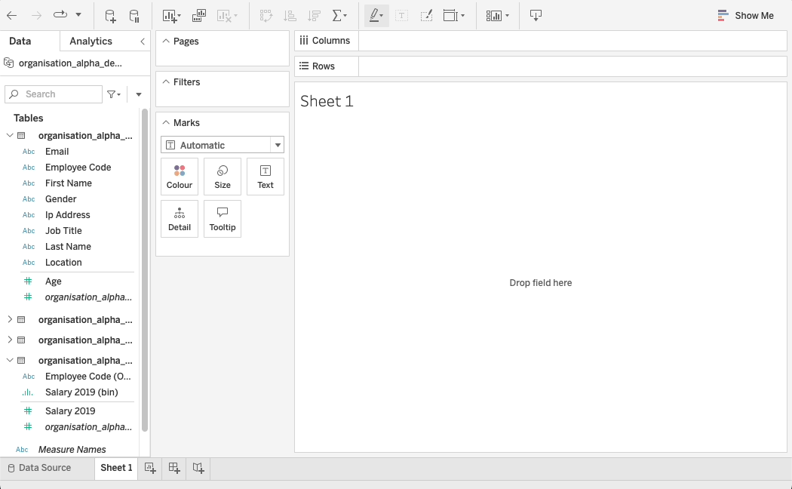{fig-align="center" style="max-height:450px;"}

A second Dimension on **Columns** puts the bars side by side; on **Colour**, it tells the groups apart.

## Comparing Distributions in Tableau {.smaller}

:::: {layout="[1,1]"}
::: {#first-column}

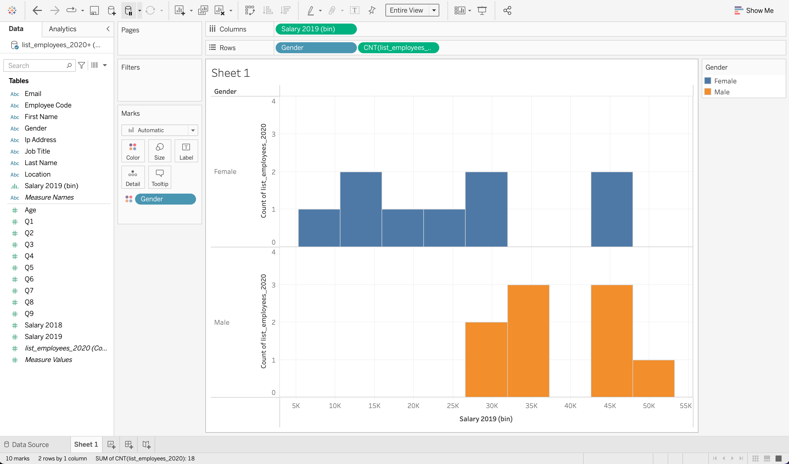

A Dimension on **Rows**: one histogram per group

:::

::: {#second-column}

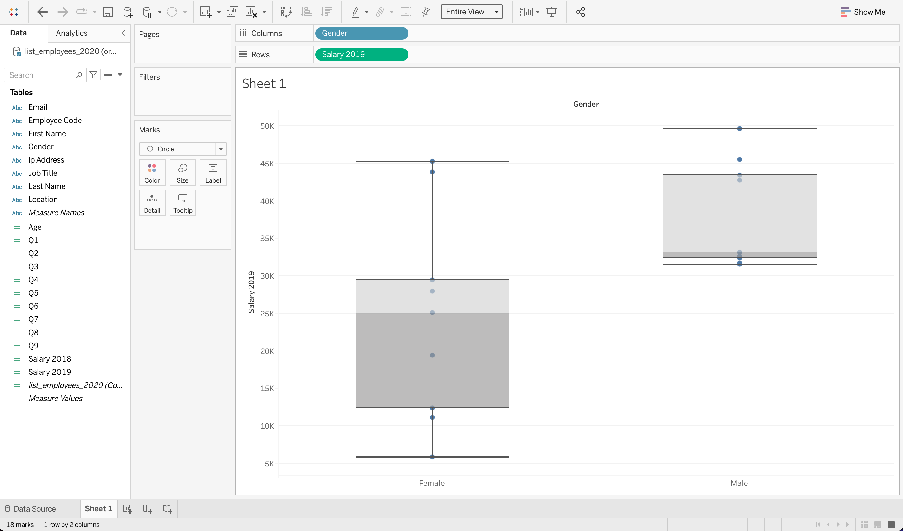

A Dimension on **Columns**: one box per group

:::
::::

## Relationship in Tableau {.smaller}

The scatterplot is the best way to show the relationship between **2 Measures**, but:

- switch both from the default **SUM** to **Dimension** (pill menu), or Tableau draws a single dot for the sum of everything
- add a **Trend Line** from the **Analytics** pane

:::: {layout="[1,1]"}
::: {#first-column}

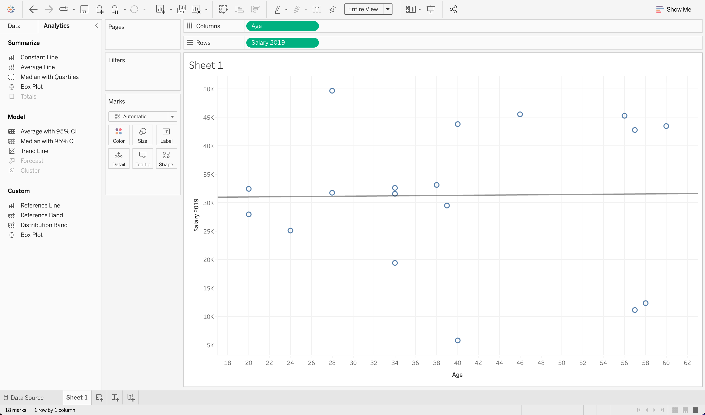

:::

::: {#second-column}

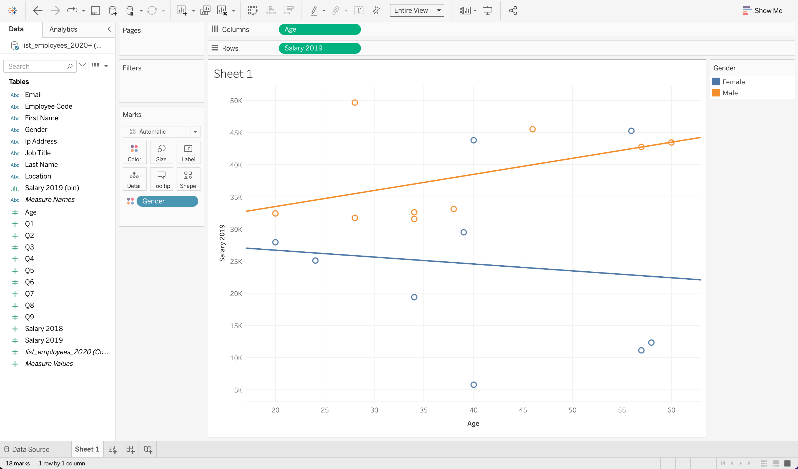

:::
::::

## Relationship in Tableau: Scatterplot {.smaller}

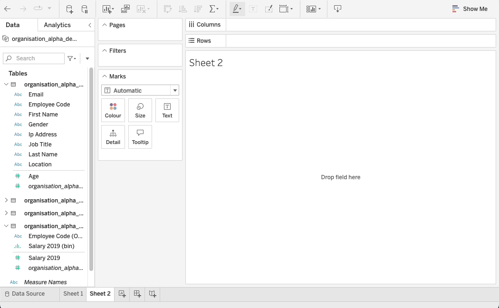{fig-align="center" style="max-height:430px;"}

Two Measures on **Columns** and **Rows**, each switched to **Dimension**. **Analytics** pane → **Trend Line** → Linear. A Dimension on **Colour** gives one line per group: hover a line to read its R² and p-value.

##  Your Turn! {background="#43464B"}

### Comparison and relationship in Tableau

1. Number of posts per `format`, with `is_paid` on **Colour**
2. Box plots of `reach` by `format`: which format has the highest median?
3. Average `reach` by `format`: which format wins now, and why?
4. A scatterplot of `impressions` against `likes` with a trend line, then `format` on **Colour**: which format earns the most likes per impression?

Save the workbook to your Tableau Public profile: Lecture 4 turns these sheets into a dashboard.

::: {#timer3_3 .timer seconds="600" starton="interaction"}
:::

## {background="#43464B"}

```{=html}
<style>img.circle {border-radius:50%;}</style>
```

:::: {layout="[1,1]"}
::: {#first-column}


:::
::: {#second-column}
**Thanks for your attention and don't hesitate to ask if you have any questions!**

[ @damien_dupre](https://datasci.social/@damien_dupre)

[ @damien-dupre](https://github.com/damien-dupre)

[ https://damien-dupre.github.io](https://damien-dupre.github.io)

[ damien.dupre@dcu.ie](mailto:damien.dupre@dcu.ie)
:::
::::
