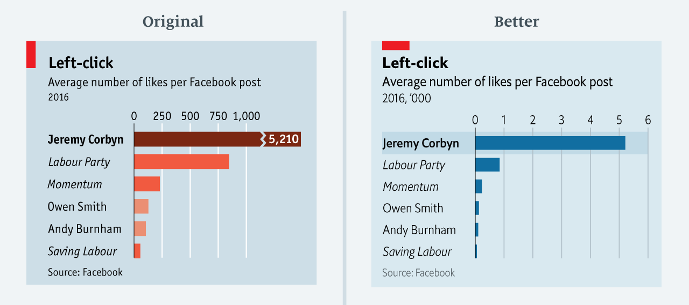
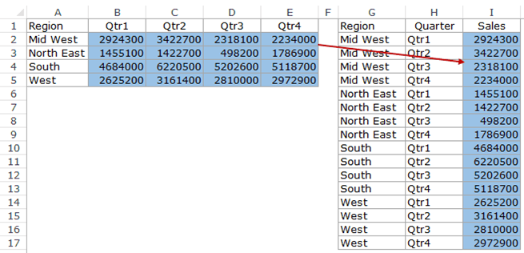

## Previously ...

- In Lecture 3 we matched each question to a family of figures (composition, distribution, comparison, relationship) and built each family in Tableau with `insta-data.csv`.

**Today: make figures clear and honest, spot the misleading ones, then prepare the table behind them in Tableau: pivot it, add calculated fields, and merge it with a second file.**

# 1. Customise your Figures

## Customise Figures

:::: {layout="[1,1.5]"}
::: {#first-column}

- Colours
- Size of the dots
- Shapes
- Position (stack or dodge)
- Orientation (vertical or horizontal)
- Text content and font
- Figure legend

:::

::: {#second-column}

{fig-align="center"}

:::
::::

## Use Figures

Use figures only if they are self-explanatory, help to understand your message (a figure is not a message)

**Don't duplicate the information**

- Always give the key information in the text of your report, but
- don't show a table and a figure with the same information

**Tell a story! Build a narrative around your figures**

- A set of observations, facts or events, presented in an order that creates a reaction in the audience
- Even if you think data are boring, make them interesting for your audience

## Fundamentals of Data Visualization

:::: {layout="[1.4,1]"}
::: {#first-column}

**Fundamentals of Data Visualization** by Claus O. Wilke

Free online at [clauswilke.com/dataviz](https://clauswilke.com/dataviz/)

It sets out the basic principles of data visualisation. The next slides take five of them, each shown as a **bad** figure next to a better one.

:::

::: {#second-column}

{fig-align="center"}

:::
::::

## Principle 1: Axes

::: {.center}
**Don't cheat with axes: include 0 when 0 is meaningful**
:::

:::: {layout="[1,1]"}
::: {#first-column}


:::

::: {#second-column}


:::
::::

A bar shows its value with its **length**, so it has to start at zero.

## Principle 1: Axes

::: {.center}
**A shaded area shows its value too: it also starts at 0**
:::

:::: {layout="[1,1]"}
::: {#first-column}


:::

::: {#second-column}


:::
::::

To zoom in on small changes, drop the shading and keep the line.

## Principle 1: Axes

::: {.center}
**Panels you compare must share the same axis**
:::

:::: {layout="[1,1]"}
::: {#first-column}


:::

::: {#second-column}


:::
::::

With its own axis in each panel, a 2-point change looks as big as a 10-point one.

## Principle 2: Make It Easy

::: {.center}
**Make your figure easy to read and to understand**
:::

:::: {layout="[1,1]"}
::: {#first-column}


:::

::: {#second-column}


:::
::::

The same five numbers: sorted bars let you compare Kent and Washington at a glance.

## Principle 3: Be Fancy

::: {.center}
**Use extra features when they help, such as transparency and jitter**
:::

:::: {layout="[1,1]"}
::: {#first-column}


:::

::: {#second-column}


:::
::::

When points pile up, even transparency is not enough: count them in small hexagons instead.

## Principle 3: Be Fancy

::: {.center}
**Use extra features when they help, such as transparency and jitter**
:::

:::: {layout="[1,1]"}
::: {#first-column}


:::

::: {#second-column}


:::
::::

Transparency and a little jitter reveal the points hidden behind each other.

## Principle 4: Colours

::: {.center}
**Use colours, but not too many**
:::

:::: {layout="[1,1]"}
::: {#first-column}


:::

::: {#second-column}


:::
::::

51 colours need a legend nobody can read: group them, and label the points that matter.

## Principle 4: Colours

::: {.center}
**Keep the same colours for the same variables**
:::

:::: {layout="[1,1]"}
::: {#first-column}


:::

::: {#second-column}


:::
::::

And check the palette for colour-blind readers: about 1 man in 12 cannot tell red from green.

## Principle 5: Details

::: {.center}
**Every detail counts, and lazy work is easily spotted**
:::

:::: {layout="[1,1]"}
::: {#first-column}


:::

::: {#second-column}


:::
::::

Label the lines directly: a legend sends the eye back and forth, here in a different order from the lines.

## Principle 5: Details

:::: {layout="[1.3,1]"}
::: {#first-column}


:::

::: {#second-column}

**Be precise, and use the title, axes and captions to do it:**

- a title and a subtitle that state the finding
- axis titles with their units
- labels on the few points worth naming
- sensible precision: 10.4%, not 10.4056%
- the data source

:::
::::

##  Your Turn! {background="#43464B"}

### What's wrong here?

For each of the next charts find what is wrong

## What's Wrong Here? {.smaller}

{fig-align="center" style="max-height:430px;"}

::: {.fragment}
**Principle 1.** The axis starts at 34%, so a rise from 35% to 39.6% is drawn as a bar more than five times taller.
:::

::: {style="font-size:0.7em;text-align:center;"}
Source: Misleading Graphs in Real Life [](https://www.statisticshowto.com/probability-and-statistics/descriptive-statistics/misleading-graphs/)
:::

## What's Wrong Here? {.smaller}

{fig-align="center" style="max-height:430px;"}

::: {.fragment}
**Principle 1.** The steps of the axis are uneven (30, 60, 90, 100, 130, 160, 190, 240, 250, 300, ...): equal distances do not mean equal numbers, and the growth looks steadier than it was.
:::

::: {style="font-size:0.7em;text-align:center;"}
Source: The Worst Covid-19 Misleading Graphs [](https://www.datasciencecentral.com/the-worst-covid-19-misleading-graphs/)
:::

## What's Wrong Here? {.smaller}

{fig-align="center" style="max-height:430px;"}

::: {.fragment}
**Principle 1.** Each panel has its own scale, so Gutiérrez's 19% is drawn higher than Petro's 37%. And December, January and March are equally spaced, although February is missing.
:::

## What's Wrong Here? {.smaller}

{fig-align="center" style="max-height:430px;"}

::: {.fragment}
**Principles 2 and 3.** A pie shows the parts of one whole, but these slices add up to 193%, and the 3D tilt distorts their sizes.
:::

::: {style="font-size:0.7em;text-align:center;"}
Source: The statisticians at Fox News use classic and novel graphical techniques to lead with data [](https://simplystatistics.org/posts/2012-11-26-the-statisticians-at-fox-news-use-classic-and-novel-graphical-techniques-to-lead-with-data/)
:::

## What's Wrong Here? {.smaller}

{fig-align="center" style="max-height:430px;"}

::: {.fragment}
**Principles 4 and 5.** The rainbow colours mean nothing, and three bars are labelled 336 with three different heights: 2020 and 2021 are drawn taller than the 382 of 2016.
:::

::: {style="font-size:0.7em;text-align:center;"}
Source: KCRA graph on the 7pm news, r/Sacramento [](https://www.reddit.com/r/Sacramento/comments/tysyxz/kcra_graph_on_the_7pm_news/)
:::

## What's Wrong Here? {.smaller}

:::: {layout="[1,1]"}
::: {#first-column}


:::

::: {#second-column}

::: {.fragment}

:::

:::
::::

::: {.fragment}
**Principle 5.** The last point, 8.6%, is drawn at the level of 9.0%. Placed correctly (right), November is the largest change of the year.
:::

## What's Wrong Here? {.smaller}

{fig-align="center" style="max-height:330px;"}

::: {.fragment}
**Relationship is not causation.** Two series that move together need not be linked: Nicolas Cage films do not drown people. The two y-axes (Principle 1) also let you make any two lines look alike.
:::

::: {style="font-size:0.7em;text-align:center;"}
Source: Nick Cage Movies Vs. Drownings, and More Strange (but Spurious) Correlations [](https://www.nationalgeographic.com/science/article/nick-cage-movies-vs-drownings-and-more-strange-but-spurious-correlations)
:::

## Land Doesn't Vote, People Do {.smaller}

:::: {layout="[1,1]"}
::: {#first-column}


:::

::: {#second-column}
::: {.fragment}

:::
:::
::::
::: {.fragment}
A county map colours **land**. Turn each county into a circle sized by its number of voters and the same result tells a very different story.

::: {style="font-size:0.7em;text-align:center;"}
Sources: Fact checking Trump's 'Impeach this' map [](https://edition.cnn.com/2019/10/01/politics/trump-impeach-this-map-fact-check/index.html) and Land Doesn't Vote, People Do [](https://demcastusa.com/2019/11/11/land-doesnt-vote-people-do-this-electoral-map-tells-the-real-story/)
:::
:::
## A Must Read {.smaller}

**"Mistakes, we've drawn a few"**: The Economist learning from its own errors in data visualisation

{fig-align="center" style="max-height:370px;"}

The original breaks Jeremy Corbyn's bar to fit it on the axis, so 5,210 likes is drawn only a little longer than the Labour Party's bar (Principle 1). The better version gives every bar the same scale, in thousands.

::: {style="font-size:0.7em;text-align:center;"}
Source: Mistakes, we've drawn a few, The Economist on Medium [](https://medium.economist.com/mistakes-weve-drawn-a-few-8cdd8a42d368)
:::

##  Your Turn! {background="#43464B" .smaller}

### Ask an AI what's wrong

:::: {layout="[1,1]"}
::: {#first-column}


:::

::: {#second-column}

1. Copy this chart:  <kbd>⊞ Win</kbd> + <kbd>⇧ Shift</kbd> + <kbd>S</kbd> or  <kbd>⌘ Cmd</kbd> + <kbd>⌃ Control</kbd> + <kbd>⇧ Shift</kbd> + <kbd>4</kbd>
2. Paste it into an AI assistant and ask: *"What is wrong with this chart?"*
3. Compare with your own answer: what did it find that you missed? What did it miss? Did it invent a fault?

:::
::::

::: {#timer4_1 .timer seconds="180" starton="interaction"}
:::

## What's Wrong Here? {.smaller}

:::: {layout="[1,1]"}
::: {#first-column}


:::

::: {#second-column}

- The y-axis is inconsistent. It shows 0.5-point intervals from 6.0 to 5.0, then switches to 1-point intervals. This distorts the 2021 bar.
- The chart only shows 2001 to 2021, so it cannot demonstrate the claim “since 1984”. The years 1984 to 2000 are missing.
- The 5.7% figure is real GDP growth, not a general measure of economic performance. The BEA reports 5.7% growth in 2021 after GDP fell 3.4% in 2020, so the result partly reflects a post-pandemic rebound and a low comparison base. 
- 2021 is a calendar year, not entirely Biden’s first year in office, so attributing all of that growth to his presidency is misleading.
- The oversized white bar and callout visually promote the desired conclusion rather than presenting the comparison neutrally.

:::
::::

::: {style="font-size:0.7em;text-align:center;"}
Source: Official Twitter account of The White House [](https://twitter.com/WhiteHouse/status/1486709480351952901)
:::

# 3. Transform your Data in Tableau

## Data Transformation in Tableau

If your data is a **stand-alone file**, prefer transformations with Excel ...

. . .

... except for **pivoting your table** (long versus wide) and **joining two or more tables**.

. . .

If your data **updates itself** (a cloud-hosted spreadsheet, a database, a connector), transforming in Tableau is required: the transformation runs again at every refresh.

Tableau has a dedicated tool for data transformation, **Tableau Prep**, but a lot can already be done in **Tableau Public**.

## The Key Transformations in Tableau {.smaller}

:::: {layout="[1.7,1]"}
::: {#first-column}

| Lecture 2 | In Tableau |
|---|---|
| **1. Extension**: create a new column | a **calculated field** |
| **2. Reduction**: keep only certain values | a **filter**, on the Filters shelf or the Data Source page |
| **3. Direction**: arrange the row order | a **sort**, from the toolbar or the axis |
| **4. Aggregation**: summarise a column | the **aggregation** of a Measure: SUM, AVG, MEDIAN, ... |
| **5. Combination**: join two tables | a **relationship** or a **join** (section 4) |

<br>

And **long or wide?** becomes a **pivot**, on the Data Source page.

:::

::: {#second-column}

{fig-align="center" style="max-height:440px;"}

:::
::::

## Long or Wide?

Lecture 2: the same data can be **wide**, one column per quarter, or **long**, one row per region and quarter.

{fig-align="center" style="max-height:330px;"}

Tableau prefers **long**: one variable, one column, which you can put on **Colour**, **Columns** or **Filters**. In Excel this arrow takes a lot of copy and paste; in Tableau it takes one click: **Pivot**.

## Pivot in Tableau {.smaller}

:::: {layout="[1,1]"}
::: {#first-column}

**Wide**: `insta-data.csv` as exported

| post_id | reach_followers | reach_non_followers |
|---|---|---|
| LR0001 | 190 | 545 |
| LR0003 | 7,737 | 2,656 |

**Long**: after the pivot

| post_id | audience | audience_reach |
|---|---|---|
| LR0001 | reach_followers | 190 |
| LR0001 | reach_non_followers | 545 |
| LR0003 | reach_followers | 7,737 |
| LR0003 | reach_non_followers | 2,656 |

:::

::: {#second-column}

1. On the **Data Source** page, select both columns:  <kbd>Ctrl</kbd> + click or  <kbd>⌘ Cmd</kbd> + click on their names
2. Click the drop-down arrow of one of them → **Pivot**
3. Rename **Pivot Field Names** as `audience` and **Pivot Field Values** as `audience_reach`

<br>

[]{style="color:#e34948;"} Each post now has **two rows** and every other value appears twice: count posts with **CNTD** (count distinct), and do not SUM the other columns.

:::
::::

## Calculated Fields

A **calculated field** is Lecture 2's Extension: a new column, computed from the others.

- **Analysis** → **Create Calculated Field**, or the drop-down arrow at the top of the Data pane
- Name it, type the formula, and wait for *The calculation is valid*
- Fields go in square brackets, under the names Tableau shows (e.g., `reach_followers` appears as **Reach Followers**)

`[Likes] + [Comments] + [Saves] + [Shares]`

Named `Engagements`, it gives every post its number of interactions, and appears in the Data pane with an **=** before its icon.

## Row Level versus Aggregate

:::: {layout="[1,1]"}
::: {#first-column}

**Row-level calculation**

Evaluated once per row, before aggregation.

`[Engagements] / [Reach]`

computed post by post, then averaged (**AVG**, not the default SUM), gives you the **average of the rates**: **6.4%**.

:::

::: {#second-column}

**Aggregate calculation**

Evaluated after aggregation.

`SUM([Engagements]) / SUM([Reach])`

gives you the **rate of the totals**: **5.7%**, which is almost always what you meant.

:::
::::

##  Your Turn! {background="#43464B"}

### Pivot and calculate

In a new workbook with `insta-data.csv`:

1. Pivot `reach_followers` and `reach_non_followers` into `audience` and `audience_reach`
2. Stacked bars of `audience_reach` by `format`, with `audience` on **Colour**: which format reaches people who do not follow Loomrow yet?
3. Create `Engagements` (`[Likes] + [Comments] + [Saves] + [Shares]`), then the engagement rate by `format`

::: {#timer4_2 .timer seconds="360" starton="interaction"}
:::

# 4. Merge your Data in Tableau

## Connect to Multiple Data

It is possible to add more than one file but it can be done with or without joining the data.

- If you join the two or more data source, you will be able to use variables from
  different files in the same visualisation. However, a relationship between the
  data has to be established.
- If you don't join the data, the variables from each data will have to be used
  separately in different visualisations.

## Relationships versus Joins

The default method in Tableau is to use **relationships**: they preserve each table's level of detail, and they are the recommended way to combine data in most cases. A **join** gives you more control, for instance to filter or to duplicate rows on purpose.

:::: {layout="[1,1]"}
::: {#first-column}

**Relationship** (the default)

- Drag the second table next to the first: a line, the "noodle", links them
- Each table keeps its own rows
- Tableau combines them for each view, only when the view needs both

:::

::: {#second-column}

**Join**

- Double-click the first table, then drag the second one inside it
- The two tables become a single table, before any view
- You choose which rows survive: **inner**, **left**, **right** or **full outer**

:::
::::

## Relating Multiple Data

1. Connect your first data file/database. In the Data Source window, beside
   Connections, click on the plus sign to "Connect to Data"
2. Drag and drop the second file next to the box representing the first file
3. Set the variables that link the two files, here `Employee Code` in both: the line between the two boxes is the relationship

:::: {layout="[1,1.1]"}
::: {#first-column}


:::

::: {#second-column}

{style="max-height:375px;"}

:::
::::

## Which Rows Survive? {.smaller}

`insta-posts.csv` has one row per post (431), `meta-ads.csv` one row per boosted post (127). Combined on `post_id`:

| Combination | Keeps | Rows |
|---|---|---|
| **Inner** join | the posts found in both files | 127 |
| **Left** join | every post, with an empty spend for the 304 organic ones | 431 |
| **Right** join | every boosted post | 127 |
| **Full outer** join | everything | 431 |
| **Relationship** | both tables as they are, combined view by view | 431 and 127 |

**Check the number of rows after every join**: it is shown above the data grid of the Data Source page. If it is not the number you expected, the join has changed your data.

##  Your Turn! {background="#43464B"}

### Merge Instagram and Meta Ads

From Loop, download `insta-posts.csv` and `meta-ads.csv`:

1. Connect `insta-posts.csv`, then drag `meta-ads.csv` next to it: a relationship on `post_id`
2. How many posts? How much was spent?
3. Return on ad spend by `format`, as a rate of the totals
4. Replace the relationship with a join: how many posts now? What can you no longer answer?

::: {#timer4_3 .timer seconds="300" starton="interaction"}
:::

## {background="#43464B"}

```{=html}
<style>img.circle {border-radius:50%;}</style>
```

:::: {layout="[1,1]"}
::: {#first-column}


:::
::: {#second-column}
**Thanks for your attention and don't hesitate to ask if you have any questions!**

[ @damien_dupre](https://datasci.social/@damien_dupre)

[ @damien-dupre](https://github.com/damien-dupre)

[ https://damien-dupre.github.io](https://damien-dupre.github.io)

[ damien.dupre@dcu.ie](mailto:damien.dupre@dcu.ie)
:::
::::
