## Previously ...

- In Lecture 3 we matched each question to a family of figures (composition, distribution, comparison, relationship) and built each family in Tableau with `insta-data.csv`.

**Today: make figures clear and honest, spot the misleading ones, assemble a first dashboard, then compute new fields and breakdowns in Tableau.**

## Learning Outcomes

By the end of this lecture you will be able to:

- Apply five design principles to make a figure clear and honest
- Diagnose a misleading chart, and check an AI assistant's diagnosis
- Connect several files and assemble a first dashboard in Tableau
- Write calculated fields, including level-of-detail expressions
- Build channel and device breakdowns you can defend to a client
- Recognise Simpson's paradox in a marketing breakdown
- Construct a first cohort triangle from your own traffic

# 1. Customise your Figures

## Customise Figures

:::: {layout="[1,1.5]"}
::: {#first-column}

- Colours
- Size of the dots
- Shapes
- Position (stack or dodge)
- Orientation (vertical or horizontal)
- Text content and font
- Figure legend

:::

::: {#second-column}

{fig-align="center"}

:::
::::

## Use Figures {.smaller}

**Use figures only if they ...**

- are self-explanatory
- help to understand your message (a figure is not a message)

. . .

**Don't duplicate the information**

- Always give the key information in the text of your report, but
- don't show a table and a figure with the same information

. . .

**Tell a story! Build a narrative around your figures**

- A set of observations, facts or events, presented in an order that creates a reaction in the audience
- Even if you think data are boring, make them interesting for your audience

## Fundamentals of Data Visualization

:::: {layout="[1.4,1]"}
::: {#first-column}

**Fundamentals of Data Visualization** by Claus O. Wilke

Free online at [clauswilke.com/dataviz](https://clauswilke.com/dataviz/)

It sets out the basic principles of data visualisation. The next slides take five of them, each shown as a **bad** figure next to a better one.

:::

::: {#second-column}

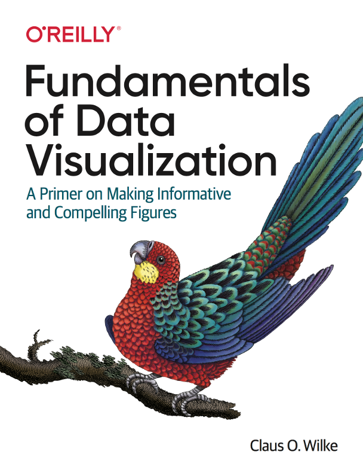{fig-align="center"}

:::
::::

## Principle 1: Axes

::: {.center}
**Don't cheat with axes: include 0 when 0 is meaningful**
:::

:::: {layout="[1,1]"}
::: {#first-column}


:::

::: {#second-column}


:::
::::

A bar shows its value with its **length**, so it has to start at zero.

## Principle 1: Axes

::: {.center}
**A shaded area shows its value too: it also starts at 0**
:::

:::: {layout="[1,1]"}
::: {#first-column}

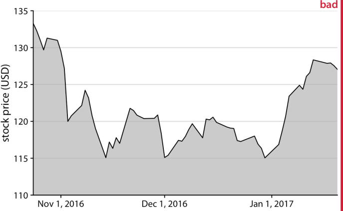

:::

::: {#second-column}

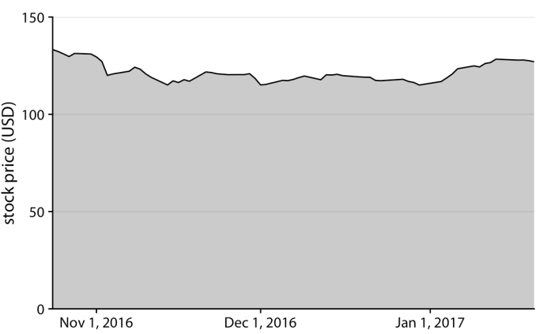

:::
::::

To zoom in on small changes, drop the shading and keep the line.

## Principle 1: Axes

::: {.center}
**Panels you compare must share the same axis**
:::

:::: {layout="[1,1]"}
::: {#first-column}

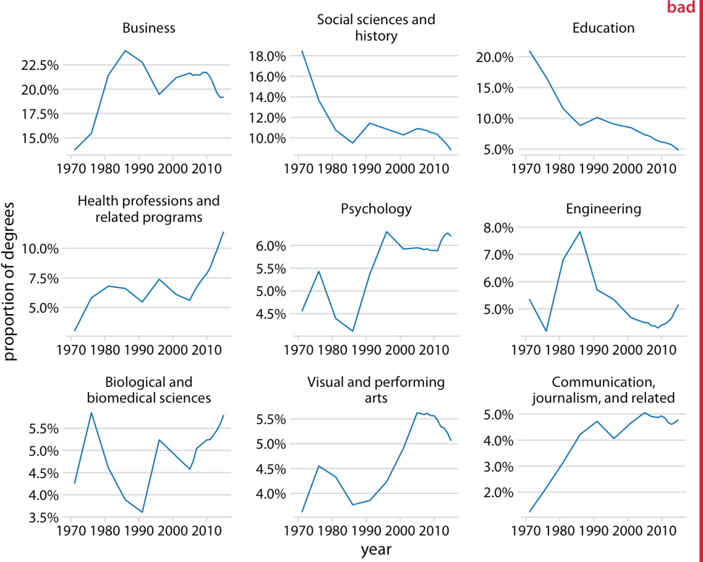

:::

::: {#second-column}

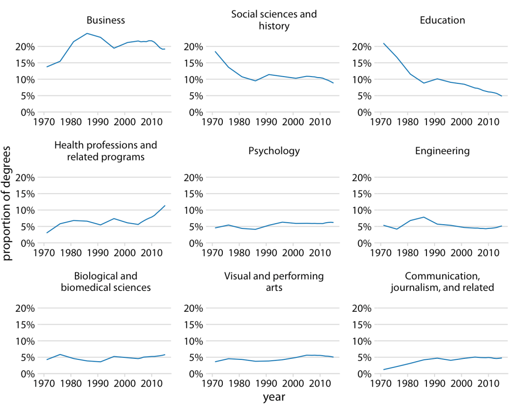

:::
::::

With its own axis in each panel, a 2-point change looks as big as a 10-point one.

## Principle 2: Make It Easy

::: {.center}
**Make your figure easy to read and to understand**
:::

:::: {layout="[1,1]"}
::: {#first-column}


:::

::: {#second-column}


:::
::::

The same five numbers: sorted bars let you compare Kent and Washington at a glance.

## Principle 3: Be Fancy

::: {.center}
**Use extra features when they help, such as transparency and jitter**
:::

:::: {layout="[1,1]"}
::: {#first-column}


:::

::: {#second-column}


:::
::::

When points pile up, even transparency is not enough: count them in small hexagons instead.

## Principle 3: Be Fancy

::: {.center}
**Use extra features when they help, such as transparency and jitter**
:::

:::: {layout="[1,1]"}
::: {#first-column}

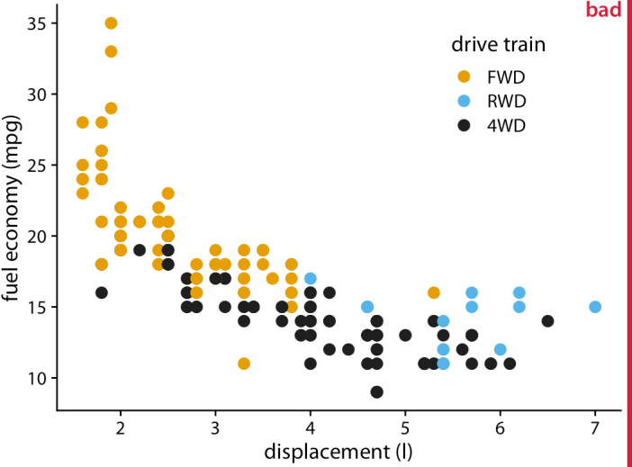

:::

::: {#second-column}

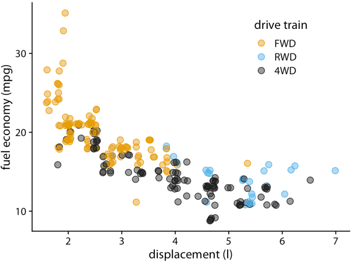

:::
::::

Transparency and a little jitter reveal the points hidden behind each other.

## Principle 4: Colours

::: {.center}
**Use colours, but not too many**
:::

:::: {layout="[1,1]"}
::: {#first-column}


:::

::: {#second-column}


:::
::::

51 colours need a legend nobody can read: group them, and label the points that matter.

## Principle 4: Colours

::: {.center}
**Keep the same colours for the same variables**
:::

:::: {layout="[1,1]"}
::: {#first-column}

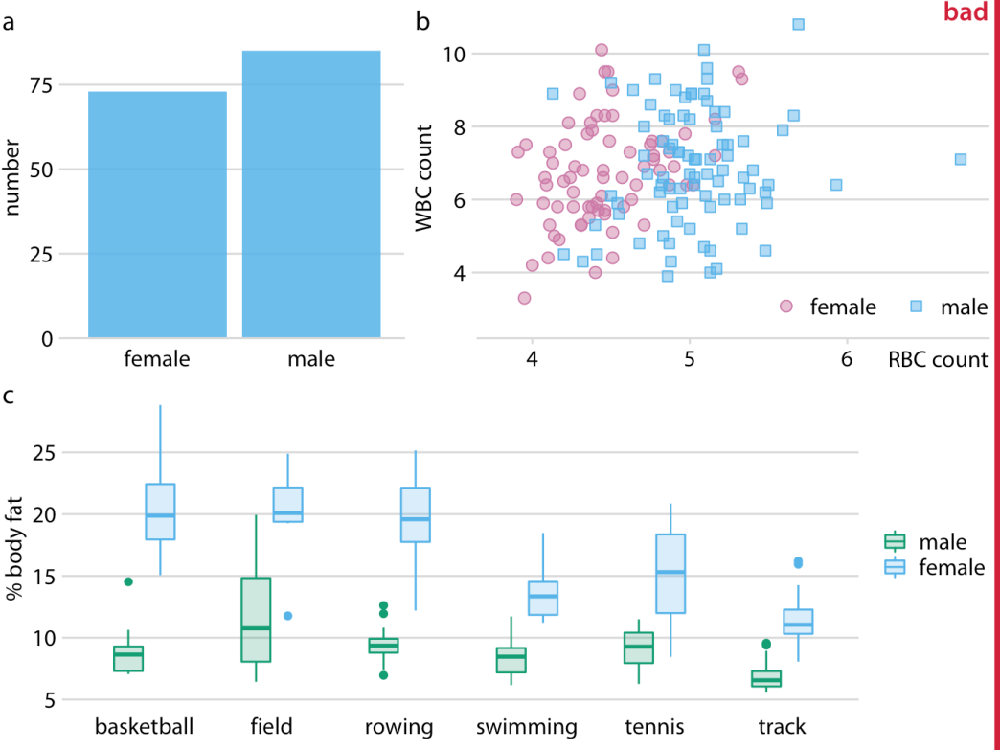

:::

::: {#second-column}

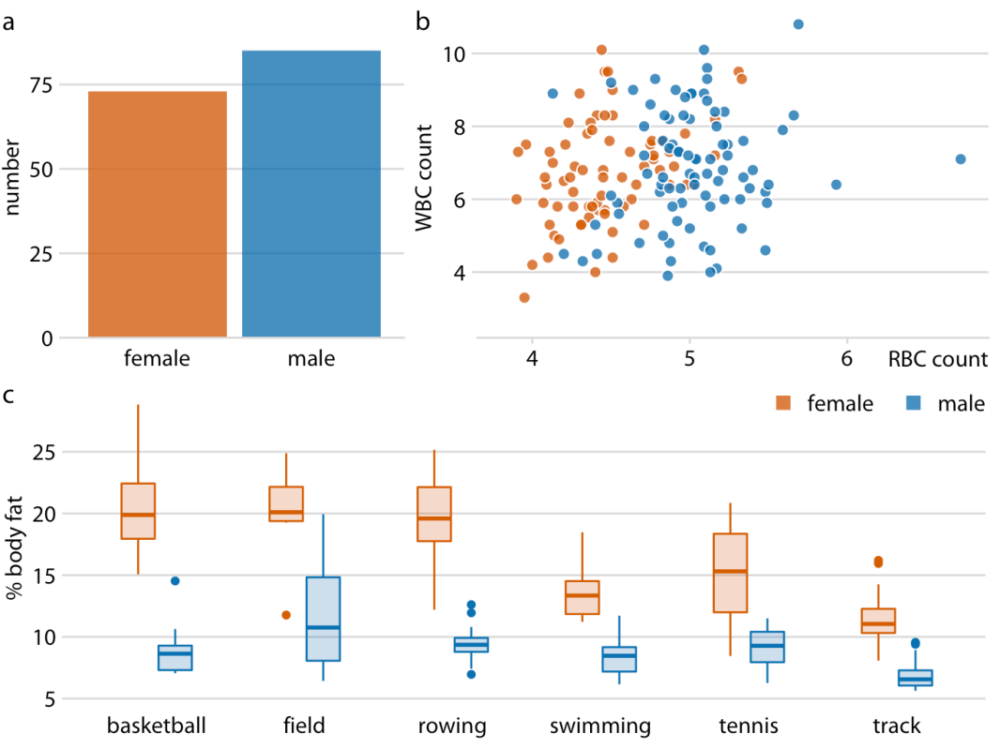

:::
::::

And check the palette for colour-blind readers: about 1 man in 12 cannot tell red from green.

## Principle 5: Details

::: {.center}
**Every detail counts, and lazy work is easily spotted**
:::

:::: {layout="[1,1]"}
::: {#first-column}


:::

::: {#second-column}


:::
::::

Label the lines directly: a legend sends the eye back and forth, here in a different order from the lines.

## Principle 5: Details

:::: {layout="[1.3,1]"}
::: {#first-column}

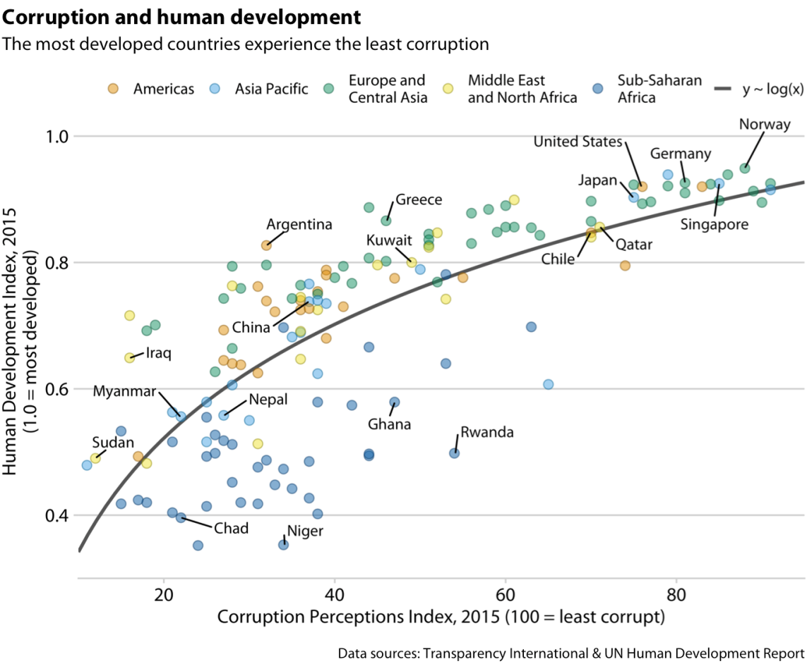

:::

::: {#second-column}

**Be precise, and use the title, axes and captions to do it:**

- a title and a subtitle that state the finding
- axis titles with their units
- labels on the few points worth naming
- sensible precision: 10.4%, not 10.4056%
- the data source

:::
::::

# 2. What's Wrong Here?

##  Your Turn! {background="#43464B"}

### What's wrong here?

In pairs, for each of the next charts:

1. Find what is wrong
2. Name the principle it breaks

About one minute per chart.

## What's Wrong Here? {.smaller}

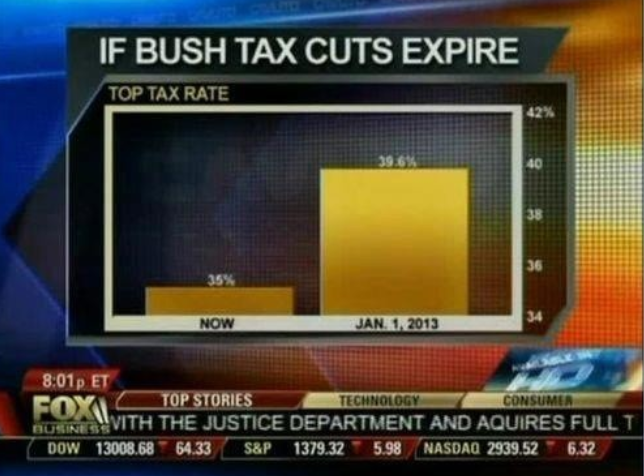{fig-align="center" style="max-height:430px;"}

::: {.fragment}
**Principle 1.** The axis starts at 34%, so a rise from 35% to 39.6% is drawn as a bar more than five times taller.
:::

::: {style="font-size:0.7em;text-align:center;"}
Source: Misleading Graphs in Real Life [](https://www.statisticshowto.com/probability-and-statistics/descriptive-statistics/misleading-graphs/)
:::

## What's Wrong Here? {.smaller}

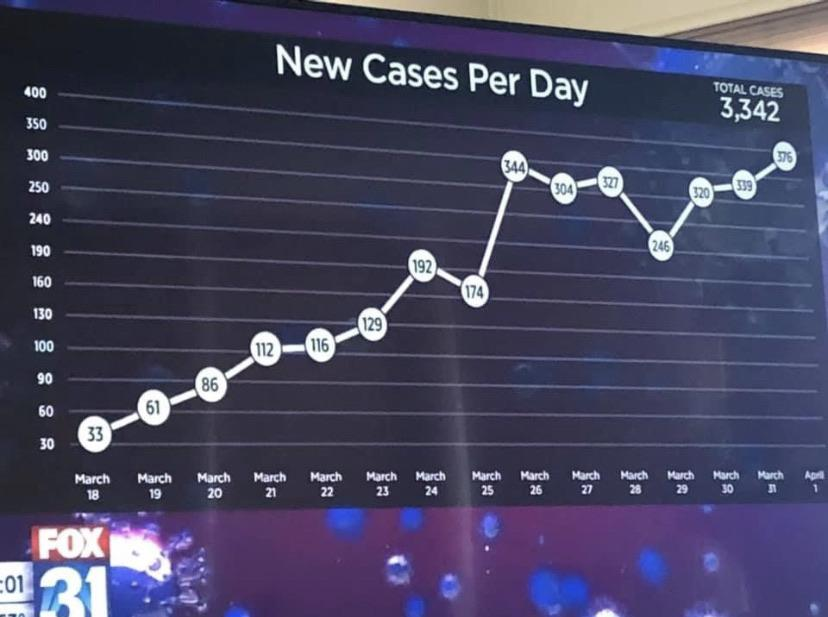{fig-align="center" style="max-height:430px;"}

::: {.fragment}
**Principle 1.** The steps of the axis are uneven (30, 60, 90, 100, 130, 160, 190, 240, 250, 300, ...): equal distances do not mean equal numbers, and the growth looks steadier than it was.
:::

::: {style="font-size:0.7em;text-align:center;"}
Source: The Worst Covid-19 Misleading Graphs [](https://www.datasciencecentral.com/the-worst-covid-19-misleading-graphs/)
:::

## What's Wrong Here? {.smaller}

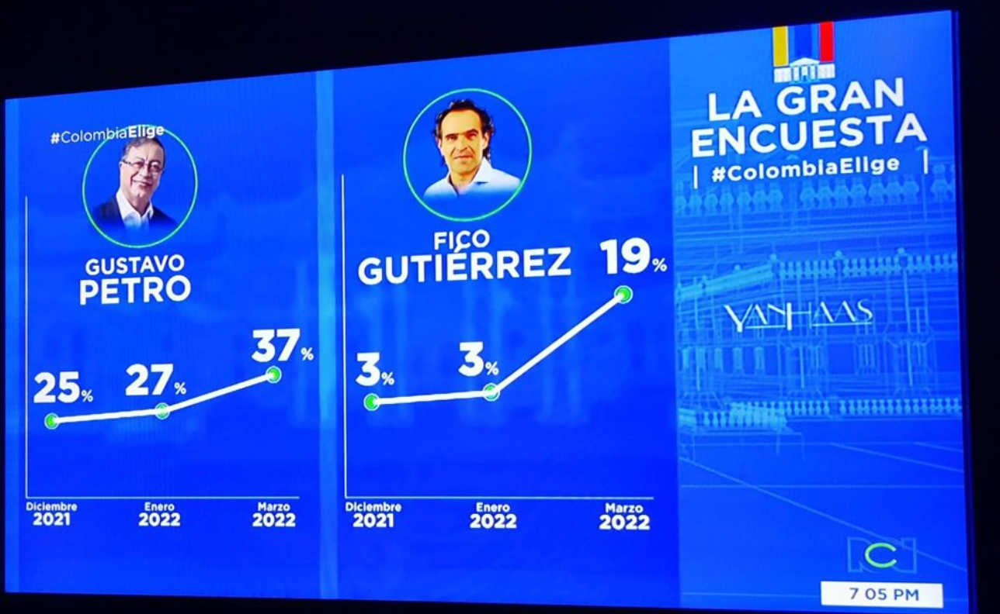{fig-align="center" style="max-height:430px;"}

::: {.fragment}
**Principle 1.** Each panel has its own scale, so Gutiérrez's 19% is drawn higher than Petro's 37%. And December, January and March are equally spaced, although February is missing.
:::

## What's Wrong Here? {.smaller}

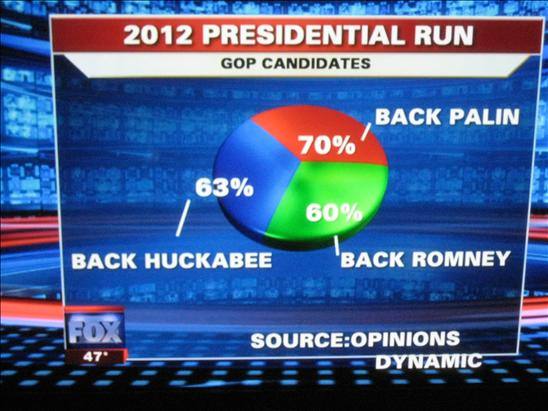{fig-align="center" style="max-height:430px;"}

::: {.fragment}
**Principles 2 and 3.** A pie shows the parts of one whole, but these slices add up to 193%, and the 3D tilt distorts their sizes.
:::

::: {style="font-size:0.7em;text-align:center;"}
Source: The statisticians at Fox News use classic and novel graphical techniques to lead with data [](https://simplystatistics.org/posts/2012-11-26-the-statisticians-at-fox-news-use-classic-and-novel-graphical-techniques-to-lead-with-data/)
:::

## What's Wrong Here? {.smaller}

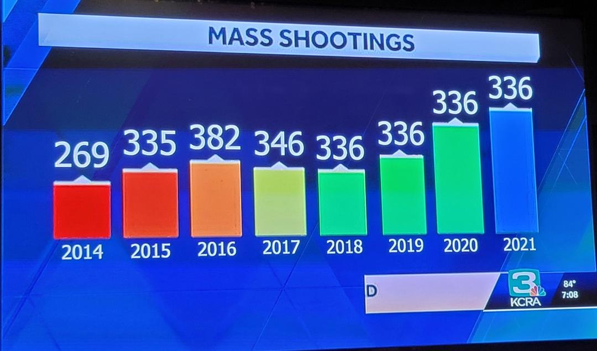{fig-align="center" style="max-height:430px;"}

::: {.fragment}
**Principles 4 and 5.** The rainbow colours mean nothing, and three bars are labelled 336 with three different heights: 2020 and 2021 are drawn taller than the 382 of 2016.
:::

::: {style="font-size:0.7em;text-align:center;"}
Source: KCRA graph on the 7pm news, r/Sacramento [](https://www.reddit.com/r/Sacramento/comments/tysyxz/kcra_graph_on_the_7pm_news/)
:::

## What's Wrong Here? {.smaller}

:::: {layout="[1,1]"}
::: {#first-column}

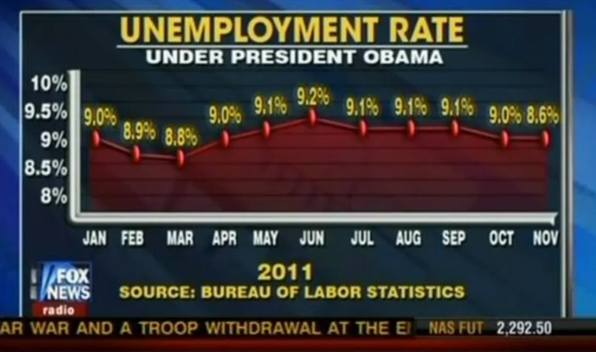

:::

::: {#second-column}

::: {.fragment}
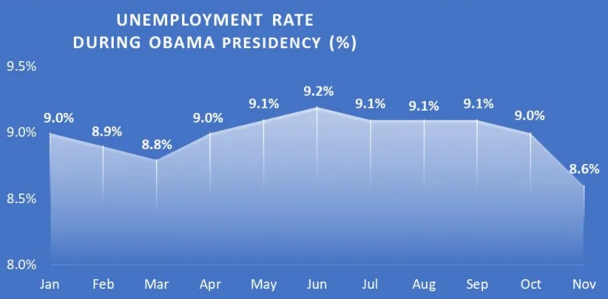
:::

:::
::::

::: {.fragment}
**Principle 5.** The last point, 8.6%, is drawn at the level of 9.0%. Placed correctly (right), November is the largest change of the year.
:::

## What's Wrong Here? {.smaller}

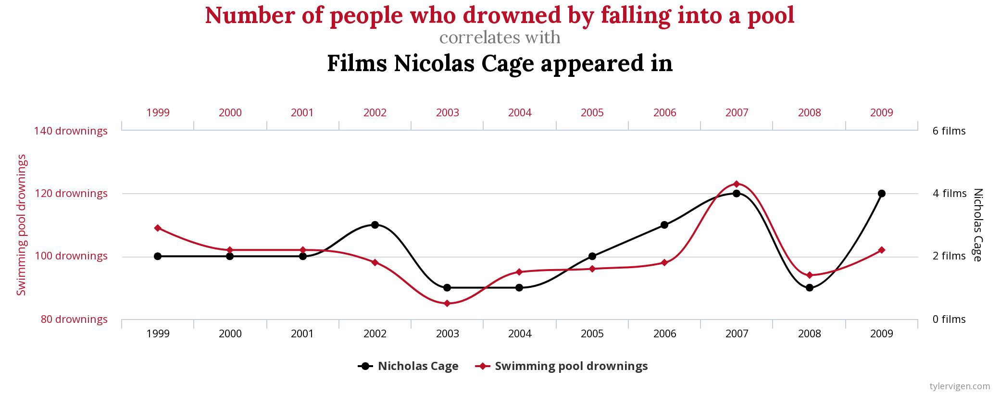{fig-align="center" style="max-height:330px;"}

::: {.fragment}
**Relationship is not causation.** Two series that move together need not be linked: Nicolas Cage films do not drown people. The two y-axes (Principle 1) also let you make any two lines look alike.
:::

::: {style="font-size:0.7em;text-align:center;"}
Source: Nick Cage Movies Vs. Drownings, and More Strange (but Spurious) Correlations [](https://www.nationalgeographic.com/science/article/nick-cage-movies-vs-drownings-and-more-strange-but-spurious-correlations)
:::

## Land Doesn't Vote, People Do {.smaller}

:::: {layout="[1,1]"}
::: {#first-column}

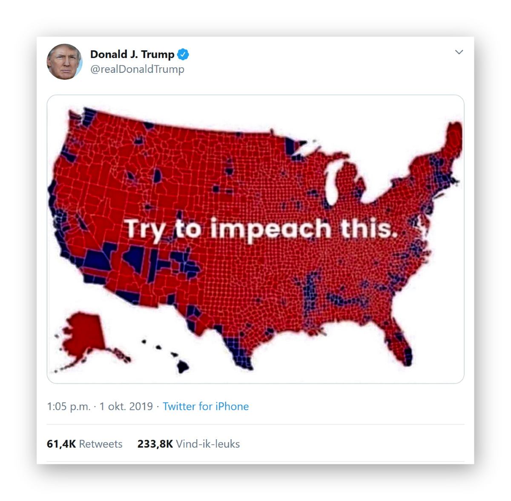

:::

::: {#second-column}

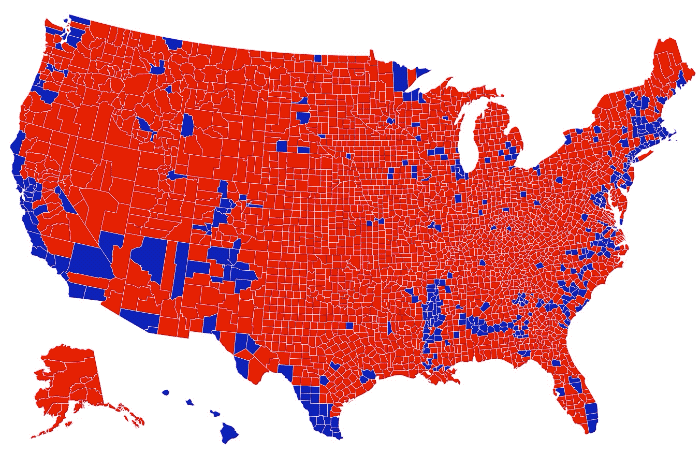

:::
::::

A county map colours **land**. Turn each county into a circle sized by its number of voters and the same result tells a very different story.

::: {style="font-size:0.7em;text-align:center;"}
Sources: Fact checking Trump's 'Impeach this' map [](https://edition.cnn.com/2019/10/01/politics/trump-impeach-this-map-fact-check/index.html) and Land Doesn't Vote, People Do [](https://demcastusa.com/2019/11/11/land-doesnt-vote-people-do-this-electoral-map-tells-the-real-story/)
:::

##  Your Turn! {background="#43464B" .smaller}

### Ask an AI what's wrong

:::: {layout="[1,1]"}
::: {#first-column}


:::

::: {#second-column}

1. Copy this chart:  <kbd>⊞ Win</kbd> + <kbd>⇧ Shift</kbd> + <kbd>S</kbd> or  <kbd>⌘ Cmd</kbd> + <kbd>⌃ Control</kbd> + <kbd>⇧ Shift</kbd> + <kbd>4</kbd>
2. Paste it into an AI assistant and ask: *"What is wrong with this chart?"*
3. Compare with your own answer: what did it find that you missed? What did it miss? Did it invent a fault?

:::
::::

::: {#timer4_1 .timer seconds="300" starton="interaction"}
:::

## What's Wrong Here? {.smaller}

:::: {layout="[1,1]"}
::: {#first-column}


:::

::: {#second-column}

- The claim is about growth **since 1984**, but the chart starts in **2001**: you cannot check it
- One bar is white and the others yellow: the colour carries **the conclusion**, not the data
- 2021 follows the 2020 collapse, so it is a **rebound**: from 2019 to 2021, the chart's own numbers give about 2% growth in two years

:::
::::

::: {style="font-size:0.7em;text-align:center;"}
Source: Official Twitter account of The White House [](https://twitter.com/WhiteHouse/status/1486709480351952901)
:::

# 3. Connect Several Files

## Connect to Multiple Data

It is possible to add more than one file but it can be done with or without joining the data.

- If you join the two or more data source, you will be able to use variables from
  different files in the same visualisation. However, a relationship between the
  data has to be established.
- If you don't join the data, the variables from each data will have to be used
  separately in different visualisations.

## Joining Multiple Data {.smaller}

:::: {layout="[1,1]"}
::: {#first-column}

Connect your first data file/database. In the Data Source window, beside
Connections, click on the plus sign to "Connect to Data"

<br>

Drag and drop the second file next to the box representing the first file

:::

::: {#second-column}

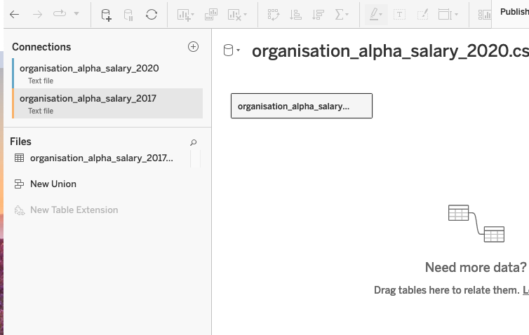{style="max-height:215px;"}

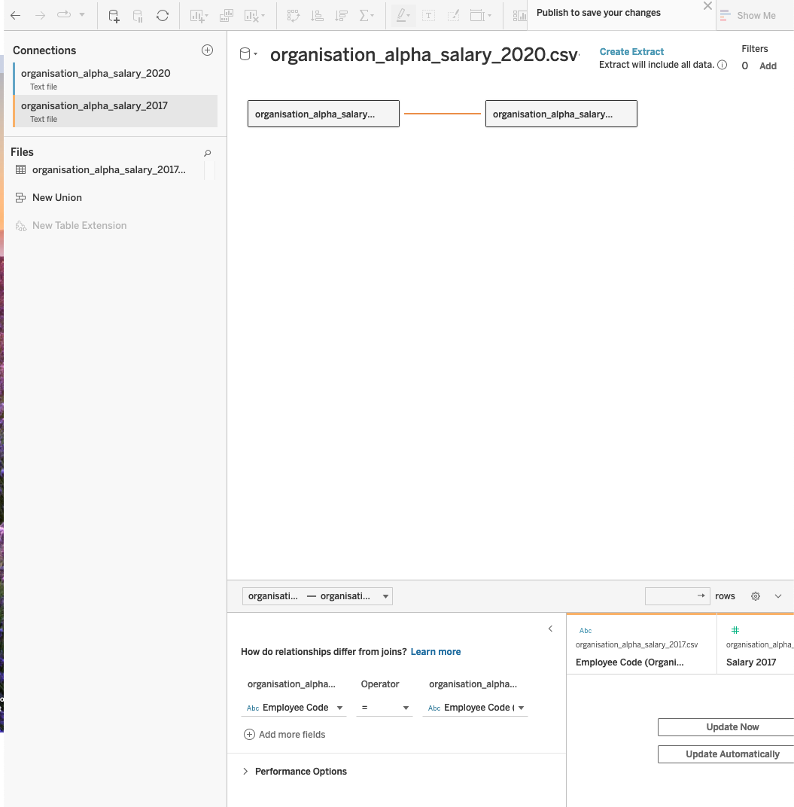{style="max-height:215px;"}

:::
::::

## Joining Multiple Data

Set the variables to join and if the link between the data files is correct then the link will be green

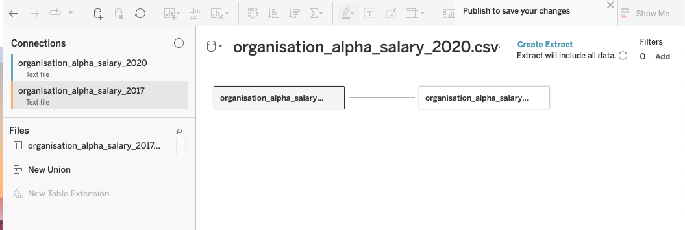{fig-align="center" style="max-height:400px;"}

## Add Different Data {.smaller}

:::: {layout="[1,1]"}
::: {#first-column}

Instead of clicking on the plus sign beside Connections, you can add data by
clicking on the database symbol.

:::

::: {#second-column}

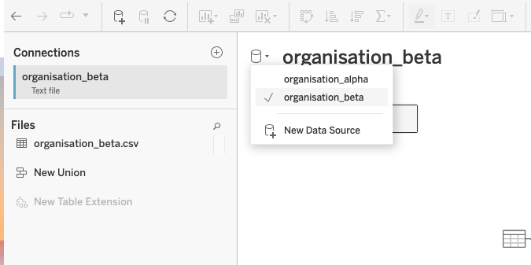{style="max-height:230px;"}

:::
::::

However you won't be able to use variable from both source for the same visualisation:

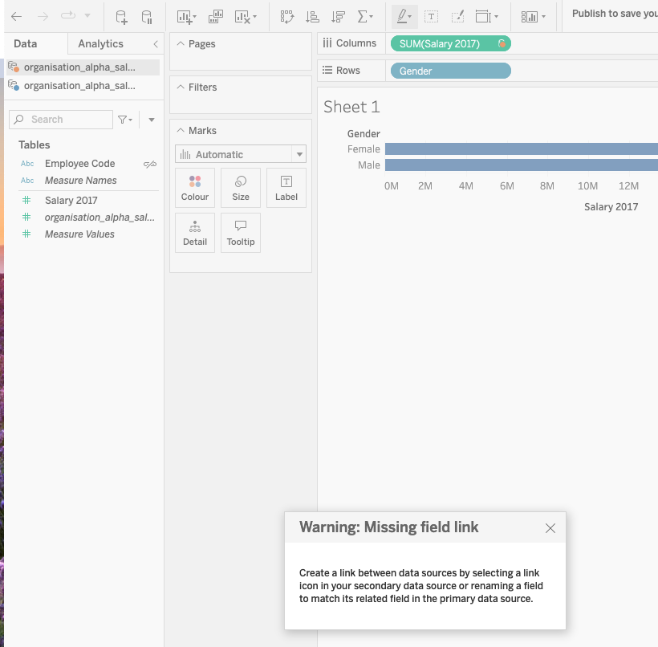{fig-align="center" style="max-height:170px;"}

# 4. Tableau Dashboard

## Tableau Objective

### Obtain the highest mark in Assignment 1

- Use **Tableau Public**, and submit the link to a **Dashboard** (not a Story)
- Work on each of the four assessment criteria (25% each):
  - **Creativity**: menus, filters and interactions that do something
  - **Analytical depth**: figures that answer a question worth asking
  - **Design**: layout, colour, typography, restraint
  - **Overall story**: title, narrative, and a conclusion with a recommendation
- Get inspired by existing dashboards on [Tableau Public](https://public.tableau.com/app/discover)

## Tableau Dashboard Showcase

Federica Pinza's visualisation, DCU winner of the 2024 European Data Visualisation Challenge organised by EDHEC

{fig-align="center" style="max-height:430px;"}

## Tableau Dashboard Showcase

:::: {layout="[1,1.6]"}
::: {#first-column}

{fig-align="center"}

:::

::: {#second-column}

[ Link to the dashboard](https://public.tableau.com/app/profile/federica.pinza/viz/Aglobalfightforgenderequalityineducation/Dashboard1)

One long page, read from top to bottom:

- a headline and the key numbers
- a map, a trend and a correlation
- the causes, explained with icons and text
- a conclusion with a call to action

:::
::::

## Nice Interactions and Design

{fig-align="center"}

{fig-align="center" style="max-height:250px;"}

## Meaningful Visualisations

{fig-align="center" style="max-height:275px;"}

{fig-align="center" style="max-height:210px;"}

## Insightful Storytelling

{fig-align="center"}

{fig-align="center" style="max-height:370px;"}

## Example Not to Follow! {.smaller}

{fig-align="center" style="max-height:320px;"}

::: {.fragment}
- Typos in the titles: "Wold", "Countires"
- One colour per country on the map, and a pie with one slice per country: the colours carry no information
- Raw field names as axis titles ("Obs Value"), two different fonts, and two bar charts on different scales
- No text to say what the index measures, or what to conclude
:::

## Tableau Dashboard

A dashboard is made by dropping several **sheets** on a page, organising their position, and adding **objects** (text, images, blank space, ...).

Design features can then be changed to give the dashboard a professional feel.

Interactions that make all the sheets move together (filters and actions) come in Lecture 7.

## Tableau Dashboard {.smaller}

{fig-align="center" style="max-height:450px;"}

Drag the sheets from the left panel onto the page. **Tiled** keeps them in a tidy grid; **Floating** lets an object sit on top of the others.

##  Your Turn! {background="#43464B"}

### Your first Loomrow dashboard

One dashboard with three of your Lecture 3 sheets:

- **Composition**: percent of posts by `format`
- **Comparison**: box plots of `reach` by `format`
- **Relationship**: `impressions` against `likes`

Titles that state the finding, the five principles, and a text box: **which format should Loomrow post more of, and why?**

Publish it on Tableau Public: start now, finish at home.

::: {#timer4_2 .timer seconds="900" starton="interaction"}
:::

# 5. Calculated Fields

## Row Level versus Aggregate {.smaller}

:::: {layout="[1,1]"}
::: {#first-column}

**Row-level calculation**

Evaluated once per row, before aggregation.

`[Key Events] / [Sessions]`

computed row by row, then summed, gives you the **average of the rates**.

:::

::: {#second-column}

**Aggregate calculation**

Evaluated after aggregation.

`SUM([Key Events]) / SUM([Sessions])`

gives you the **rate of the totals**, which is almost always what you meant.

:::
::::

. . .

Lecture 3's "you cannot average an average", in Tableau syntax.

::: {.callout-note appearance="minimal"}
Under what circumstances would the average of the rates be the number you
actually want? What would you have to believe about the rows?
:::

## Conditional Logic

Your source / medium values are a mess. They are supposed to be. Grouping them
into named channels is the first calculated field everyone writes.

```
IF CONTAINS([Source], "google") AND [Medium] = "cpc" THEN "Paid Search"
ELSEIF [Medium] = "organic" THEN "Organic Search"
ELSEIF CONTAINS([Source], "linkedin")
    OR CONTAINS([Source], "instagram")
    OR [Source] = "t.co" THEN "Social"
ELSEIF [Medium] = "email" THEN "Email"
ELSEIF [Medium] = "referral" THEN "Referral"
ELSEIF [Source] = "(direct)" THEN "Direct"
ELSE "Other"
END
```

. . .

**Then check the size of "Other".** If it holds more than a few percent of your
sessions, your grouping is hiding something rather than simplifying it.

## The Grouping Is an Argument

<!-- Speaker notes: the point to labour. A channel grouping is not a technical
     artefact, it is a claim about which traffic sources are the same kind of
     thing. Two analysts group differently and produce different strategies from
     identical data. Nobody ever asks to see the CASE statement. -->

A channel grouping asserts that these sources are the same kind of traffic and
those are different.

. . .

Put `t.co` in Social and paid X campaigns become invisible. Put `(direct)` in
its own channel and you have quietly labelled "we could not tell" as a marketing
channel with a budget line.

. . .

**Every channel report anyone has ever shown you rests on a CASE statement you
did not see.** Keep yours in your measurement plan.

## Level of Detail Expressions

An LOD expression computes at a grain other than the one in the view. It is how
Tableau lets you say "per user, regardless of what is on the rows".

```
{ FIXED [User ID] : MIN([Date]) }
```

Each user's first-touch date, available on every row for that user.

. . .

This one expression is the building block of every cohort view you will ever
build, and of the triangle chart at the end of this lecture.

::: {.callout-note appearance="minimal"}
`{FIXED}` ignores the filters on the view; `{INCLUDE}` and `{EXCLUDE}` do not.
On a cohort chart, why does that difference decide whether your cohort sizes
change when someone clicks a filter?
:::

# 6. Breakdowns That Mean Something

## Channel

From source / medium to a grouping you can defend, then the two questions:

1. Does each channel behave differently on the metric you care about?
2. Could you spend differently against each one tomorrow?

. . .

If both answers are no, you have built a nicer-looking version of the same
number.

## Device

Device is a segment, not a curiosity. The mobile conversion gap is one of the
most consistent findings in digital marketing, and it is usually a **design**
finding rather than an audience one.

. . .

At portfolio volume, expect the gap to be visible and the sample to be too small
to size it. Both facts belong in the report.

## Simpson's Paradox

<!-- Speaker notes: worth ten minutes of its own. A channel can look worse
     overall and better within every device category. Once they have seen it
     with numbers they never quite trust an aggregate again, which is the
     desired state. -->

A channel can convert **worse overall** and **better within every single device
category**.

. . .

Not a paradox, and not rare. It happens whenever the segments differ in both
their base rate and their share of the traffic.

## Simpson's Paradox, With Numbers {.smaller}

:::: {layout="[1,1]"}
::: {#first-column}

**Mobile**

| Channel | Sessions | Conv. | Rate |
|---|---|---|---|
| Email | 900 | 45 | **5.0%** |
| Social | 100 | 4 | 4.0% |

:::

::: {#second-column}

**Desktop**

| Channel | Sessions | Conv. | Rate |
|---|---|---|---|
| Email | 100 | 12 | **12.0%** |
| Social | 900 | 99 | 11.0% |

:::
::::

. . .

**Combined**: Email 57 / 1000 = 5.7%. Social 103 / 1000 = **10.3%**.

. . .

Email wins on mobile, wins on desktop, and loses overall, because email traffic
is mostly mobile and mobile converts badly.

::: {.callout-note appearance="minimal"}
Which number goes in the client deck? Neither is wrong.
:::

## What to Do About It

You cannot fix Simpson's paradox with a better chart. You can only decide which
question you are answering.

. . .

- **"Which channel should I buy more of?"** needs the breakdown, because the mix
  is part of what you are buying
- **"Which channel converts better for the same kind of visitor?"** needs the
  within-device rates
- **"What happened last month?"** needs both, and the mix shift is often the
  entire story

. . .

**Always show the sizes.** The paradox is invisible without the counts, which is
Lecture 3's rule 2 arriving with consequences.

# 7. Cohorts

## What a Cohort Is

A **cohort** is the set of users first seen in the same period, followed
forward.

. . .

A **segment** is a group defined by an attribute, measured now.

. . .

Cohorts are the only honest way to ask whether things are getting better,
because they hold acquisition date constant. An overall retention rate mixes
this month's new users with users acquired two years ago.

## The C Matrix {.smaller}

Let $C(t, t')$ be the number of users acquired in period $t$ who are still
active in period $t' \ge t$.

- $C(t,t)$ is simply the users acquired in $t$: the cohort's size
- $C(t,t')$ is weakly decreasing in $t'$: cohorts only shrink
- $C(\cdot,t)$ is everyone active in $t$, which is roughly what drives revenue
- The difference between consecutive columns is attrition

. . .

Startups call the picture of this matrix a **triangle retention chart**. It is
the single most informative chart about a subscription or repeat-purchase
business, and it is the thing investors ask for.

::: {.callout-note appearance="minimal"}
Whether you label the columns with calendar months or with months-since-signup
changes the shape of the chart completely. Which labelling answers "is our
product getting better?" and which answers "how was March?"
:::

## The Cohort Matrix, Drawn {.smaller}

 (CC BY 4.0)](./figures/external/mgt100_cohort_c_matrix.png){fig-align="center" height="350px"}

*Rows are acquisition cohorts, columns are periods since acquisition. Reading
across a row is a survival curve; reading down a column is a calendar snapshot.*


## Building One in Tableau

1. `{ FIXED [User ID] : MIN([Date]) }` → first-touch date
2. `DATETRUNC('week', [First Touch])` → cohort label, on rows
3. `DATEDIFF('week', [First Touch], [Date])` → periods since acquisition, on
   columns
4. `COUNTD([User ID])` → the cell value
5. Divide by the cohort's own week-0 count for a percentage, and keep the raw
   count as a label

. . .

Column 0 is 100% by construction. If it is not, your first-touch field is wrong.

## What One Looks Like With Real Data {.smaller}

 (CC BY 4.0)](./figures/external/mgt100_cohort_retention_heatmap.png){fig-align="center" height="350px"}

*The triangle is not missing data. Recent cohorts simply have not lived long enough.*


## The Portfolio Caveat

Your site may produce cohorts of four people.

. . .

Build it anyway. The mechanics are the same at four users and four million, and
the discipline of writing "cohort n = 4" beside a percentage is the thing being
assessed.

. . .

**Documented judgement beats undocumented certainty**, including when the
judgement is "this chart cannot support a conclusion".

## Exercise {background="#43464B"}

In Tableau, on your own data:

1. Write a channel grouping calculated field, and report the share in "Other"
2. Build a channel-by-device matrix of sessions and key events, counts visible
3. Check whether any channel shows Simpson's paradox across device
4. Create a first-touch date LOD field
5. Produce a weekly cohort triangle of returning users, with cohort sizes shown

**25 minutes**

# 8. Vibe Coding Tableau Calculations

## AI This Block: Chat with context

Where we are on the module's AI spine, set out in Lecture 1 and named properly
in Lecture 12:

> **Chat with context**

## Calculated Fields Are Ideal for This

Tableau's calculation language is verbose, thoroughly documented and heavily
represented in training data. Assistants write it well, and the cost of a wrong
answer is visible immediately.

> "Write a Tableau calculated field that groups source and medium into Paid
> Search, Organic Search, Social, Email, Referral and Direct. My Source values
> include google, bing, linkedin.com, t.co, l.instagram.com and (direct)."

. . .

Give it your **actual** source values. Pasted from the data, not remembered.

## LOD Expressions Especially

> "Write a FIXED LOD expression giving each user's first session date, and a
> second field giving the number of weeks between a row's date and that user's
> first session date."

. . .

**Then check it.** Not by reading it:

- Does the row count change after adding the field? It should not
- Does one user you can trace by hand get the date you expect?
- Is column 0 of the cohort chart exactly 100%?

## The Delegation Boundary

The assistant should write the **syntax**. You must own the **grouping**,
because the grouping is the argument.

. . .

Ask it for a channel grouping and it will produce a sensible industry-standard
one. Sensible and industry-standard is not the same as right for a one-page
portfolio site with three traffic sources, one of which is your own phone.

::: {.callout-note appearance="minimal"}
Delegate the typing, keep the deciding. On this lecture's material, exactly
which decisions are yours?
:::

## Exercise {background="#43464B"}

1. Generate your channel grouping with an assistant, giving it your real source
   values
2. Generate the first-touch LOD field
3. Verify both against five rows you check by hand
4. Find one source value the grouping puts in the wrong bucket, and say what it
   would have cost you
5. Change one grouping decision on purpose and note which conclusion moves

**15 minutes**

## Going Further

- Claus O. Wilke, [Fundamentals of Data Visualization](https://clauswilke.com/dataviz/), free online
- The Economist, [Mistakes, we've drawn a few](https://medium.economist.com/mistakes-weve-drawn-a-few-8cdd8a42d368): their own misleading charts, and how they fixed them
- Sequoia, *Retention*: the triangle chart as investors read it
- Tableau, *Level of Detail Expressions* whitepaper: FIXED, INCLUDE, EXCLUDE
  and the order of operations
- Wagner (1982), *Simpson's Paradox in Real Life*: short, and mostly about
  medicine, which makes the marketing case land harder

## Next Lecture

Segmentation: of all the splits you can now build, which ones actually pay.

**Prepare**: bring your channel-by-device matrix. We will test its segments
against three criteria.

## {background="#43464B"}

```{=html}
<style>img.circle {border-radius:50%;}</style>
```

:::: {layout="[1,1]"}
::: {#first-column}


:::
::: {#second-column}
**Thanks for your attention and don't hesitate to ask if you have any questions!**

[ @damien_dupre](https://datasci.social/@damien_dupre)

[ @damien-dupre](https://github.com/damien-dupre)

[ https://damien-dupre.github.io](https://damien-dupre.github.io)

[ damien.dupre@dcu.ie](mailto:damien.dupre@dcu.ie)
:::
::::
