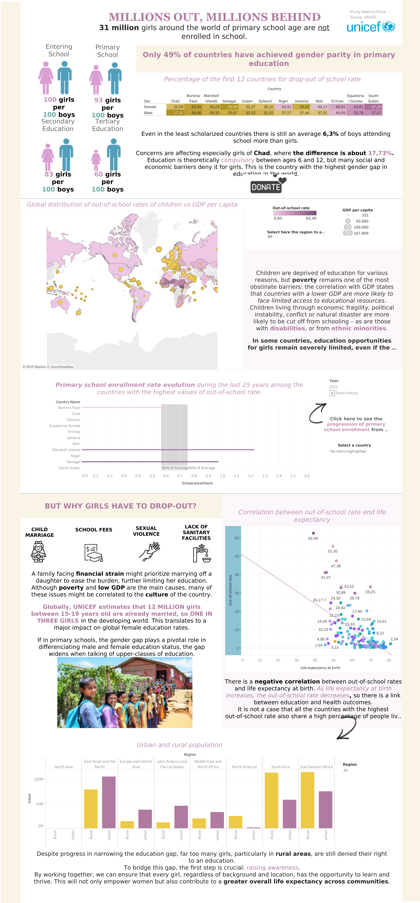
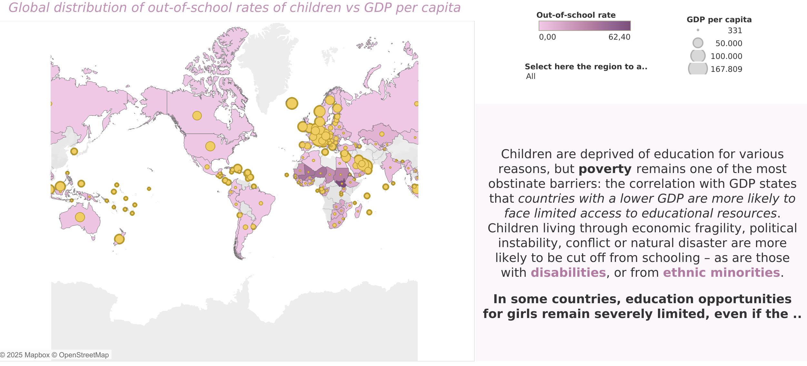
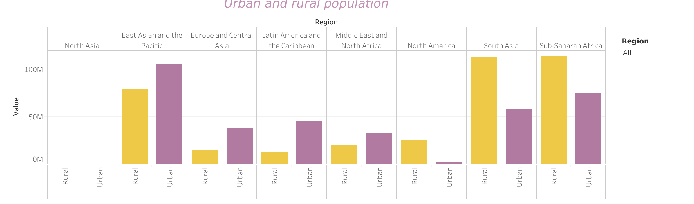
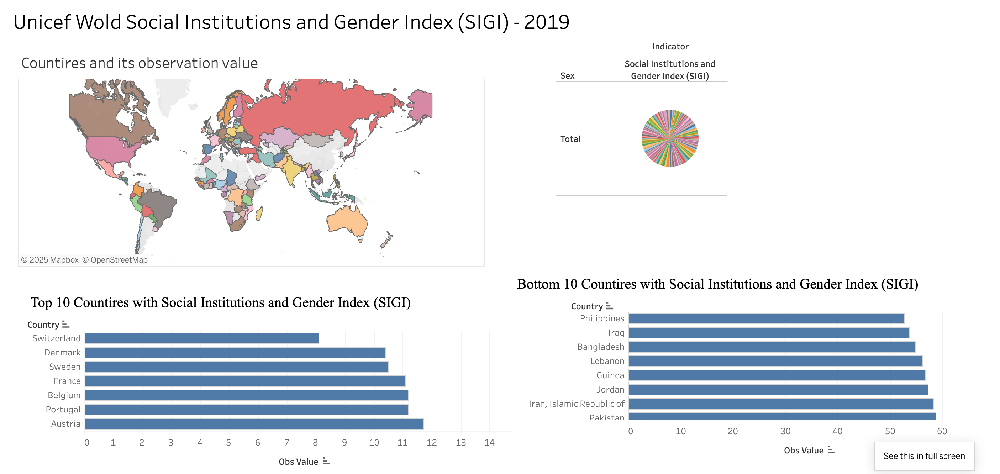
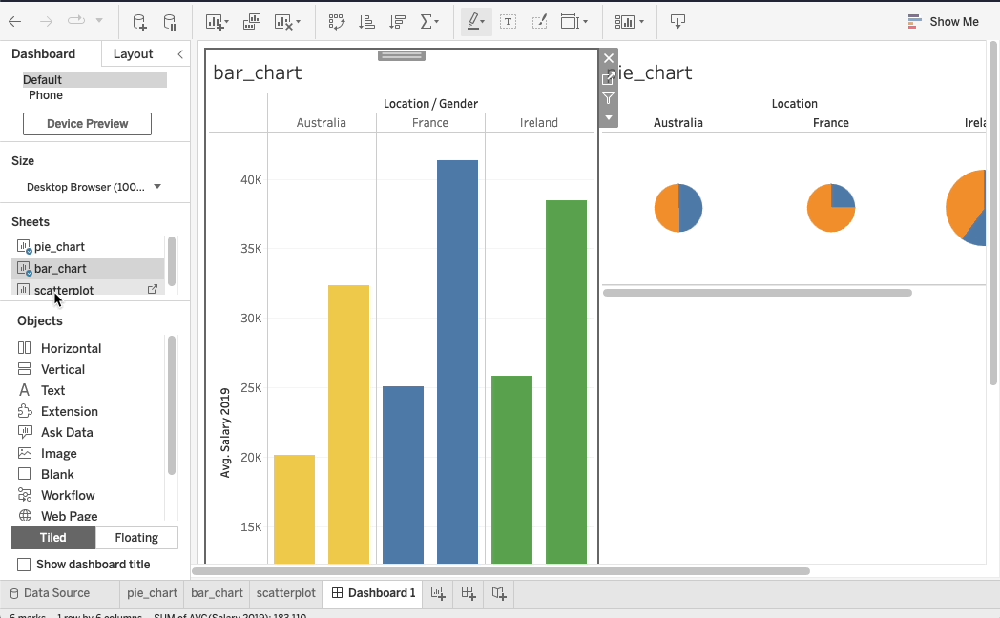

## Previously ...

- In Lecture 4 we made figures clear and honest, then prepared the table behind them in Tableau: a pivot, calculated fields, and two files merged into one data source.

You can slice the data many ways. Most slices are noise. **Today: a first dashboard, then the breakdowns, segments and cohorts worth building, and which ones pay.**

## Learning Outcomes {.smaller}

By the end of this lecture you will be able to:

- Assemble a first dashboard in Tableau
- Write calculated fields, including level-of-detail expressions
- Explain what customer heterogeneity is and which kinds of it predict behaviour
- Judge a segment against measurability, substantiality and actionability
- Build channel and device breakdowns you can defend to a client
- Recognise Simpson's paradox in a marketing breakdown
- Compare new versus returning, source / medium, device and geography honestly
- Recognise when a segment difference is too small to act on
- Construct a first cohort triangle from your own traffic

# 1. Tableau Dashboard

## Tableau Objective

### Obtain the highest mark in Assignment 1

- Use **Tableau Public**, and submit the link to a **Dashboard** (not a Story)
- Work on each of the four assessment criteria (25% each):
  - **Creativity**: menus, filters and interactions that do something
  - **Analytical depth**: figures that answer a question worth asking
  - **Design**: layout, colour, typography, restraint
  - **Overall story**: title, narrative, and a conclusion with a recommendation
- Get inspired by existing dashboards on [Tableau Public](https://public.tableau.com/app/discover)

## Tableau Dashboard Showcase

Federica Pinza's visualisation, DCU winner of the 2024 European Data Visualisation Challenge organised by EDHEC

{fig-align="center" style="max-height:430px;"}

## Tableau Dashboard Showcase

:::: {layout="[1,1.6]"}
::: {#first-column}

{fig-align="center"}

:::

::: {#second-column}

[ Link to the dashboard](https://public.tableau.com/app/profile/federica.pinza/viz/Aglobalfightforgenderequalityineducation/Dashboard1)

One long page, read from top to bottom:

- a headline and the key numbers
- a map, a trend and a correlation
- the causes, explained with icons and text
- a conclusion with a call to action

:::
::::

## Nice Interactions and Design

{fig-align="center"}

{fig-align="center" style="max-height:250px;"}

## Meaningful Visualisations

{fig-align="center" style="max-height:275px;"}

{fig-align="center" style="max-height:210px;"}

## Insightful Storytelling

{fig-align="center"}

{fig-align="center" style="max-height:370px;"}

## Example Not to Follow! {.smaller}

{fig-align="center" style="max-height:320px;"}

::: {.fragment}
- Typos in the titles: "Wold", "Countires"
- One colour per country on the map, and a pie with one slice per country: the colours carry no information
- Raw field names as axis titles ("Obs Value"), two different fonts, and two bar charts on different scales
- No text to say what the index measures, or what to conclude
:::

## Tableau Dashboard

A dashboard is made by dropping several **sheets** on a page, organising their position, and adding **objects** (text, images, blank space, ...).

Design features can then be changed to give the dashboard a professional feel.

Interactions that make all the sheets move together (filters and actions) come in Lecture 7.

## Tableau Dashboard {.smaller}

{fig-align="center" style="max-height:450px;"}

Drag the sheets from the left panel onto the page. **Tiled** keeps them in a tidy grid; **Floating** lets an object sit on top of the others.

##  Your Turn! {background="#43464B"}

### Your first Loomrow dashboard

One dashboard with three of your Lecture 3 sheets:

- **Composition**: percent of posts by `format`
- **Comparison**: box plots of `reach` by `format`
- **Relationship**: `impressions` against `likes`

Titles that state the finding, the five principles, and a text box: **which format should Loomrow post more of, and why?**

Publish it on Tableau Public: start now, finish at home.

::: {#timer5_1 .timer seconds="900" starton="interaction"}
:::

# 2. Calculated Fields

## Conditional Logic

Your source / medium values are a mess. They are supposed to be. Grouping them
into named channels is the first calculated field everyone writes.

```
IF CONTAINS([Source], "google") AND [Medium] = "cpc" THEN "Paid Search"
ELSEIF [Medium] = "organic" THEN "Organic Search"
ELSEIF CONTAINS([Source], "linkedin")
    OR CONTAINS([Source], "instagram")
    OR [Source] = "t.co" THEN "Social"
ELSEIF [Medium] = "email" THEN "Email"
ELSEIF [Medium] = "referral" THEN "Referral"
ELSEIF [Source] = "(direct)" THEN "Direct"
ELSE "Other"
END
```

. . .

**Then check the size of "Other".** If it holds more than a few percent of your
sessions, your grouping is hiding something rather than simplifying it.

## The Grouping Is an Argument

<!-- Speaker notes: the point to labour. A channel grouping is not a technical
     artefact, it is a claim about which traffic sources are the same kind of
     thing. Two analysts group differently and produce different strategies from
     identical data. Nobody ever asks to see the CASE statement. -->

A channel grouping asserts that these sources are the same kind of traffic and
those are different.

. . .

Put `t.co` in Social and paid X campaigns become invisible. Put `(direct)` in
its own channel and you have quietly labelled "we could not tell" as a marketing
channel with a budget line.

. . .

**Every channel report anyone has ever shown you rests on a CASE statement you
did not see.** Keep yours in your measurement plan.

## Level of Detail Expressions

An LOD expression computes at a grain other than the one in the view. It is how
Tableau lets you say "per user, regardless of what is on the rows".

```
{ FIXED [User ID] : MIN([Date]) }
```

Each user's first-touch date, available on every row for that user.

. . .

This one expression is the building block of every cohort view you will ever
build, and of the triangle chart later in this lecture.

::: {.callout-note appearance="minimal"}
`{FIXED}` ignores the filters on the view; `{INCLUDE}` and `{EXCLUDE}` do not.
On a cohort chart, why does that difference decide whether your cohort sizes
change when someone clicks a filter?
:::

# 3. Heterogeneity

## Customers Differ. On What? {.smaller}

"Heterogeneity" is a long word for the fact that customers differ. The question
that matters is **on which dimension**.

:::: {layout="[1,1]"}
::: {#first-column}

**Predicts behaviour well**

- Product needs: usage intensity, frequency, context
- Prior experience with the category
- Information: what they already know
- Occasion and context

:::

::: {#second-column}

**Predicts behaviour weakly**

- Demographics: age, gender, income
- Location, in most categories
- Stated attitudes
- Psychographics

:::
::::

. . .

**Needs beat demographics, by a distance**, and by more than marketers expect.

## You Are Not Your Customer {.smaller}

 (CC BY 4.0)](./figures/external/mgt100_computer_skills_distribution.png){fig-align="center" height="340px"}

*Computer skills across OECD countries. Somewhere under 10% of people are at
Level 3. Everyone in this room is one of them.*

## So Why Does Everyone Segment by Demographics? {.smaller}

<!-- Speaker notes: this is the good bit, because they have all been taught
     demographic personas on another module and nobody has told them the
     evidence is weak. Handle it as "here is why the default persists", not
     "your other module is wrong". -->

Three honest reasons:

1. Demographics are **easily measurable**, and often the only thing you can buy
2. They are **visually perceivable**, so people believe they understand them
3. Many people **identify themselves** in those terms

. . .

None of those is "they predict purchasing".

. . .

**The exceptions are real**: makeup, nappies, sports kit and footwear are
categories where demographics correlate strongly with needs. Notice what those
categories have in common.

::: {.callout-note appearance="minimal"}
Is segmenting by gender sexist? Literally, yes: it treats people differently by
a protected characteristic. When is that acceptable, and who decides? Does your
answer change between a nappy brand and a car insurer?
:::

## A Segmentation Someone Published {.smaller}

 (CC BY 4.0)](./figures/external/mgt100_firefox_personas.png){fig-align="center" height="320px"}

*Mozilla's Firefox user types. Note that each one is written so a product
team could act on it. That is the test.*

## The Circularity Trap

Suppose you segment your visitors by which product they bought.

. . .

**This gets you nowhere.** You have used the outcome as the input. The segments
are defined by the thing you were trying to predict, so they predict it
perfectly and tell you nothing about who to target next.

. . .

The same error in your own portfolio: segmenting by "converted" and "did not
convert", then reporting that the converters converted more.

::: {.callout-note appearance="minimal"}
Where is the boundary? "Visitors who viewed the pricing page" is close to the
outcome but not the outcome. Is it a usable segment?
:::

## How to Pick Attributes

You want to segment on attributes that drive sales, retention or profit. Six
routes to candidates, roughly in order of cost:

1. Theory and experience
2. Consulting the people who talk to customers
3. Your own database, explored
4. Market research
5. Finding out what competitors are doing
6. Letting the data pick, with a clustering or a heterogeneous-choice model

. . .

Route 6 is where k-means and its relatives live. We reach it properly in
Lecture 15, on your own users. It is last on this list for a reason.

## Segmentation as a Process, Not a Chart {.smaller}

 (CC BY 4.0)](./figures/external/mgt100_segmentation_process.png){fig-align="center" height="265px"}

# 4. What Makes a Segment Worth Having

## The Three Tests

**Measurable.** You can identify who is in the segment, from data you actually
have, at the moment you need to act.

. . .

**Substantial.** The segment is large enough to be worth serving. Small can be
fine, and a niche can sustain a business, but there is a floor below which the
operation cannot pay for itself.

. . .

**Actionable.** You could do something different for this segment tomorrow. If
the answer is "nothing we could change", it is a description, not a segment.

::: {.callout-note appearance="minimal"}
Add a fourth test: **different**. The segments must actually behave differently
on the metric you care about. Which of the four does a typical marketing persona
deck usually fail?
:::

## Measurable, and the Trap Inside It

A segment that is measurable **after the fact** but not **at the point of
action** is useless for targeting.

. . .

"High-lifetime-value customers" is measurable in your database in two years'
time. Whether you can identify one on their first visit is a different, harder
and more valuable question.

. . .

This is the whole business of a customer data platform, and its four jobs:
collect, unify, comprehend, activate. **Activation is where most of them fail.**

## Measurable, and Worth Measuring {.smaller}

 (CC BY 4.0)](./figures/external/mgt100_yield_by_fico_score.png){fig-align="center" height="340px"}

*Portfolio yield by credit score. The middle 36% of accounts are
indistinguishable. The segments that matter are at the edges.*

## Substantial, and Small Numbers

<!-- Speaker notes: with a student portfolio getting 40 sessions a week, most
     segment differences are noise. Name it now rather than letting them
     over-interpret in the portfolio. Lecture 21 gives them the tools; here they
     only need the instinct. -->

A 100% conversion rate on 2 sessions.

. . .

A segment that converts at 8% versus one at 4%, on 25 sessions each: that is two
conversions versus one.

. . .

**Rate differences on small denominators are almost always noise.** You will not
have the tools to say how much until Lecture 21. Until then, the rule is: put
the denominator on the slide and let the room see it.

## Actionable

Segments that regularly fail this test on a portfolio site:

- **Browser version.** You are not building a version-specific experience
- **Screen resolution.** Unless it is a responsive-design bug, in which case it
  is a bug, not a segment
- **Hour of day**, at low volume. Interesting, unactionable, and unstable
- **Country**, when you serve one city

. . .

Naming a segment you deliberately did not pursue, and why, is worth more marks
than a fourth chart of one you did.

# 5. Breakdowns That Mean Something

## Channel

From source / medium to a grouping you can defend, then the two questions:

1. Does each channel behave differently on the metric you care about?
2. Could you spend differently against each one tomorrow?

. . .

If both answers are no, you have built a nicer-looking version of the same
number.

## Device

Device is a segment, not a curiosity. The mobile conversion gap is one of the
most consistent findings in digital marketing, and it is usually a **design**
finding rather than an audience one.

. . .

At portfolio volume, expect the gap to be visible and the sample to be too small
to size it. Both facts belong in the report.

## Simpson's Paradox

<!-- Speaker notes: worth ten minutes of its own. A channel can look worse
     overall and better within every device category. Once they have seen it
     with numbers they never quite trust an aggregate again, which is the
     desired state. -->

A channel can convert **worse overall** and **better within every single device
category**.

. . .

Not a paradox, and not rare. It happens whenever the segments differ in both
their base rate and their share of the traffic.

## Simpson's Paradox, With Numbers {.smaller}

:::: {layout="[1,1]"}
::: {#first-column}

**Mobile**

| Channel | Sessions | Conv. | Rate |
|---|---|---|---|
| Email | 900 | 45 | **5.0%** |
| Social | 100 | 4 | 4.0% |

:::

::: {#second-column}

**Desktop**

| Channel | Sessions | Conv. | Rate |
|---|---|---|---|
| Email | 100 | 12 | **12.0%** |
| Social | 900 | 99 | 11.0% |

:::
::::

. . .

**Combined**: Email 57 / 1000 = 5.7%. Social 103 / 1000 = **10.3%**.

. . .

Email wins on mobile, wins on desktop, and loses overall, because email traffic
is mostly mobile and mobile converts badly.

::: {.callout-note appearance="minimal"}
Which number goes in the client deck? Neither is wrong.
:::

## What to Do About It

You cannot fix Simpson's paradox with a better chart. You can only decide which
question you are answering.

. . .

- **"Which channel should I buy more of?"** needs the breakdown, because the mix
  is part of what you are buying
- **"Which channel converts better for the same kind of visitor?"** needs the
  within-device rates
- **"What happened last month?"** needs both, and the mix shift is often the
  entire story

. . .

**Always show the sizes.** The paradox is invisible without the counts, which is
the denominator rule of section 4 arriving with consequences.

# 6. The Standard Comparisons

## New versus Returning

Different funnels, different intent, different appropriate metrics.

. . .

A blended conversion rate over both describes nobody: it is a weighted average
of a first-visit rate and a considered-return rate, and it moves whenever the
mix moves, without either underlying rate changing.

. . .

**This is Simpson's paradox again, in its most common marketing costume.**

## Source and Medium

Intent varies more by source than by almost anything else you can measure.

. . .

Someone arriving from a search for your service and someone arriving from a
social feed are at different points of the same journey, and comparing their
conversion rates as though they were competing channels is a category error that
still shapes budgets.

::: {.callout-note appearance="minimal"}
Your own site: which of your sources reflect intent, and which reflect
interruption? Should they ever appear in the same bar chart?
:::

## Geography and Device

**Geography** is genuinely useful for a business with regional operations, and
mostly noise for a student portfolio. Say so in the report rather than producing
a map because Tableau makes maps easy.

. . .

**Device** we covered in section 5. The addition here: a device gap is
actionable in a way most segments are not, because you can change the design
this week.

## The Consent Segment You Cannot See

Your declined-consent visitors are a segment. They are invisible, they are
probably not random, and every comparison you make excludes them.

. . .

Lecture 10 established this. It matters here because **segmentation on consented
data is segmentation of the consenting**.

. . .

If privacy-conscious visitors differ in ways related to your outcome, and there
is evidence they do, then every segment comparison in your portfolio carries the
same unmeasured bias.

::: {.callout-note appearance="minimal"}
Does that make the analysis worthless, or does it make one sentence mandatory?
What is the sentence?
:::

# 7. Cohorts

## What a Cohort Is

A **cohort** is the set of users first seen in the same period, followed
forward.

. . .

A **segment** is a group defined by an attribute, measured now.

. . .

Cohorts are the only honest way to ask whether things are getting better,
because they hold acquisition date constant. An overall retention rate mixes
this month's new users with users acquired two years ago.

## The C Matrix {.smaller}

Let $C(t, t')$ be the number of users acquired in period $t$ who are still
active in period $t' \ge t$.

- $C(t,t)$ is simply the users acquired in $t$: the cohort's size
- $C(t,t')$ is weakly decreasing in $t'$: cohorts only shrink
- $C(\cdot,t)$ is everyone active in $t$, which is roughly what drives revenue
- The difference between consecutive columns is attrition

. . .

Startups call the picture of this matrix a **triangle retention chart**. It is
the single most informative chart about a subscription or repeat-purchase
business, and it is the thing investors ask for.

::: {.callout-note appearance="minimal"}
Whether you label the columns with calendar months or with months-since-signup
changes the shape of the chart completely. Which labelling answers "is our
product getting better?" and which answers "how was March?"
:::

## The Cohort Matrix, Drawn {.smaller}

 (CC BY 4.0)](./figures/external/mgt100_cohort_c_matrix.png){fig-align="center" height="350px"}

*Rows are acquisition cohorts, columns are periods since acquisition. Reading
across a row is a survival curve; reading down a column is a calendar snapshot.*

## Building One in Tableau

1. `{ FIXED [User ID] : MIN([Date]) }` → first-touch date
2. `DATETRUNC('week', [First Touch])` → cohort label, on rows
3. `DATEDIFF('week', [First Touch], [Date])` → periods since acquisition, on
   columns
4. `COUNTD([User ID])` → the cell value
5. Divide by the cohort's own week-0 count for a percentage, and keep the raw
   count as a label

. . .

Column 0 is 100% by construction. If it is not, your first-touch field is wrong.

## What One Looks Like With Real Data {.smaller}

 (CC BY 4.0)](./figures/external/mgt100_cohort_retention_heatmap.png){fig-align="center" height="350px"}

*The triangle is not missing data. Recent cohorts simply have not lived long enough.*

## The Portfolio Caveat

Your site may produce cohorts of four people.

. . .

Build it anyway. The mechanics are the same at four users and four million, and
the discipline of writing "cohort n = 4" beside a percentage is the thing being
assessed.

. . .

**Documented judgement beats undocumented certainty**, including when the
judgement is "this chart cannot support a conclusion".

## Exercise {background="#43464B"}

In Tableau, on your own data:

1. Write a channel grouping calculated field, and report the share in "Other"
2. Build a channel-by-device matrix of sessions and key events, counts visible
3. Check whether any channel shows Simpson's paradox across device
4. Create a first-touch date LOD field
5. Produce a weekly cohort triangle of returning users, with cohort sizes shown

**25 minutes**

# 8. In Practice

## Live Demo {background="#43464B"}

1. Segment comparison view in Tableau, rates with counts alongside
2. New versus returning on the key event, then the mix shift over time that
   explains the blended rate
3. A segment that looks striking, with n shown, and the room deciding whether to
   believe it
4. Writing the caveat sentence together

## Exercise {background="#43464B"}

On your own data:

1. Build a new versus returning comparison on your key event
2. Add the raw counts next to every rate
3. Identify one segment that passes all four tests, and one that fails, naming
   the test it fails
4. Write what you would do differently for the segment that passes
5. Write the sentence about who is missing from all of it

**20 minutes**

# 9. AI for Calculations and Segment Hypotheses

## AI This Block: Chat with context

Where we are on the module's AI spine, set out in Lecture 1 and named properly
in Lecture 12:

> **Chat with context**

## Calculated Fields Are Ideal for This

Tableau's calculation language is verbose, thoroughly documented and heavily
represented in training data. Assistants write it well, and the cost of a wrong
answer is visible immediately.

> "Write a Tableau calculated field that groups source and medium into Paid
> Search, Organic Search, Social, Email, Referral and Direct. My Source values
> include google, bing, linkedin.com, t.co, l.instagram.com and (direct)."

. . .

Give it your **actual** source values. Pasted from the data, not remembered.

## LOD Expressions Especially

> "Write a FIXED LOD expression giving each user's first session date, and a
> second field giving the number of weeks between a row's date and that user's
> first session date."

. . .

**Then check it.** Not by reading it:

- Does the row count change after adding the field? It should not
- Does one user you can trace by hand get the date you expect?
- Is column 0 of the cohort chart exactly 100%?

## The Delegation Boundary

The assistant should write the **syntax**. You must own the **grouping**,
because the grouping is the argument.

. . .

Ask it for a channel grouping and it will produce a sensible industry-standard
one. Sensible and industry-standard is not the same as right for a one-page
portfolio site with three traffic sources, one of which is your own phone.

::: {.callout-note appearance="minimal"}
Delegate the typing, keep the deciding. On this lecture's material, exactly
which decisions are yours?
:::

## Exercise {background="#43464B"}

1. Generate your channel grouping with an assistant, giving it your real source
   values
2. Generate the first-touch LOD field
3. Verify both against five rows you check by hand
4. Find one source value the grouping puts in the wrong bucket, and say what it
   would have cost you
5. Change one grouping decision on purpose and note which conclusion moves

**15 minutes**

## Generating Candidates, Not Conclusions

Use it to widen the list of segments worth considering, then apply the tests
yourself.

> "I run a portfolio site for a freelance designer in Dublin. What visitor
> segments might behave differently on an enquiry form? Rank them by how likely
> they are to matter at 200 sessions a month, and say which I could actually
> identify in a GA4 export."

. . .

The second clause is the one that turns a generic list into a usable one.

## The Trap

<!-- Speaker notes: it will happily propose twelve segments, and testing twelve
     segments on small traffic guarantees a spurious finding. This is the
     multiple-comparisons problem arriving three lectures before they have the
     vocabulary for it. Plant it here, pay it off in 19. -->

More hypotheses means more chances to find noise.

. . .

Test twelve segments on 200 sessions and something will look significant. Not
because it is, but because you looked twelve times.

. . .

**Pick two before you look.** Write them down. This is the same pre-registration
discipline as the success statement in Lecture 8, and it will return in
Lecture 21.

## Exercise {background="#43464B"}

1. Generate ten candidate segments
2. Reject eight using measurable / substantial / actionable / different
3. Say what made the surviving two different
4. Commit to which two you will test, in writing, **before** you build the view

**10 minutes**

## Going Further {.smaller}

- Tableau, *Level of Detail Expressions* whitepaper: FIXED, INCLUDE, EXCLUDE
  and the order of operations
- Kotler and Keller, *Marketing Management*, ch. on STP: the canonical criteria,
  worth reading critically against today's evidence
- Yankelovich and Meer (2006), *Rediscovering Market Segmentation*, HBR: why so
  much segmentation produces nothing
- Sharp, *How Brands Grow*, ch. 9: the sceptical case against segmentation
  altogether, which you should be able to answer
- Wagner (1982), *Simpson's Paradox in Real Life*: short, and mostly about
  medicine, which makes the marketing case land harder
- Sequoia, *Retention*: the triangle chart as investors read it

## Next Lecture

Turning views into something a client can read, and being critiqued on it.

**Prepare**: bring one chart from your workbook that you are pleased with. It
will be pulled apart.

## {background="#43464B"}

```{=html}
<style>img.circle {border-radius:50%;}</style>
```

:::: {layout="[1,1]"}
::: {#first-column}


:::
::: {#second-column}
**Thanks for your attention and don't hesitate to ask if you have any questions!**

[ @damien_dupre](https://datasci.social/@damien_dupre)

[ @damien-dupre](https://github.com/damien-dupre)

[ https://damien-dupre.github.io](https://damien-dupre.github.io)

[ damien.dupre@dcu.ie](mailto:damien.dupre@dcu.ie)
:::
::::
