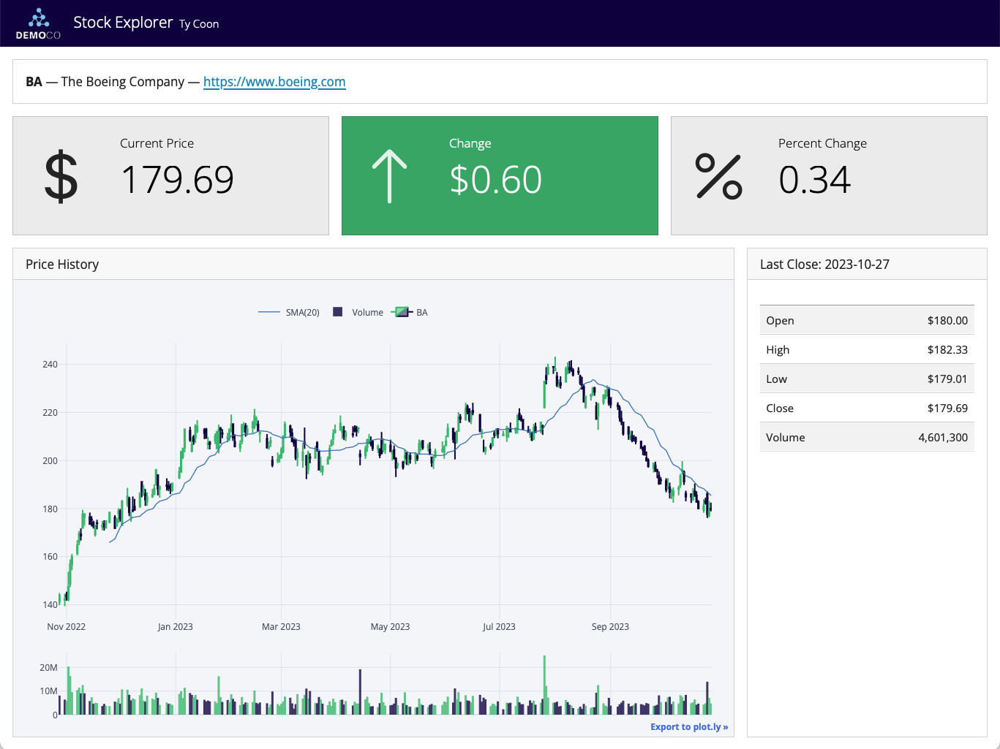
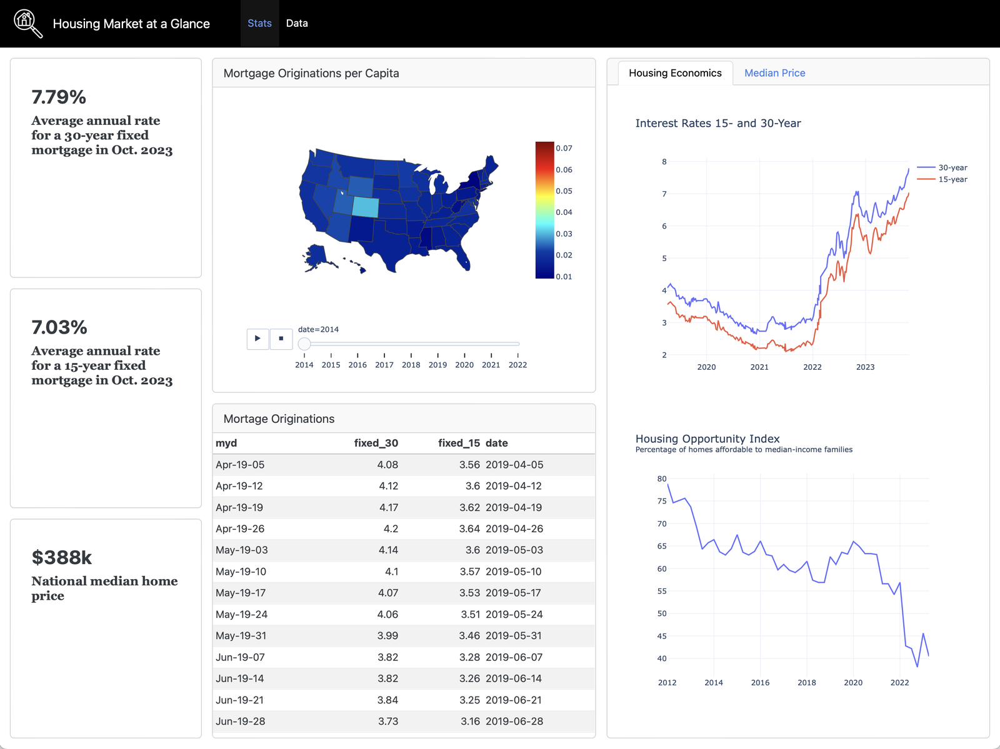

## Previously ...

Five lectures in Tableau. You have the four families of figure, calculated
fields, segments, and the design principles a stakeholder view has to meet.

. . .

Today you assemble them into the client deliverable, which is also
**Assignment 1**.

## Learning Outcomes

By the end of this lecture you will be able to:

- Design a dashboard around a decision rather than around available data
- Structure a dashboard as title, story and visualisations
- Add interactivity with filter and highlight actions, and useful tooltips
- Publish to Tableau Public and hand the result to somebody else

# 1. Design First

## Start With the Decision

Open a blank page, not Tableau. Write one sentence:

> *This dashboard exists so that ______ can decide ______.*

. . .

If you cannot finish the sentence, you are not ready to build. Everything that
follows is judged against it: a view that cannot change that decision does not
go on the page.

::: {.callout-note appearance="minimal"}
This is Lecture 1's test, applied to a whole page rather than a single number.
:::

## Dashboards Are Not All the Same Thing {.smaller}

Three broad types, and they are built differently:

| Type | Purpose | Design consequence |
|---|---|---|
| **Monitoring** | Is anything wrong right now? | Few numbers, large, with thresholds |
| **Analytic** | Why did this happen? | Filters, breakdowns, detail on demand |
| **Communication** | Here is what we found | Narrative order, written story, fixed conclusion |

. . .

**Assignment 1 is a communication dashboard.** It is read once, by somebody who
was not in the room, and it has to end somewhere.

*See [Dashboard Design Patterns](https://dashboarddesignpatterns.github.io/) for
the full taxonomy.*

## The Four-Step Build {.smaller}

The order matters, and almost everybody gets it wrong by polishing too early.

1. **Basic figures.** Build many worksheets, all on default settings. Do not
   style anything
2. **Basic dashboard.** Assemble the ones that survive, with the title, text and
   images in place, and no design work at all
3. **Improve the figures.** Now go back into each worksheet: colour, size, shape,
   titles, captions, axes, tooltips
4. **Improve the dashboard.** Background, fonts, layout, containers, actions

. . .

**Steps 1 and 2 decide whether the dashboard is any good.** Steps 3 and 4 decide
whether it looks it. Doing them in the other order wastes a weekend.

## The Sketch

Five minutes, pen and paper, before step 2.

- What is the **first** thing the reader's eye lands on?
- What is above the fold, and what needs scrolling?
- Which views are the argument, and which are the evidence?

. . .

**Reading order follows the decision**, not the order you happened to build
things in.

## Layout Conventions

Most communication dashboards that work look similar, because Western readers
scan the same way:

- **Headline numbers top-left**: the finding, in figures
- **The trend beneath them**: how it got there
- **Breakdowns below**: who and what is driving it
- **Detail last**, or on demand through a filter

. . .

Convention is not a lack of imagination. It is how the reader finds the argument
without being taught your layout first.

## A Dashboard That Answers One Question {.smaller}

](./figures/external/qd_dashboard_customer_churn.png){fig-align="center" height="340px"}

*Three numbers at the top, the reasons underneath, the detail last. You can
say what decision it supports in one sentence.*

## Two More, For Comparison {.smaller}

:::: {layout="[1,1]"}
::: {#first-column}

**Focused**

{fig-align="center" height="255px"}

:::

::: {#second-column}

**Dense**

{fig-align="center" height="255px"}

:::
::::

::: {style="font-size:0.55em;text-align:center;"}
Source: [Quarto Dashboards, posit::conf(2024)](https://github.com/posit-conf-2024/quarto-dashboards)
:::

*Both are competent. Only one of them can be read from the back of a room.*

## What to Leave Out

<!-- Speaker notes: students will want to show everything they built over the
     block. The discipline of removal is the assessed skill, and it is the one
     they resist hardest. -->

Every chart must earn its place by changing a decision. The usual offenders:

- A view that duplicates another in a different shape
- A count that nobody would act on
- A breakdown with four posts in a category
- Anything included because it was hard to build

. . .

**A dashboard is what is left after the removals.** Assignment 1 is marked on
storytelling, and a story with seven endings has none.

## Ten Rules Worth Taping to the Wall {.smaller}

:::: {layout="[1,1]"}
::: {#first-column}

1. Do not overwhelm the viewer
2. Avoid visual clutter
3. Do not add data because you have it
4. Be consistent: one palette, one date format, one number format
5. Make interaction visible; a filter nobody notices does not exist

:::

::: {#second-column}

6. Manage complexity: progressive detail, not everything at once
7. Group related charts together
8. Avoid saying the same thing twice
9. Context beats completeness
10. Iterate. Nobody's first layout is their last

:::
::::

# 2. The Three Key Elements

## Title, Story, Visualisations

Every dashboard in this module carries three things. Images, buttons and menus
are optional; these are not.

1. A **title** that pinpoints the problem
2. A written **story**: introduction, analysis, conclusion
3. **Multiple visualisations**, in a deliberate order

. . .

Most student dashboards have the third and neither of the others, and lose marks
on Overall Story for exactly that reason.

## The Title Does the Work {.smaller}

A title states the problem, asks a question, or is simply memorable enough to be
read. Real examples from Tableau Public:

- *Healthcare Crisis in Rural America* — names the problem
- *#CollegeGameday: Can My Family Out-Pick the Pundits?* — asks a question
- *NBA Lords of the Rings* — catchy enough that you look

. . .

What a title is not: `Dashboard 1`, `Instagram Analysis`, or `Loomrow Data`.
Those name the contents. **Name the finding.**

## The Story {.smaller}

:::: {layout="[1,1]"}
::: {#first-column}

**Introduction**

The context. Who is Loomrow, what do they sell, what were they asking?

**Analysis**

Walk the reader through the visualisations, extracting the point of each. Link
them: by time, by geography, by logic, by increasing complexity.

:::

::: {#second-column}

**Conclusion**

Summarise, then **recommend**. What should they do on Monday?

A conclusion that only summarises has stopped one step short of the job.

:::
::::

. . .

Three short paragraphs of text on the dashboard itself. Not a separate document,
and not spoken over it.

## The Visualisations

1. Place them in an order that matches the story, not the order you built them
2. Make sure each one has been through step 3: styled, titled, captioned
3. Add a caption where the finding is not obvious from the chart alone
4. Wire up the global interactive features, which is the next section

## Exercise {background="#43464B"}

For the Loomrow dashboard you are going to submit:

1. Write the decision sentence
2. Write a title that names the finding, not the contents
3. Sketch the layout on paper: what is above the fold, and in what order

Swap with the person beside you. **Can they say what your dashboard is for
without you explaining it?**

::: {#timer1 .timer seconds="600"}
:::

# 3. Interactivity

## Local Filters and Highlighters

On a single worksheet, right-click a field and **Show Filter** to put a control
beside the view.

. . .

- A **filter** removes rows. The chart is recalculated on what is left
- A **highlighter** keeps every row and dims the ones you did not pick

. . .

**The difference matters for percentages.** Filter to reels and the rates
recompute among reels; highlight reels and the rates still include everything
else.

## Dashboard Actions {.smaller}

The control that turns four charts into one dashboard. **Dashboard → Actions →
Add Action**:

| Action | What it does |
|---|---|
| **Filter** | Selecting a mark in one view filters every other view |
| **Highlight** | Selecting a mark dims the non-matching marks everywhere |
| **Go to URL** | A mark becomes a link out |
| **Parameter / Set** | A selection changes a calculation |

. . .

Set the trigger (`Hover`, `Select`, `Menu`) deliberately. **Hover actions on a
dense chart are unusable**; select is almost always the right answer.

## Tooltips

The Marks card's **Tooltip** button. What appears there is a design decision, not
a default.

- Remove the fields the reader does not need
- Write it as a **sentence**: *"Reels in March reached 41,300 accounts across 18
  posts"*
- Include the **sample size**. A tooltip is where an honest `n` fits without
  cluttering the chart
- Advanced: embed another worksheet in the tooltip, so hovering shows a small
  chart

## Alias, Format, and the Small Things

- **Aliases**: right-click a dimension member to rename it for display.
  `behind the scenes` becomes `Behind the scenes` without editing the data
- **Number format**: set it once on the field, not per view
- **Dates**: Tableau's date hierarchy (`Year > Quarter > Month > Day`) gives you
  drilldown for free. Use `Week` for portfolio-scale data
- **Device layouts**: build the desktop version, then check the phone layout.
  Your marker may open it on a phone

## Live Demo {background="#43464B"}

<!-- Speaker notes: about twelve minutes. Build it badly first, on purpose, then
     apply steps 3 and 4 in front of them. The contrast is the lesson. -->

1. Four default worksheets dropped on a dashboard, ugly and unstyled
2. Add the title, the three story paragraphs, a logo
3. Back into each worksheet: colour, axis titles, number format, tooltip
   sentences
4. Back on the dashboard: containers, background, one filter action and one
   highlight action
5. Open the phone layout, and fix what breaks

# 4. Publishing and Handover

## Publishing to Tableau Public

**File → Save to Tableau Public As...**, and the workbook uploads to your
profile.

. . .

::: {.callout-note appearance="minimal"}
**Everything you publish is public.** Do not upload anything confidential, and
check what is in the data before you press it. This is a real habit, not a
classroom rule.
:::

. . .

Publishing is also saving. Publish at the end of every working session, and
rename versions so you can go back.

## Export Versus Share

- **Share**: the link to your published viz. Interactive, and the one you submit
- **Download → Image / PDF**: a snapshot for a slide deck. Interactivity is gone
- **Download → Workbook**: the `.twbx`, for someone who will edit it
- **Download → Data**: the underlying table. Check whether you meant to offer
  this

## The Handover Test

The dashboard is finished when somebody can open it **without you in the room**
and reach the conclusion you intended.

. . .

Test it properly: send the link to someone outside the module, say nothing, and
ask them what they think it says.

. . .

**Most dashboards fail this test on the title and the missing story**, not on the
charts.

## Caveats Belong on the Page

Anything you know about the data that would change how it is read goes on the
dashboard, in small text, not in your head:

- How many posts are behind the smallest bar
- That `attributed_revenue_eur` is what the platform claims, not what was audited
- That spend on days without a boosted post is not in the file, so the figures
  are the content budget rather than the media budget

. . .

**A caveat you disclose is professional. The same caveat found by your reader is
a credibility problem.** We come back to this in Lecture 20.

## Assignment 1 Brief {.smaller}

A Tableau Public **dashboard** built on `insta-data.csv`, answering Loomrow's two
questions. Marked in four equal parts:

| Criterion | 25% each |
|---|---|
| **Creativity** | Menus, filters and interactions that do something |
| **Analytical depth** | Figures that answer a question worth asking |
| **Design** | Layout, colour, typography, restraint |
| **Overall story** | Title, narrative, and a conclusion with a recommendation |

. . .

**Submit the Tableau Public link.** Not a story, not a PDF, not a workbook file.
Due mid-November.

## Studio Time {background="#43464B"}

Build. Checkpoints, in order:

1. Decision sentence written and visible on the page
2. Sketch reviewed by one peer
3. Draft assembled with real data, unstyled
4. Steps 3 and 4 of the build: figures, then dashboard
5. One filter action and one highlight action working
6. Peer review against the Lecture 6 critique checklist

::: {#timer2 .timer seconds="1500"}
:::

# 5. AI as a Dashboard Critic

## AI This Block: Chat With Context

Where we are on the module's AI spine, set out in Lecture 1 and named properly in
Lecture 12:

> **Chat with context.** Attach the thing. A screenshot of your dashboard is
> context.

## Specification, Not Construction

An assistant cannot build a Tableau workbook. It is good at the step before and
the step after.

. . .

> "My dashboard supports this decision: *[your sentence]*. Propose a layout:
> which views, in what order, above and below the fold. Say what to leave out."

. . .

And afterwards, on a screenshot:

> "Here is the dashboard. Read it as a client who has ninety seconds. What do you
> think it is telling me to do?"

## The Removal Test

Give it your list of built views and ask **which one does not change a
decision**.

. . .

It is better at removing than you are, for one reason: it is not attached to the
work. You spent two hours on that map.

. . .

Cut at least one view it names, even one you disagree about, and look at the
dashboard again before you decide.

## What It Cannot See

- Whether your filter action actually fires
- Whether the smallest bar rests on four posts
- What your client will really ask, which is usually about money
- Whether the colours survive on a projector

. . .

::: {.callout-note appearance="minimal"}
Asked "is this dashboard good?", it will say yes. Ask it what the dashboard is
telling you to do instead: that question has a wrong answer, so it is worth
asking.
:::

## Exercise {background="#43464B"}

1. Give an assistant your decision sentence and your list of built views
2. Ask which to cut, and why
3. Cut at least one you disagree about, and look at the result
4. Screenshot the dashboard and ask what it thinks you are recommending

If its answer is not your recommendation, the dashboard is wrong, not the
assistant.

::: {#timer3 .timer seconds="600"}
:::

## Going Further

- [Dashboard Design Patterns](https://dashboarddesignpatterns.github.io/), and
  its workshop slides
- Stephen Few, *Information Dashboard Design*
- [Tableau Public gallery](https://public.tableau.com/app/discover), and the
  annual Viz Wrap posts
- Tableau, *Actions* and *Dashboard Layout* documentation

## Next Lecture

Block 2 closes here. Next week Block 1 of Semester 2 opens: you stop analysing
data somebody else generated and start generating your own.

. . .

**You will build a website.**
