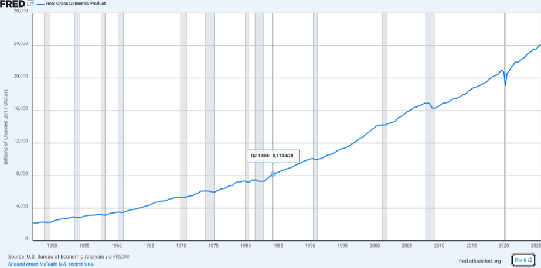
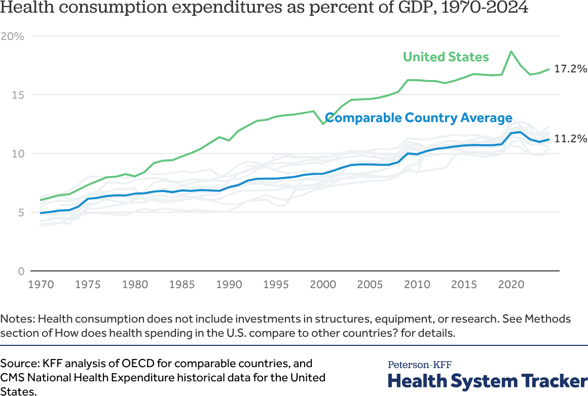
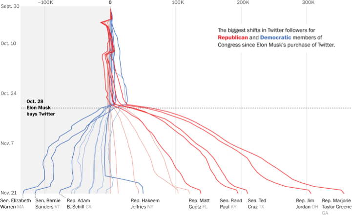
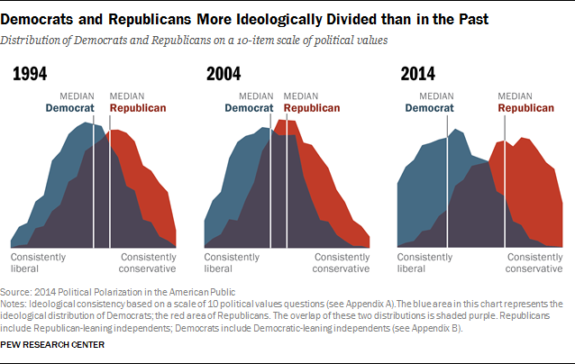
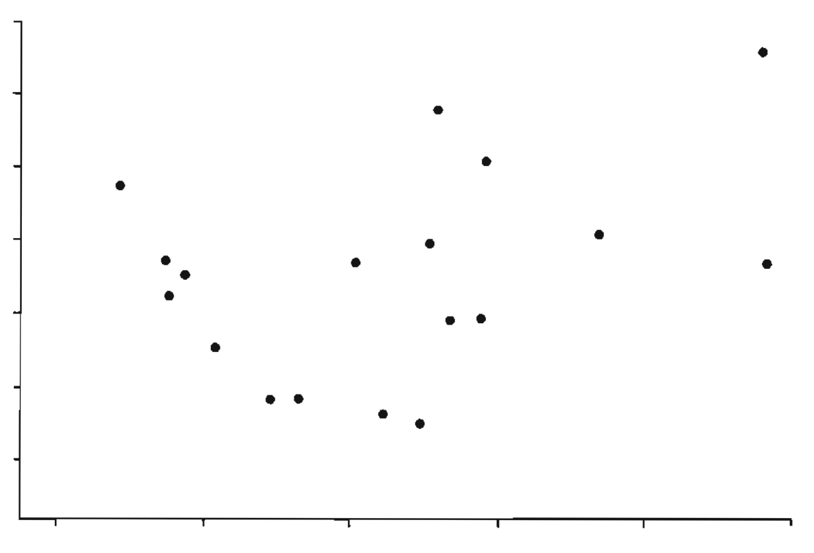
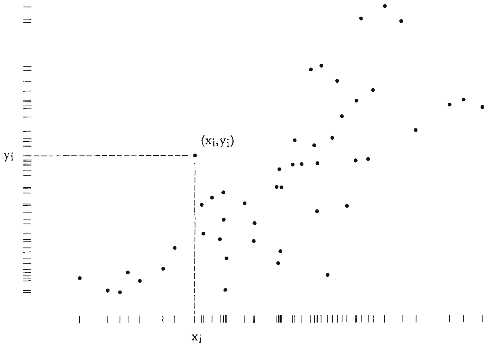
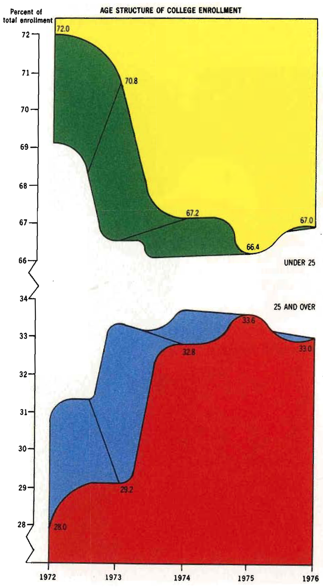
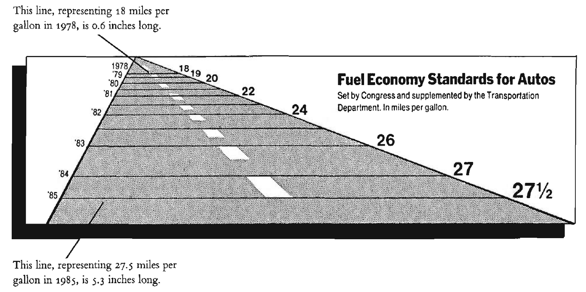
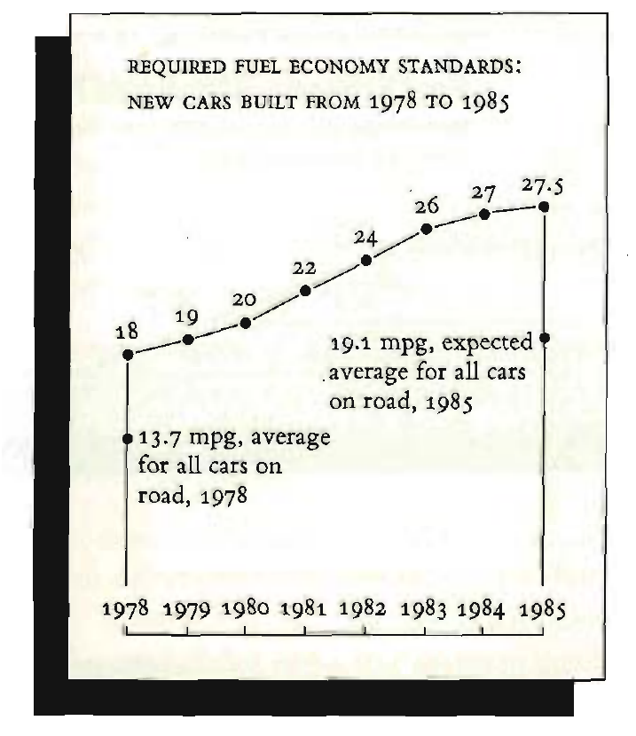

## Previously ...

You have views that answer your questions. A client has different questions, and
about ninety seconds of attention.

## Learning Outcomes

By the end of this lecture you will be able to:

- Distinguish an analyst's view from a client's view, and build both
- Apply the ranking of visual channels to a marketing chart
- Identify the standard ways a chart misleads, deliberately or otherwise
- Critique a real marketing dashboard, and survive having yours critiqued

# 1. What a Chart Is For

## Why We Bother

- Humans are extremely good at reading visual patterns and poor at reading
  tables
- Charts reveal properties of the data nobody thought to test for
- They are understandable to non-specialists, which is most of the people who
  make decisions
- They are a *lingua franca* across functions: finance, product and marketing
  can argue over the same chart

. . .

**A chart succeeds when it raises the next question.** "I wonder why that is" is
the sound of someone accepting the fact and moving to the explanation.

::: {.callout-note appearance="minimal"}
Charts rarely settle an argument on their own. If a chart will not settle it,
what is it for?
:::

## What Excellence Looks Like {.smaller}

](./figures/external/smm635_graphical_excellence.png){fig-align="center" height="255px"}

*Ideas, ink, space, time. A good chart spends the least ink on the fewest
ideas that carry the point.*

## One Dataset, Many Charts

The same small dataset can be drawn a hundred different ways, each emphasising a
different comparison.

. . .

One shows change over time within a country. One shows the ranking at a single
date. One shows regional grouping. One shows one country overtaking another.

. . .

**None of them is dishonest. They answer different questions.** The choice of
which comparison to foreground is the analyst's, and it is rarely visible to the
audience.

## One Dataset, Six Charts {.smaller}

 (CC BY 4.0)](./figures/external/mgt100_one_dataset_six_charts.png){fig-align="center" height="350px"}

*World Heritage sites in three countries, 2004 and 2022. Each chart makes a
different comparison easy and the others hard.*

## Each Chart Makes One Point

Graphics journalists work to a hard rule: **one chart, one point, obvious how to
read it.**

In practice, most good charts say one of four things:

1. The number went up or down recently
2. The number moved when something happened
3. One line, or one group of lines, diverges from the rest
4. The distribution has two lumps rather than one

. . .

Scientific and analyst charts are often the opposite: four variables, six
symbols, and the explanation two pages away.

::: {.callout-note appearance="minimal"}
Take the chart you brought. Which of the four points does it make? If it makes
two, which one loses?
:::

## The Four Points a Chart Usually Makes {.smaller}

:::: {.columns style="gap:0px;"}
::: {.column style="width:50%;line-height:0;"}
{fig-align="center" height="200px"}

{fig-align="center" height="200px"}
:::
::: {.column style="width:50%;line-height:0;"}
{fig-align="center" height="200px"}

{fig-align="center" height="200px"}
:::
::::

::: {style="font-size:0.5em;"}
Number goes up, lines diverge, something happened, the distribution is bimodal. Jeremy Merrill, Washington Post, via [MGT 100 Customer Analytics, UC San Diego](https://github.com/kennethcwilbur/mgt100) (CC BY 4.0)
:::

# 2. Two Audiences

## What an Analyst Needs

- Detail, at the grain the question lives at
- Uncertainty made visible
- The ability to drill down and check
- Access to the raw rows when something looks wrong
- Ugly is fine. Fast is better

## What a Client Needs

- One number, its direction, and what to do about it
- The comparison that makes the number mean something
- The caveat, once, in words
- No vocabulary they have to learn to read the chart

. . .

**These are not the same chart with different formatting.** They are usually
different charts, and the analyst's chart is the one that produced the client's.

## The Title Does the Work {.smaller}

:::: {.columns}
::: {.column width="45%"}
**Analyst title**

"Sessions by source / medium, weekly, 2026-01 to 2026-03"

Describes the fields.
:::
::: {.column width="45%"}
**Client title**

"Referral traffic has replaced search as our main source since February"

States the finding.
:::
::::

. . .

If you cannot write the second title, you have not finished the analysis. The
chart is not the deliverable, the sentence is.

<!-- Speaker notes: make them do this live for one chart each. It is the single
     highest-yield change in the whole lecture and it takes thirty seconds per
     chart. It also exposes charts that do not have a finding, which is the more
     valuable diagnosis. -->

## A Title That Does the Work {.smaller}

 (CC BY 4.0)](./figures/external/mgt100_title_does_the_work.png){fig-align="center" height="350px"}

*You know the finding before you have read a single axis label.*

# 3. Encoding

## The Ranking of Visual Channels {.smaller}

Cleveland and McGill established, experimentally, how accurately people read
quantities from different visual channels. Best to worst:

1. **Position** along a common scale
2. **Position** along non-aligned scales
3. **Length**
4. **Angle** and slope
5. **Area**
6. **Volume**, curvature
7. **Colour** hue, saturation

. . .

Everything above the line in a good chart is doing its work with the top three.

::: {.callout-note appearance="minimal"}
A pie chart encodes quantity as angle and area, positions four and five. What
does it buy in exchange for that cost, and when is the trade worth it?
:::

## Chart Choice by Question

| Question | Chart |
|---|---|
| How has it changed? | Line |
| How do categories compare? | Bar, sorted by value not alphabetically |
| What is the distribution? | Histogram, or box plot for comparisons |
| What is the composition? | Stacked bar, rarely a pie |
| Where does it drop off? | Funnel, with counts at every step |
| Is there a relationship? | Scatter, with the n stated |

. . .

**Start from the question, not from the chart menu.** Tableau's Show Me panel
inverts that order, which is why it is so easy to produce a beautiful chart of
nothing.

## The Data-Ink Ratio

Tufte's principle: **maximise the share of ink that represents data.**

. . .

Remove, in this order: 3D effects, background fills, heavy gridlines, borders,
redundant legends, decorative images, drop shadows.

. . .

Add back only what a reader needs to decode the chart. The test is subtraction:
delete an element and see whether the chart still works.

## The Data-Ink Ratio, Concretely {.smaller}

:::: {.columns}
::: {.column width="48%"}
**Default**

{fig-align="center" height="265px"}
:::
::: {.column width="48%"}
**Same data, less ink**

{fig-align="center" height="265px"}
:::
::::

::: {style="font-size:0.55em;text-align:center;"}
Source: [SMM635 Data Visualisation, Bayes Business School](https://github.com/simoneSantoni/data-viz-smm635)
:::

*The right-hand version deletes the frame and spends the freed ink on the
marginal distributions. Nothing was lost.*

## Chart Junk, and Its Modern Forms

The 1980s version was 3D bars and a picture of a duck. The current version is
subtler:

- A rainbow palette on an ordered variable
- Colour used to encode a category **and** decorate the background
- Animated transitions between states nobody asked to compare
- An interactive filter for a dimension with two values
- A dashboard with eleven tiles, because there were eleven metrics

. . .

**Every element on a dashboard competes for attention with every other.** That
is the cost, and it is paid by the reader.

## The Duck {.smaller}

:::: {.columns}
::: {.column width="48%"}
**A building shaped like a duck**

{fig-align="center" height="265px"}
:::
::: {.column width="48%"}
**A chart shaped like a duck**

{fig-align="center" height="265px"}
:::
::::

::: {style="font-size:0.55em;text-align:center;"}
Source: [SMM635 Data Visualisation, Bayes Business School](https://github.com/simoneSantoni/data-viz-smm635)
:::

*Tufte's term. When the decoration becomes the structure, the chart is the duck.*

## Honest Charting: Five Rules

1. Start axes at zero, or say clearly that you have not
2. Show all the relevant data and label it accurately
3. Bin, smooth and aggregate judiciously, and say which you did
4. Show uncertainty when it would change the reading
5. Cite the source, including the date you pulled it

. . .

**A misleading chart can indicate bad faith.** Two goals here: not being
misread, and spotting when someone else is misleading you.

::: {.callout-note appearance="minimal"}
Rule 1 has a genuine exception: a series where the interesting variation is 2%
of the level. How do you take the exception honestly?
:::

## The Standard Failures

- **Truncated axis** on a bar chart, which turns a 3% difference into a
  landslide
- **Dual axes**, which let you manufacture any crossing point you like by
  choosing the scales
- **Colour as the only encoding**, which fails for about 8% of men
- **Pie with nine slices**, which is a sorted bar chart wearing a disguise
- **A rate with no denominator**, which is Lecture 6, again, forever

## A Famous Failure, and Its Repair {.smaller}

:::: {.columns}
::: {.column width="48%"}
**As published**

{fig-align="center" height="265px"}
:::
::: {.column width="48%"}
**As it should have been**

{fig-align="center" height="265px"}
:::
::::

::: {style="font-size:0.55em;text-align:center;"}
Source: [SMM635 Data Visualisation, Bayes Business School](https://github.com/simoneSantoni/data-viz-smm635)
:::

*A 53% increase in fuel economy standards drawn as a 783% increase in line
length. The redraw uses the same numbers.*

# 4. Critique

## Live Critique {background="#43464B"}

Two real dashboards on screen: the GA4 default home, and one agency or Looker
Studio gallery template.

For each, as a room:

1. Who is the audience, judging only by what is on it?
2. What decision could it support?
3. Which tile would you delete first, and what would you notice sooner?
4. Which number on it has no denominator?

## Exercise {background="#43464B"}

In pairs:

1. Take one chart from your own Tableau workbook
2. Rewrite its title as a finding rather than a field name
3. Redesign it for a client rather than for yourself
4. Swap with your partner and critique theirs against the channel ranking and
   the five honesty rules
5. List the three changes that most improved it

**25 minutes**

# 5. AI as a Design Critic

## AI This Block: Chat with context

Where we are on the module's AI spine, set out in Lecture 1 and named properly
in Lecture 10:

> **Chat with context**

## Paste the Chart, Ask What Is Wrong

Screenshot critique is one of the strongest uses of a multimodal assistant,
because the encoding rules are explicit, well documented and heavily written
about.

> "Here is a chart from my dashboard [screenshot]. Critique it against the
> Cleveland and McGill ranking of visual channels. Say specifically what a
> non-technical client would misread, and what they would conclude that the data
> does not support."

. . .

The last clause matters. "Critique this chart" gets you a list of tidying. "What
would they wrongly conclude" gets you the failure.

## Two More Prompts Worth Keeping

> "Rewrite this chart title as a finding rather than a field name. Give me three
> versions at different levels of confidence."

. . .

> "What would a CFO ask when they see this? What would a marketing manager ask?
> Which of those questions can this chart answer?"

. . .

The three-confidence-levels trick is useful because it forces you to choose how
strong a claim your data supports, rather than defaulting to the strongest
phrasing that sounds fine.

## What It Cannot See

- Whether the finding is **true**. It is critiquing an image, not your data
- Whether the comparison is the one your client cares about
- Whether the number has a denominator, unless the denominator is on the chart
- Your audience, unless you describe them, and it will not ask

::: {.callout-note appearance="minimal"}
It will make your chart prettier and more conventional. Under what circumstances
is "more conventional" the wrong direction?
:::

## Exercise {background="#43464B"}

1. Screenshot one of your charts and ask for a critique
2. Apply the two changes you agree with
3. Note one piece of its advice you rejected, and why
4. Ask it to rewrite the title at three confidence levels, and pick the one your
   data supports

**15 minutes**

## Going Further

- Cleveland and McGill (1984), *Graphical Perception* — the source of the
  ranking, and it is readable
- Tufte, *The Visual Display of Quantitative Information* — ch. 2 on graphical
  integrity, ch. 4 on data-ink
- Cairo, *The Functional Art* — the design process framework, and the best
  bridge between journalism and analysis
- Wilke, *Fundamentals of Data Visualization* — free online, and the practical
  reference you will actually keep open

## Next Lecture

Block 3 begins. We move to Python for the analyses Tableau makes awkward, and we
stop and name what we are doing with AI.

**Prepare**: nothing to build. Come with the question about AI you have been
not asking.
