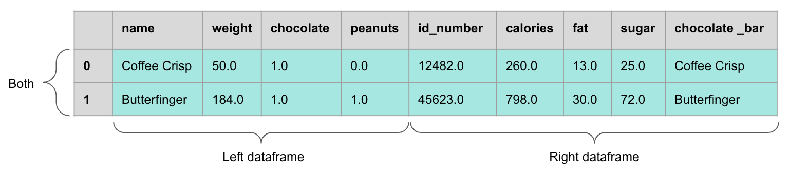
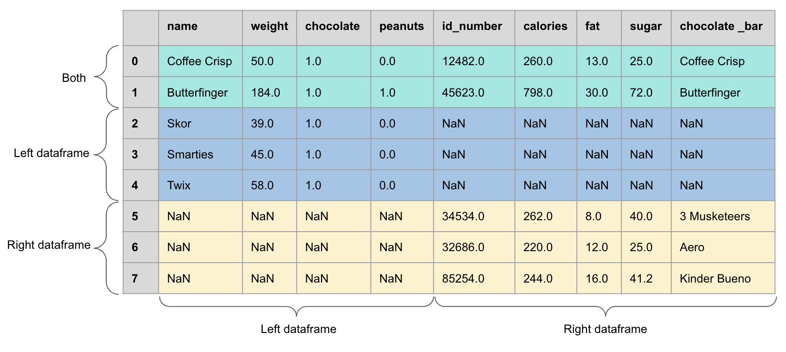

## Previously ...

You can load your GA4 export into a notebook and look at it. Today we combine it
with everything else, which is where marketing metrics actually come from.

## Learning Outcomes

By the end of this lecture you will be able to:

- Aggregate with `groupby()` and named `agg()`
- State the grain of a table before and after every operation
- Join traffic data to ad spend or content metadata
- Diagnose a join that has gone wrong, and prove that one has not

# 1. Aggregation

## Split, Apply, Combine

Every aggregation is three steps, and naming them prevents most errors:

1. **Split** the rows into groups by one or more keys
2. **Apply** a function to each group independently
3. **Combine** the results into a new table

. . .

The new table has a **different grain**. That is the whole point, and it is the
thing people forget one line later.

```{.python}
(ga4
  .groupby("channel")
  .agg(sessions=("sessions", "sum"),
       conversions=("key_events", "sum"))
  .assign(cvr=lambda d: d.conversions / d.sessions)
)
```

## Named Aggregation, and Why

```{.python}
.agg(sessions=("sessions", "sum"),
     conversions=("key_events", "sum"),
     first_seen=("date", "min"),
     users=("user_id", "nunique"))
```

. . .

One line per output column, each saying explicitly which input column and which
function. No multi-level column index to unpack afterwards, and the code reads
as a specification of the output table.

. . .

**Compute the rate after the aggregation, never before.** `conversions.sum() /
sessions.sum()` is the rate of the totals. Averaging a per-row rate is Lecture 6
returning in Python.

::: {.callout-note appearance="minimal"}
`nunique` on `user_id` and `sum` on `sessions` produce different numbers for the
same group. Which one belongs in the denominator of a conversion rate, and does
your answer depend on the question?
:::

## Multiple Grains From One Table

```{.python}
by_channel      = ga4.groupby("channel").agg(...)
by_channel_week = ga4.groupby(["channel", "week"]).agg(...)
by_channel_dev  = ga4.groupby(["channel", "device"]).agg(...)
```

. . .

Three tables, three grains, all correct, and they will not reconcile against
each other unless you are careful about which rows each one includes.

. . .

**Write the grain in a comment above every aggregation.** One row is one
______. It costs three seconds and it is the single highest-yield habit in this
block.

<!-- Speaker notes: make them do this literally in the exercise. The habit is
     what carries into lecture 15's cleaning log, where the grain of the log
     itself becomes a question. -->

# 2. Joining

## Why Joining Is the Whole Point

<!-- Speaker notes: GA4 alone cannot tell you cost. Spend lives in the ad
     platform. Content attributes live in a spreadsheet the marketer keeps.
     Every interesting marketing metric is a join. -->

GA4 knows what happened on your site. It does not know what anything cost.

. . .

The marketer always has three tables, held in three different places by three
different systems:

| Table | Grain | Lives in |
|---|---|---|
| Traffic | Session or event | GA4 |
| Spend | Campaign × day | The ad platform |
| Content | One row per page or post | A spreadsheet somebody maintains |

. . .

**Cost per acquisition, ROAS, content performance: every one of them is a
join.** There is no single system that hands you the number.

## Join Types, With the Marketing Case {.smaller}

| Type | Keeps | Right when |
|---|---|---|
| `inner` | Rows matching in both | You need both sides to compute anything, and unmatched rows are meaningless |
| `left` | All traffic rows | Traffic is the truth and spend is optional: organic sessions have no cost |
| `right` | All spend rows | You want to find campaigns that spent money and produced no traffic |
| `outer` | Everything | Diagnosis. Rarely the final answer |

. . .

**The `left` join is the default for a reason**, and it is also the one that
silently produces nulls that become zeros that become a ROAS of infinity.

## Inner and Outer, Drawn {.smaller}

:::: {.columns}
::: {.column width="48%"}
**Inner join: only the matches**

{fig-align="center" height="245px"}
:::
::: {.column width="48%"}
**Outer join: everything, with NaN**

{fig-align="center" height="245px"}
:::
::::

::: {style="font-size:0.55em;text-align:center;"}
Source: [UBC MDS, Programming in Python for Data Science](https://github.com/UBC-MDS/programming-in-python-for-data-science)
:::

*The NaN block on the right is the whole reason to check a join. It is also
where your row count went.*


## The Grain Contract {.smaller}

Before a merge, answer three questions in writing:

1. What is the grain of the left table?
2. What is the grain of the right table?
3. What should the grain of the result be?

. . .

If the right table has more than one row per key, a `left` join **multiplies**
your rows. Sessions get counted twice. Spend gets attributed twice. Revenue
doubles.

. . .

```{.python}
merged = traffic.merge(spend, on="campaign", how="left",
                       validate="many_to_one")
```

. . .

`validate` makes pandas raise an error instead of quietly producing a bigger
table. **Use it on every merge.** It is one keyword and it catches the most
expensive class of error in this module.

::: {.callout-note appearance="minimal"}
A many-to-many join between traffic and spend, both at campaign × day, with one
duplicate day in the spend table. How many rows do you get, and which number in
the final report is wrong?
:::

## Join Keys That Do Not Match

`google / cpc` versus `Google Ads`. `Newsletter` versus `newsletter`.
`/pricing` versus `/pricing/`. A campaign named `spring26` in GA4 and
`Spring 2026` in the spend sheet.

. . .

Case, whitespace, trailing slashes, and the human who typed the UTM by hand at
11pm.

. . .

**This is where Lecture 3's tagging discipline pays off, or does not.** The
students who wrote a UTM conventions sheet in week 3 spend five minutes here.
The others spend the lecture.

## Checking a Join

```{.python}
merged = traffic.merge(spend, on="campaign", how="left", indicator=True)
merged["_merge"].value_counts()

# the four numbers that matter
len(traffic), len(spend), len(merged), merged["_merge"].eq("both").sum()
```

. . .

**The four-number check**, run after every join:

1. Rows in, left side
2. Rows in, right side
3. Rows out
4. Rows matched

. . .

If (3) is greater than (1) on a left join, you have fanned out. If (4) is much
less than (1), your keys do not match. Neither will announce itself.

## Diagnosing the Mismatch

```{.python}
unmatched = merged.loc[merged["_merge"] == "left_only", "campaign"].unique()
sorted(unmatched)[:20]

# then look at the other side
sorted(spend["campaign"].unique())[:20]
```

. . .

**Look at the actual values, side by side.** Nine times in ten the answer is
visible in ten seconds and invisible in any summary statistic.

. . .

Then fix the key with a normalisation you can write down, not a manual mapping
you cannot reproduce:

```{.python}
def norm(s):
    return s.str.strip().str.lower().str.replace(r"\s+", " ", regex=True)
```

::: {.callout-note appearance="minimal"}
Normalising keys makes rows match. Under what circumstances does making rows
match make the analysis worse?
:::

# 3. Putting It Together

## Live Demo {background="#43464B"}

1. Traffic aggregated to campaign × week, grain written in a comment
2. Spend read in at campaign × day, aggregated up to campaign × week first
3. `merge` with `validate="one_to_one"`, which fails, because the spend sheet
   has a duplicate row
4. Find the duplicate, decide what to do about it, write the decision down
5. Cost per session, and the campaigns with cost and no sessions

## Exercise {background="#43464B"}

Using your own export plus a spend table, real or simulated:

1. Aggregate sessions and key events by channel and week, and write the grain in
   a comment
2. Join to spend on campaign, with `validate=` set
3. Report the four-number check
4. Report how many rows failed to match, and **why**, with the actual key values
5. Compute cost per key event by channel, and say which channels it is undefined
   for

**25 minutes**

# 4. Agentic Joins

## AI This Block: Agentic coding

Where we are on the module's AI spine, introduced in Lecture 10:

> **Agentic coding**

## A Failed Join Is the Ideal Agentic Task

Because the diagnosis is a **loop**: count, inspect, hypothesise, test, count
again.

. . .

Chat can list the usual causes of a key mismatch. An agent can find out which
one is actually happening in your file, in one pass, without you pasting
anything.

> "This merge left 340 of 500 rows unmatched. Find out why, show me the
> mismatched key values side by side, and propose a normalisation. Do not apply
> it yet."

. . .

**"Do not apply it yet"** is the useful half of that prompt.

## Why an Agent Beats Chat Here

- It can run `value_counts()` on both sides rather than asking you to
- It can test a normalisation and report the new match rate immediately
- It can check whether the fix changed the row count, which is the check you
  would forget

. . .

The loop is fast, mechanical, and has an unambiguous success criterion. That
combination is exactly where delegation pays.

## What You Still Verify

- Row counts before and after: the four-number check is yours, not its
- That the fix **normalised** keys rather than dropping the rows that did not
  match
- That no duplicate rows were created by a many-to-many join
- That the campaigns which still do not match are genuinely absent from the
  spend table, and not renamed

::: {.callout-note appearance="minimal"}
An agent that silently changes `how="left"` to `how="inner"` will report a 100%
match rate. Which of the checks above catches that, and would you have run it?
:::

<!-- Speaker notes: this is the concrete instance of lecture 10's "verification
     is checking output, not reading code". Reading the diff would catch the
     changed keyword; but so would the row count, and the row count also catches
     the five other ways it could go wrong. -->

## Exercise {background="#43464B"}

1. Deliberately break a join by changing case in one key
2. Ask an agent to diagnose it
3. Check whether its fix preserved the row count you expected
4. Ask it to add a `validate=` argument and explain which value it chose and why
5. Break it a second way, with a duplicate row rather than a bad key, and see
   whether the same prompt finds it

**15 minutes**

## Going Further

- Wickham (2011), *The Split-Apply-Combine Strategy for Data Analysis* — the
  paper that named the pattern
- pandas user guide, *Merge, join, concatenate and compare* — read the
  `validate` and `indicator` sections properly
- McKinney, *Python for Data Analysis*, ch. 8 — the reference for this lecture

## Next Lecture

The analyses Tableau makes awkward: cohorts, retention and RFM.

**Prepare**: have a joined table ready. Lecture 13 builds on it rather than
starting again.
