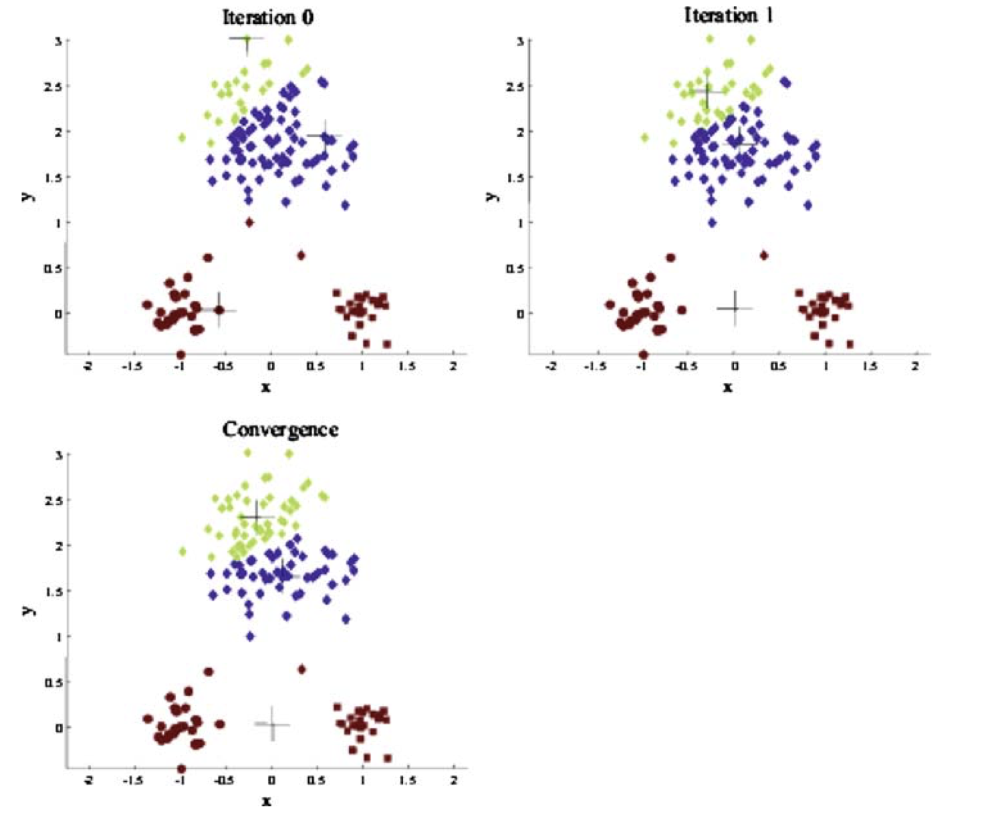
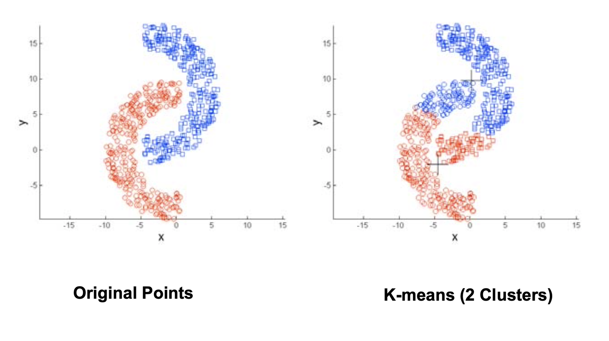

## Previously ...

You can group and join. Now we do the analyses that are painful in a
drag-and-drop tool and natural in code.

## Learning Outcomes

By the end of this lecture you will be able to:

- Build a cohort retention table and read it in both directions
- Explain why retention, not acquisition, is what a valuation turns on
- Compute recency, frequency and monetary scores and name the segments
- Run k-means on your own users, and say what it did and did not find

# 1. Cohort Retention

## Why Cohorts Are the Serious Version

An overall retention rate blends this month's new users with users acquired two
years ago. It moves whenever the mix moves, without anything real changing.

. . .

A **cohort** holds acquisition date constant and follows the group forward. It
is the only way to ask "is the product getting better", because it compares like
with like.

. . .

Lecture 7 built one in Tableau. Here we build it in five lines and then do
something with it.

## The C Matrix, Again

$C(t, t')$: users acquired in period $t$, still active in period $t' \ge t$.

- Down a column: how one period's active base was built from many cohorts
- Across a row: the survival curve of one cohort
- The diagonal: cohort sizes, which is your acquisition history
- Consecutive differences: attrition

. . .

Two firms with identical revenue can have completely different matrices, and
that difference is most of what an investor is buying.

## The Matrix, Drawn Again {.smaller}

 (CC BY 4.0)](./figures/external/mgt100_cohort_c_matrix.png){fig-align="center" height="340px"}


## Two Strategies, Visible in the Matrix {.smaller}

:::: {.columns}
::: {.column width="45%"}
**Promotion focus**

High acquisition, high acquisition cost, high churn.

Rows fall away steeply. The diagonal is large and growing.

Needs a big market. Carries pump-and-dump risk.
:::
::: {.column width="45%"}
**Retention focus**

Lower acquisition, higher lifetime value, lower cost.

Rows flatten out. The diagonal grows slowly.

Compounds. Harder to fake.
:::
::::

. . .

**Retention + churn = 100%.** Subscription businesses observe churn directly;
transaction businesses must infer it.

::: {.callout-note appearance="minimal"}
Which tactics move acquisition, and which move retention? Which set gets the
budget?
:::

## Building It

```{.python}
# grain in: one row per user per active day
df["cohort"] = (df.groupby("user_id")["date"]
                  .transform("min").dt.to_period("W"))
df["period"] = (df["date"].dt.to_period("W") - df["cohort"]).apply(lambda x: x.n)

# grain out: one row per cohort, one column per period since acquisition
cohort_table = df.pivot_table(index="cohort", columns="period",
                              values="user_id", aggfunc="nunique")

retention = cohort_table.div(cohort_table[0], axis=0)
```

. . .

Column 0 is 1.0 by construction. **If it is not, your cohort assignment is
wrong**, and everything downstream is decoration.

## Reading It

**Across a row**: this cohort's survival curve. The number that matters is not
how fast it falls but **where it flattens**. A curve that flattens at 20% has a
durable core of customers. A curve that keeps falling has none.

. . .

**Down a column**: how each successive cohort behaved at the same age. This is
the product-improvement question, and it is the one people fail to ask.

. . .

**Newer cohorts retaining worse than older ones** is the most important early
warning a marketing team can get, and it is invisible in every aggregate metric.

<!-- Speaker notes: the DoorDash case is the clean illustration. Pandemic-era
     gross order value spiked and then resumed trend, which looked fine. But the
     post-pandemic cohorts retained materially worse than the pre-pandemic ones.
     The aggregate said "back to normal"; the matrix said "we are buying worse
     customers now". -->

## Retention Curves, Cohort by Cohort {.smaller}

 (CC BY 4.0)](./figures/external/mgt100_retention_by_cohort_curves.png){fig-align="center" height="340px"}

*Each line is one cohort. Later cohorts sitting above earlier ones is the
signal you are looking for.*


## Calendar Time or Relative Time {.smaller}

The same matrix, labelled two ways, produces two different-looking charts:

:::: {.columns}
::: {.column width="45%"}
**Columns are calendar periods**

"How did March go?"

Shows shocks that hit everyone at once: a pandemic, an outage, a price change.
:::
::: {.column width="45%"}
**Columns are periods since acquisition**

"Is the product getting better?"

Aligns every cohort at its own week zero. Curves become comparable.
:::
::::

. . .

Relative time is the default for a triangle chart. Calendar time is the one you
switch to when you suspect an external event.

## The Triangle Problem

Recent cohorts have been observed for fewer periods. The bottom-right of the
matrix is empty, and it is empty **by construction**, not by attrition.

. . .

**Never average down a column that mixes complete and incomplete cohorts.** Your
most recent cohort has a week-1 number and nothing else; including it in a "mean
retention" drags the average toward week 1, which is the highest number in the
table.

. . .

The fix is to compute each summary over cohorts old enough to have the periods
you are summarising, and say which cohorts you excluded.

# 2. RFM

## The Three Scores

**Recency**: how long since they last did the thing. **Frequency**: how often.
**Monetary**: how much.

. . .

Devised by catalogue retailers in the 1960s, who had huge customer databases,
expensive books to post, and no computers worth the name.

. . .

It has survived sixty years and every generation of cleverer method, because it
uses only data everyone has, it is explicable to a non-analyst in one sentence,
and recency turns out to be a remarkably strong predictor on its own.

::: {.callout-note appearance="minimal"}
Why would recency out-predict frequency? What does a recent single purchase tell
you that ten purchases two years ago does not?
:::

## Scoring

```{.python}
rfm["R"] = pd.qcut(rfm["recency"], 5, labels=[5,4,3,2,1])
rfm["F"] = pd.qcut(rfm["frequency"].rank(method="first"), 5, labels=[1,2,3,4,5])
rfm["M"] = pd.qcut(rfm["monetary"], 5, labels=[1,2,3,4,5])
rfm["code"] = rfm["R"].astype(str) + rfm["F"].astype(str) + rfm["M"].astype(str)
```

. . .

Note `.rank(method="first")` on frequency. Frequency is full of ties, `qcut`
cannot split a tie across quintiles, and it will raise or produce unequal bins.

. . .

**Every quintile scheme is relative to your own customers.** A "5" means top
fifth of this file, not "good". Two firms' RFM codes are not comparable, and
neither are yours across two different date ranges.

## From Codes to Names {.smaller}

| Code pattern | Name | Action |
|---|---|---|
| 5-5-5, 5-5-4 | Champions | Ask for referrals and reviews. Do not discount |
| 5-4-x, 4-4-x | Loyal | Cross-sell. Protect |
| 5-1-x | New | Onboard. The next 30 days decide everything |
| 2-5-5 | At risk | High value, gone quiet. Worth a real intervention |
| 1-1-1 | Hibernating | Cheapest possible reactivation, or let go |

. . .

**The names are the deliverable.** A three-digit code changes nobody's
behaviour; "at risk, high value, 43 of them, here is the list" does.

## The Honest Caveat

RFM needs transactions. A portfolio site may not have any.

. . .

The substitutes, in descending order of honesty:

- **Repeat sessions** for frequency, **days since last session** for recency,
  and **engaged time or pages** as a weak stand-in for monetary
- Say explicitly that M is a proxy, and what it is a proxy for
- Or run R and F only, and call it RF, which is not a crime

. . .

What is lost: monetary value is the dimension that makes RFM commercial. Without
it you have an engagement segmentation, which is a different and less valuable
thing. **Say so.**

# 3. Letting the Data Pick: k-means

## The Promise From Lecture 8

Lecture 8 listed six routes to segmentation attributes and put "let the data
pick" last. Here it is.

. . .

**k-means**: choose $K$ centroids to minimise total within-segment variation.

$$\min \sum_{k=1}^{K} W(C_k), \qquad
W(C_k)=\sum_{i \in I_k}\sum_{p}(x_{ip}-\bar{x}_{kp})^2$$

. . .

In words: find $K$ groups whose members are as similar to each other as
possible, on the attributes you chose.

## The Algorithm

1. Choose $K$ centroids at random
2. Assign every customer to the nearest centroid
3. Recompute each centroid from the customers assigned to it
4. Repeat 2 and 3 until nothing moves
5. **Repeat 1 to 4 from many random starts and keep the best**

. . .

Step 5 is not optional. $W$ is not globally convex, so the algorithm finds a
local minimum, and which one depends on where it started.

```{.python}
from sklearn.cluster import KMeans
from sklearn.preprocessing import StandardScaler

X = StandardScaler().fit_transform(rfm[["recency", "frequency", "monetary"]])
km = KMeans(n_clusters=4, n_init=25, random_state=0).fit(X)
```

## k-means, Iteration by Iteration {.smaller}

](./figures/external/ds701_kmeans_iterations.png){fig-align="center" height="340px"}

*Assign to nearest centroid, recompute centroids, repeat until nothing moves.*


## Two Things That Will Bite You

**Scaling.** k-means minimises Euclidean distance, so the variable with the
largest numeric range dominates. Monetary in euro and recency in days are not
comparable. **Standardise, always.**

. . .

**Skew.** Lecture 6 told you these variables are right-skewed. k-means on
untransformed monetary value produces one cluster containing your single biggest
customer. Log-transform first, or accept that you have built an outlier
detector.

::: {.callout-note appearance="minimal"}
Standardising makes every variable count equally. Is equal weighting what you
want? What decides how much recency should matter relative to spend?
:::

## Two Ways It Goes Wrong {.smaller}

:::: {.columns}
::: {.column width="48%"}
**A bad starting point**

{fig-align="center" height="255px"}
:::
::: {.column width="48%"}
**Clusters that are not blobs**

{fig-align="center" height="255px"}
:::
::::

::: {style="font-size:0.55em;text-align:center;"}
Source: [DS701 Tools for Data Science, Boston University](https://github.com/tools4ds/DS701-Course-Notes)
:::

*k-means finds spherical, similarly-sized clusters because that is what it is
looking for, not because that is what is there.*


## Ways to Pick K

1. **Elbow method**: plot $W$ against $K$ and look for the bend. Honest about
   its own vagueness. Often there is no bend
2. **Stability**: run k-means on random halves of the data and see whether the
   same structure appears. If it does not, $K$ is too high
3. **External validity**: does the segmentation predict something you did not
   cluster on, like next month's purchase?

. . .

**And the fourth, which is the real one**: can the marketing team do something
different for each of the $K$ groups? Seven statistically defensible clusters
and four possible actions means $K = 4$.

## The Elbow, and Its Honesty {.smaller}

 (CC BY 4.0)](./figures/external/mgt100_scree_choose_k.png){fig-align="center" height="340px"}

*Within-cluster sum of squares against K. The elbow is a judgement call, not
a result.*


## k-means Versus RFM {.smaller}

:::: {.columns}
::: {.column width="45%"}
**RFM**

Boundaries you chose. Reproducible. Explicable to a client in a sentence.

Ignores structure the data might actually have.
:::
::: {.column width="45%"}
**k-means**

Boundaries the data chose. Finds structure across dimensions at once.

Unstable, needs scaling decisions, and every one of those decisions is invisible
in the output.
:::
::::

. . .

**Run both.** If they broadly agree, you have a finding. If they disagree
completely on a few hundred users, you have a sample-size problem rather than a
method problem.

# 4. In Practice

## Exercise {background="#43464B"}

Using your own data or the supplied e-commerce sample:

1. Build a weekly cohort retention table and plot it as a heatmap
2. Say where the curve flattens, or state that it has not yet
3. Identify which cohorts are incomplete and exclude them from any average
4. Compute RFM scores, assign segment names, and write one action per segment
5. Run k-means on the same customers, standardised, and compare the groups to
   your RFM names

**30 minutes**

# 5. Agentic Cohorts and Segmentation

## AI This Block: Agentic coding

Where we are on the module's AI spine, introduced in Lecture 10:

> **Agentic coding**

## Delegating the Fiddly Part

Cohort period arithmetic and quintile scoring are error-prone to write and easy
to check. That combination is the definition of a good delegation.

> "Build a weekly cohort retention table from this dataframe. Columns are
> user_id and date. Show me the table and the code, and tell me which cohorts
> are incomplete."

. . .

The last clause is the one that separates a useful answer from a plausible one.

## The Checks That Matter

- **Column 0 is exactly 1.0** for every cohort. If not, the cohort assignment
  is wrong
- **One cohort's week-0 count**, verified by hand against a filter of the raw
  data
- **Incomplete cohorts**: ask what it did with them, and whether they are in any
  average it reported
- **Ties in frequency**: ask what `qcut` did with users who have identical
  frequency values. This is the most common silent failure in RFM code

::: {.callout-note appearance="minimal"}
An agent that drops the incomplete cohorts without telling you produces a
correct-looking chart and a wrong history. Which of the four checks catches it?
:::

## Where It Will Get Segmentation Wrong

- It will run k-means **without standardising**, unless you ask, because the
  example it learned from had comparable units
- It will pick $K$ from an elbow plot and present the choice as though it were
  determined by the data
- It will name the clusters confidently, and the names will describe the
  centroids rather than any behaviour you can act on

. . .

**Delegate the typing, keep the deciding.** Here, the deciding is: which
attributes, how scaled, how many groups, and what each group is called.

## Exercise {background="#43464B"}

1. Have an agent build your cohort table
2. Check one cohort's first-period count by hand
3. Ask it what it did about incomplete cohorts, and whether you agree
4. Have it run k-means, then ask whether it standardised, and why
5. Ask it to name your clusters, then rewrite one name so a marketer could act
   on it

**20 minutes**

## Going Further

- Sequoia, *Retention* — the triangle chart and how investors read it
- Fader and Hardie, *Probability Models for Customer-Base Analysis* — where RFM
  goes when it grows up
- Boehmke, *K-means Cluster Analysis* (UC Business Analytics R guide) — the
  clearest practical treatment of choosing K
- McCarthy and Fader (2018), *Customer-Based Corporate Valuation* — cohort
  retention as a valuation input

## Next Lecture

Text and social data: everything customers said that none of this captures.

**Prepare**: collect 50 real comments, reviews or replies relevant to your
portfolio. Real ones. We hand-label them next lecture.
