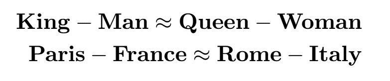
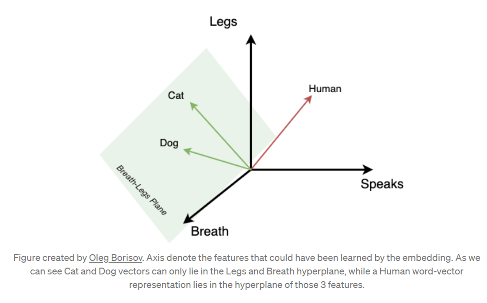

## Previously ...

Everything so far has been structured. Most of what customers say is not.

## Learning Outcomes

By the end of this lecture you will be able to:

- Prepare text for analysis, and say what each preparation step destroys
- Represent text as numbers, from counts to embeddings
- Score sentiment with a lexicon and with a model, and state the trade
- Validate any text method against human labels before reporting a number

# 1. Text as Data

## Where Marketing Text Comes From

Reviews, comments, replies, support tickets, survey free text, social captions,
search queries, and the sales team's notes.

. . .

It is the only data that tells you **why**. Every structured metric in this
module tells you what happened.

. . .

It is also the data most likely to be analysed badly, because the tooling makes
producing a number very easy and validating it entirely optional.

## The Lifecycle, Upside Down

**How it used to go**: define the task, collect thousands of examples, label
them by hand, train a model, evaluate, deploy. Months.

. . .

**How it goes now**: write a prompt, get labels, ship. Minutes.

. . .

The expensive step was labelling, and it has apparently disappeared. It has not.
It has moved from the start of the project, where it was a budget line, to the
end, where it is optional and therefore skipped.

::: {.callout-note appearance="minimal"}
If labelling was where the domain knowledge entered the process, and labelling
is now automated, where does the domain knowledge enter?
:::

<!-- Speaker notes: this framing is the spine of the lecture. The old pipeline
     forced you to look at your data. The new one does not, and that is the
     entire risk. Everything after this slide is about putting the looking
     back in on purpose. -->

## Semantic and Pragmatic Meaning {.smaller}

:::: {.columns}
::: {.column width="45%"}
**Semantic**

What the words literally mean.

> "Wow, you really are an expert."

A compliment.
:::
::: {.column width="45%"}
**Pragmatic**

What was meant, given context, speaker and history.

> "Wow, you really are an expert."

Possibly the opposite of a compliment.
:::
::::

. . .

Lexicons see only the semantic layer. Models see more of the pragmatic layer,
but not the context that decides it: who wrote it, to whom, after what.

. . .

**You have that context**, and it does not scale, which is why it is spent on a
sample rather than the corpus.

## Preparation, and Its Costs {.smaller}

| Step | Fixes | Destroys |
|---|---|---|
| Lowercase | `Great` = `great` | `US` vs `us`, brand names, SHOUTING |
| Strip punctuation | Token noise | `!!!` intensity, emoji, `:(` |
| Remove stopwords | "the" topping every list | Negation: "not good" becomes "good" |
| Lemmatise | `running`/`ran` unify | Tense, which sometimes is the finding |

. . .

**Removing stopwords before sentiment analysis destroys negation.** It is a
standard step in a standard pipeline and on this task it inverts your answer.

. . .

Every preparation step is a decision about what does not matter. Write down
which ones you made, in Lecture 15's log.

## Counting

```{.python}
from sklearn.feature_extraction.text import TfidfVectorizer

tfidf = TfidfVectorizer(ngram_range=(1, 2), min_df=3, stop_words=None)
X = tfidf.fit_transform(comments["text"])
```

. . .

**Raw counts return "the".** TF-IDF weights a term by how often it appears in a
document against how rare it is across the corpus, which surfaces the terms that
distinguish documents rather than the terms that fill them.

. . .

`ngram_range=(1,2)` keeps two-word phrases, which is how "not recommended"
survives as a unit. `min_df=3` drops terms appearing in fewer than three
documents, most of which are typos.

## Embeddings {.smaller}

TF-IDF says two documents are similar when they share words. `car` and
`automobile` share none.

. . .

An **embedding** is a vector representation where similar meanings sit near each
other in space, learned from how words are used rather than how they are spelt.

. . .

What that buys you:

- Semantic search: retrieve comments about pricing without the word "price"
- Clustering by meaning, which is Lecture 13's k-means on a different feature
  space
- Duplicate and near-duplicate detection, which is more useful than it sounds on
  review data

::: {.callout-note appearance="minimal"}
Embeddings encode the usage patterns of the corpus they were trained on,
including its biases. What does that imply about running them on a corpus that
does not look like general web English?
:::

## What an Embedding Buys You {.smaller}

:::: {.columns}
::: {.column width="48%"}
**Arithmetic on meaning**

{fig-align="center" height="235px"}
:::
::: {.column width="48%"}
**Directions that mean something**

{fig-align="center" height="235px"}
:::
::::

::: {style="font-size:0.55em;text-align:center;"}
Source: [MGT 100 Customer Analytics, UC San Diego](https://github.com/kennethcwilbur/mgt100) (CC BY 4.0)
:::

*Meaning becomes geometry. Similar things sit close together, and the
directions between them are themselves interpretable.*


# 2. Sentiment

## Lexicon Approaches

```{.python}
from vaderSentiment.vaderSentiment import SentimentIntensityAnalyzer
analyser = SentimentIntensityAnalyzer()
comments["compound"] = comments["text"].apply(
    lambda t: analyser.polarity_scores(t)["compound"])
```

. . .

VADER: a hand-built dictionary of words with valence scores, plus rules for
negation, intensifiers, capitals and punctuation. Tuned on social media text.

. . .

**Fast, free, deterministic, and fully auditable.** You can show a client the
exact word that produced the score, which matters more often than accuracy does.

## Model Approaches

```{.python}
from transformers import pipeline
clf = pipeline("sentiment-analysis")
clf("The delivery was late but the product is excellent")
```

. . .

A transformer classifier fine-tuned on labelled sentiment data. Substantially
better than a lexicon on negation, context and mixed sentences.

. . .

Still deterministic, still local, still inspectable in the sense that the same
input gives the same output. **The middle option, and the one most often
skipped** in the jump from VADER to an LLM.

## Where All of Them Fail

- **Sarcasm.** "Great, another outage." Lexicons fail completely, models mostly
- **Negation at distance.** "I wouldn't say I was impressed"
- **Domain terms.** "Sick trainers", "this is fire", "wicked". Positive
- **Mixed sentiment in one sentence.** "Service was great but the food was
  terrible" is not neutral, it is two opposite judgements about two different
  things
- **Non-English text**, and code-switching within a sentence
- **No units.** A compound score of 0.7 is not 70% positive. It is not a
  percentage of anything

## Aspect-Based Sentiment

> "The service was great but the food was terrible."

Document-level sentiment: roughly neutral, and useless.

. . .

Aspect-based: `service: positive`, `food: negative`. Two findings, both
actionable.

. . .

**This is almost always what a marketer actually wanted.** It is also where the
benchmark gap between lexicons, fine-tuned models and LLMs is widest, and where
an LLM's ability to follow an instruction in plain language is worth the most.

::: {.callout-note appearance="minimal"}
Which aspects would you extract from comments about your own portfolio site?
Name them **before** you run anything.
:::

## Validate Against Humans

**Hand-label 50 items. Compare. Report the agreement.**

. . .

Not as a nicety. As the only evidence you have that the number means anything.

```{.python}
from sklearn.metrics import cohen_kappa_score, classification_report
cohen_kappa_score(human_labels, method_labels)
```

. . .

Raw agreement flatters you: if 80% of comments are positive, a classifier that
answers "positive" every time is 80% accurate. **Cohen's kappa** corrects for
agreement by chance, and is the number to report.

. . .

**Never ship an unvalidated sentiment number.** It takes forty minutes to label
fifty comments, and it is the difference between a finding and a decoration.

# 3. Themes

## Simple Before Clever

Before any topic model:

1. TF-IDF ranking, read by a human, which takes ten minutes
2. Keyword grouping, using terms you chose because you know the business
3. Co-occurrence: which terms appear together, which is often the whole finding

. . .

On a few hundred comments this is usually all you need, and it produces themes
you can defend line by line.

## A Brand Map Built From Text Alone {.smaller}

 (CC BY 4.0)](./figures/external/mgt100_brand_maps_from_text.png){fig-align="center" height="340px"}

*Netzer et al. built these car brand maps from forum posts, with no survey.
The left map is co-mention, the right is switching.*


## Topic Extraction

**LDA** assumes documents are mixtures of topics and topics are distributions
over words. Long-established, and needs a lot of documents.

. . .

**BERTopic** clusters embeddings and then labels the clusters. Better on short
text, which is what marketing text is.

. . .

Two honest warnings, equally true of both:

- **Topics need human naming.** The model gives you word lists. The name is your
  interpretation, and it is where the errors go in
- **They are unstable across runs and across $K$.** Same data, different seed,
  different topics. Report the seed, or do not report the topics

## Exercise {background="#43464B"}

On a set of comments, reviews or captions relevant to your portfolio:

1. Clean the text and produce a TF-IDF ranking, and say what your cleaning
   destroyed
2. Score sentiment with VADER
3. Hand-label 30 items and report kappa, not just raw agreement
4. Name three themes and quote one example of each
5. Find one item where the method and your label disagree, and explain why

**30 minutes**

# 4. LLMs for Text: Better and Riskier

## AI This Block: Agentic coding

Where we are on the module's AI spine, introduced in Lecture 10:

> **Agentic coding**

## An LLM Is a Better Sentiment Classifier

This is not in dispute. On sarcasm, negation, domain language and aspect-based
tasks, a general model beats a lexicon comfortably.

. . .

The published picture is more interesting than "better": general models are
**jack of all trades, master of none**. A model fine-tuned on your domain
usually beats a general LLM **within** that domain, and the LLM generalises
better **outside** it.

. . .

Which means the right choice depends on whether your text looks like the
training data of any available specialised model. Usually it does not.

## What You Give Up

- **Reproducibility.** The same comment can score differently across runs, and
  across silent model updates you are not told about
- **Auditability.** You cannot show a client the lexicon, because there is not
  one
- **Cost.** Scales with corpus size, so the pilot is free and the production run
  is not
- **Calibration.** It is confidently wrong on the ambiguous cases, which are
  exactly the cases you were trying to resolve

. . .

**Be able to state the trade, not just pick a side.** That is what is being
assessed.

## The Discipline Is Unchanged

Hand-label 50. Compare. Report kappa.

. . .

Identical to what this lecture demands of VADER. An LLM does not exempt you from
validation. It makes validation **more** important, because you cannot inspect
the rule that produced the label.

. . .

And two additions specific to LLMs:

- **Fix the prompt and record it.** The prompt is the method section
- **Run a sample twice** and report how often the two runs disagree with each
  other. That is your reproducibility number, and it is rarely zero

::: {.callout-note appearance="minimal"}
If two runs of the same prompt disagree on 6% of comments, what is the honest
sentence to put under the chart?
:::

## Exercise {background="#43464B"}

1. Score 50 comments with VADER and with an LLM, using a prompt you write down
2. Hand-label the same 50
3. Report kappa for each method against your labels
4. Run the LLM a second time on the same 50 and report run-to-run agreement
5. Say which you would ship, and exactly what you would tell the client about
   its limits

**25 minutes**

## Going Further

- Hutto and Gilbert (2014), *VADER* — the paper, and read the rules section
- Kocoń et al. (2023), *ChatGPT: Jack of all trades, master of none* — the
  benchmark picture across NLP tasks
- Zhang et al. (2023), *Is ChatGPT a Good Sentiment Analyzer?* — aspect-based
  results specifically
- Grimmer and Stewart (2013), *Text as Data* — the methodological warnings, all
  of which predate LLMs and none of which have expired

## Next Lecture

The unglamorous lecture that decides whether any of this is true: cleaning, and
the audit trail.

**Prepare**: bring the list of preparation decisions you made today. They are
the first entries in your cleaning log.
