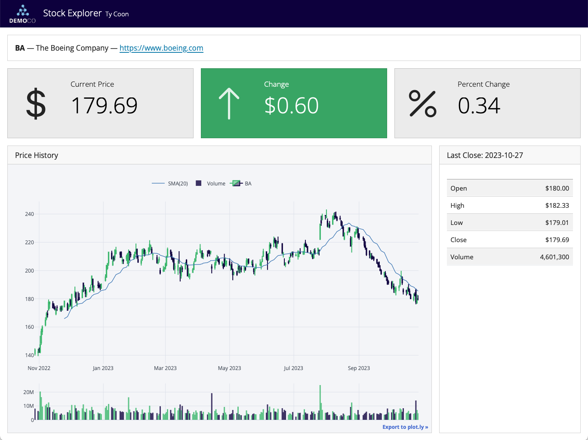
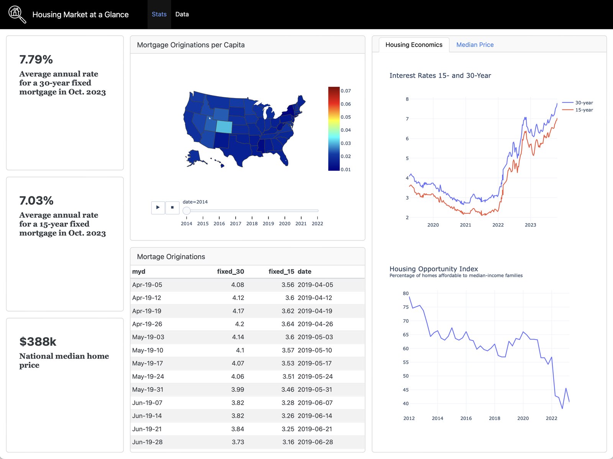

## Previously ...

You have the data, the metrics, the framework and the design principles. Today
you assemble the client deliverable.

## Learning Outcomes

By the end of this lecture you will be able to:

- Design a dashboard around a decision rather than around available data
- Build it in Tableau to a client standard
- Anticipate the questions a client will ask of it

# 1. Design First

## Start With the Decision

TODO: write the decision the dashboard supports at the top of a blank page
before opening Tableau.

## The Sketch

TODO: pen and paper. Five minutes. Layout, hierarchy, and what goes above the
fold.

## Layout Conventions

TODO: headline metrics top-left, trend beneath, breakdowns below, detail on
demand. Reading order follows the decision.

## A Dashboard That Answers One Question {.smaller}

](./figures/external/qd_dashboard_customer_churn.png){fig-align="center" height="340px"}

*Three numbers at the top, the reasons underneath, the detail last. You can
say what decision it supports in one sentence.*

## What to Leave Out

<!-- Speaker notes: students will want to show everything they built over
     22 sessions. The discipline of removal is the assessed skill. -->

TODO: every chart must earn its place by changing a decision.

# 2. Building It

## Structure in Tableau

TODO: worksheets, dashboard containers, device layouts, actions and filters.

## Performance

TODO: extracts versus live, filter order, avoiding a dashboard that takes
30 seconds to load in front of a client.

## Annotation

TODO: a dashboard without context is a quiz. Titles that state findings, not
field names. Notes on definitions and data caveats.

## Consistency

TODO: one palette, one date format, one number format. Reuse the Lecture 9
encoding rules.

## Two More, For Comparison {.smaller}

:::: {.columns}
::: {.column width="48%"}
**Focused**

{fig-align="center" height="255px"}
:::
::: {.column width="48%"}
**Dense**

{fig-align="center" height="255px"}
:::
::::

::: {style="font-size:0.55em;text-align:center;"}
Source: [Quarto Dashboards, posit::conf(2024)](https://github.com/posit-conf-2024/quarto-dashboards)
:::

*Both are competent. Only one of them can be read from the back of a room.*

# 3. Client Standard

## The Handover Test

TODO: could someone open this without you in the room and reach the right
conclusion?

## Caveats in Public

TODO: your cleaning log from Lecture 15 and your consent bias from Lecture 4
belong on the dashboard, not in your head.

## Studio Time {background="#43464B"}

Build your portfolio performance dashboard.

Checkpoints:

1. Decision statement written and visible
2. Sketch approved by one peer
3. Draft built with real data
4. Peer review against the Lecture 9 critique checklist

**Remainder of lecture**

# 4. Agent as Dashboard Draftsman

## AI This Block: A producer

Where we are on the module's AI spine, introduced in Lecture 10:

> **A producer**

## Specification, Not Construction

TODO: the agent is good at turning your decision statement into a layout spec,
and at listing the views you have forgotten.

> "My dashboard supports this decision: [statement]. Propose a layout: which
> views, in what order, above and below the fold. Say what to leave out."

## What It Cannot Do

TODO: expand. It cannot build the Tableau workbook, it does not know your data
quality caveats, and it has no view on what your client will actually ask.

## The Removal Test

TODO: ask it which of your existing views does not change a decision. It is
better at removing than you are, because it is not attached to the work.

## Exercise {background="#43464B"}

1. Give an agent your decision statement and your list of built views
2. Ask which to cut
3. Cut at least one you disagree about, and see whether the dashboard is worse

**15 minutes**

## Next Lecture

Presenting it.
